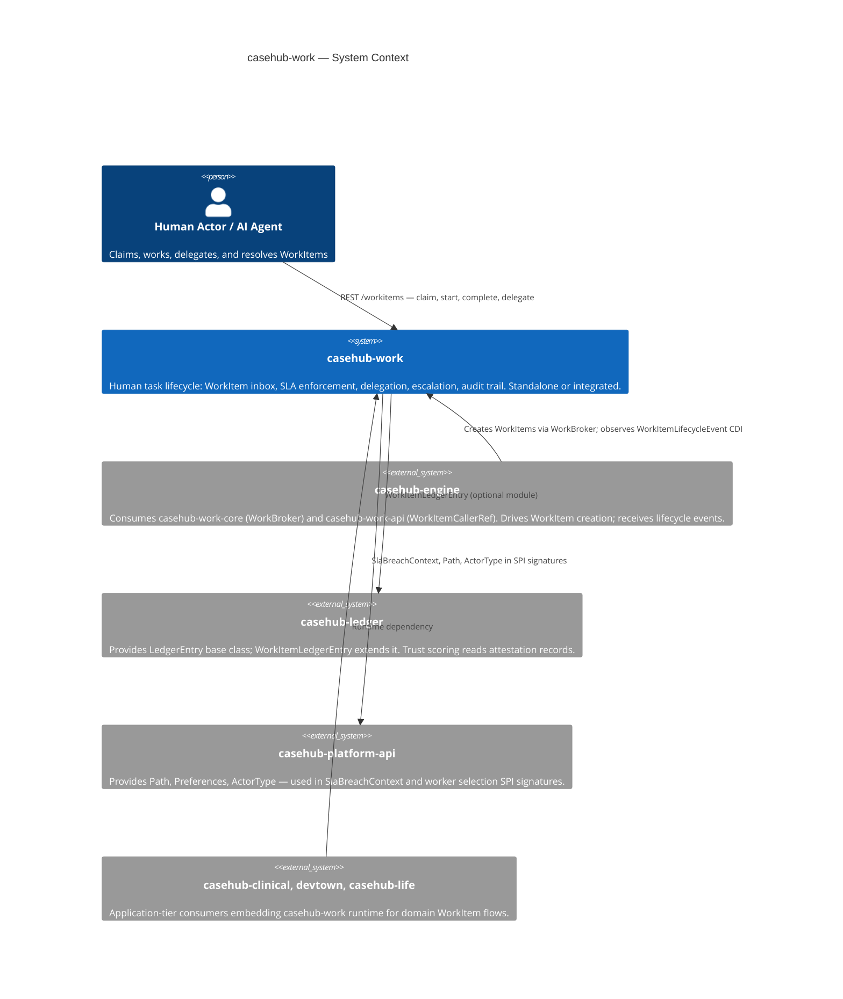
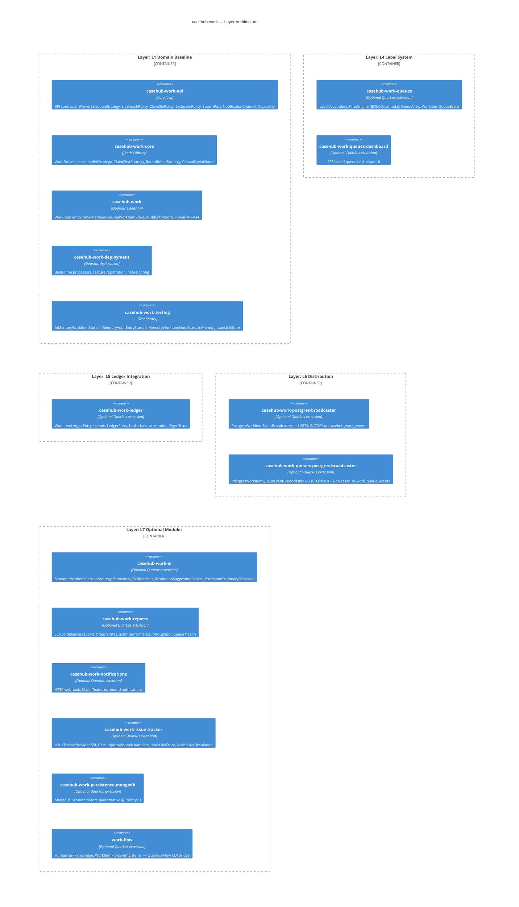
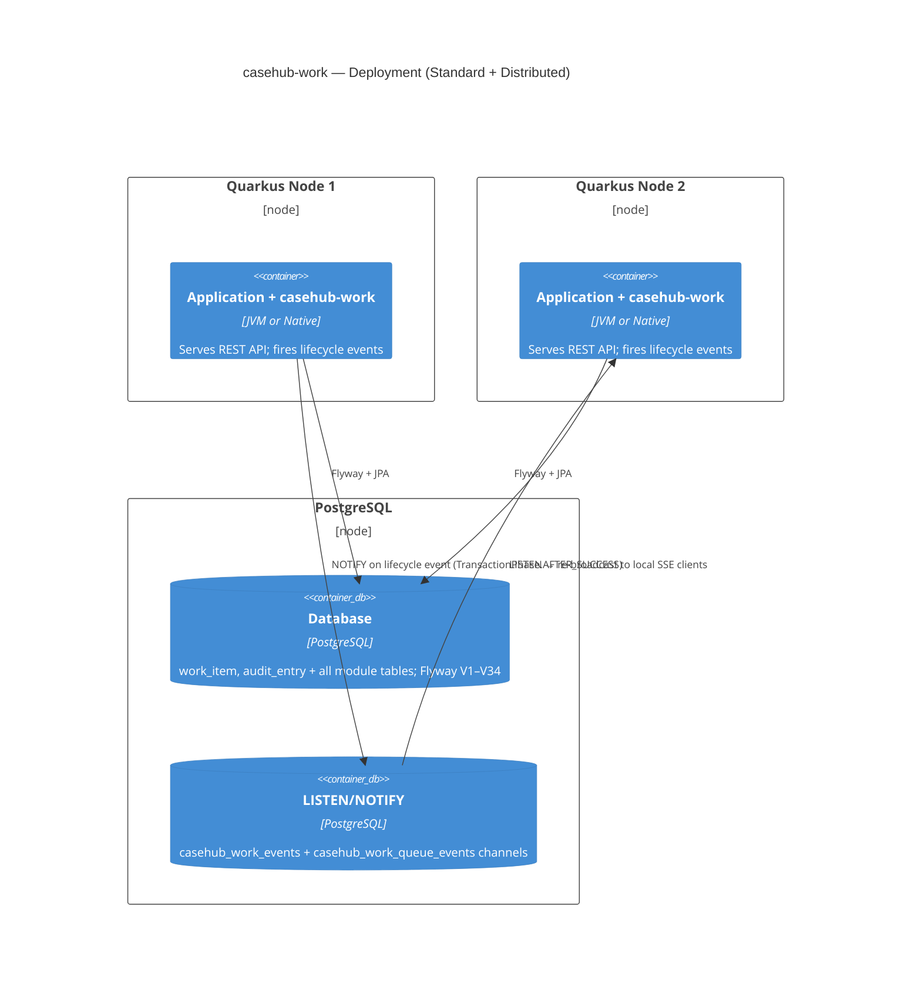

# CaseHub Work — ARC42STORIES.MD

**Spec:** Arc42Stories v0.1
**Profile:** CaseHub — Foundation tier
**Profile ref:** `../parent/docs/arc42stories-casehub-profile.md` · fallback: `https://raw.githubusercontent.com/casehubio/parent/main/docs/arc42stories-casehub-profile.md`
**Build position:** Foundation — depends on `casehub-platform-api` only (core); `casehub-ledger` optional
**Consumed by:** `casehub-engine` (work-adapter), `casehub-clinical`, `devtown`, `casehub-life`
**Depends on:** `casehub-platform-api` (compile, `api/` module only)

---

## §1 Introduction and Goals

### Description

CaseHub Work is a Quarkus extension that provides human-scale WorkItem lifecycle management: expiry, delegation, escalation, priority, SLA tracking, and audit trail. It is not a workflow engine, not a case manager, and not an agent mesh — those concerns belong to `casehub-engine`, `casehub-qhorus`, and Quarkus-Flow respectively. Any Quarkus application embeds it via CDI and REST resources without taking a dependency on any other casehubio module.

### Stakeholders

| Stakeholder | Interest |
|---|---|
| Quarkus app developer | Embeds the extension; configures `casehub.work.*` properties; wires CDI beans |
| Consumer repo (casehub-engine, casehub-clinical, devtown) | Calls REST or CDI API to create, claim, delegate, and complete WorkItems |
| Human task actor | Receives, claims, and resolves WorkItems via the inbox REST surface |
| AI agent | Polls or subscribes to WorkItem queues; delegates or escalates on SLA breach |
| Platform team | Maintains lifecycle contracts, SPI stability, and cross-repo protocol compliance |

### Quality Goals

| Priority | Goal | Scenario |
|---|---|---|
| 1 | SLA correctness | An expired WorkItem triggers its breach policy within one scheduler cycle, with no manual intervention |
| 2 | Isolation | The core extension compiles and passes unit tests without `casehub-ledger`, `casehub-qhorus`, or `casehub-engine` on the classpath |
| 3 | Zero-datasource unit testing | `WorkItemServiceTest` runs without Quarkus boot via `InMemoryWorkItemStore`, completing in under 1 s |

### Artifact Schema

| Artifact type | Format | Example | Where it lives |
|---|---|---|---|
| Issue | `#NNN` or `casehubio/work#NNN` | `#246` | GitHub Issues |
| ADR | `ADR-NNNN` | `ADR-0005` | `docs/adr/` |
| Garden entry | `GE-YYYYMMDD-XXXXXX` | `GE-20260522-9cd6d5` | `~/.hortora/garden/` |
| Protocol | `PP-YYYYMMDD-XXXXXX` | `PP-20260525-607b33` | `casehub-parent/docs/protocols/` |
| Design spec | `YYYY-MM-DD-topic-design` | `2026-04-14-tarkus-design` | `docs/specs/` |

---

## §2 Constraints

### Platform

| Constraint | Value |
|---|---|
| Java | 21 language level, running on JVM 26 |
| Framework | Quarkus 3.32.2 |
| Native target | GraalVM 25; verified startup 0.084 s |
| Build | `JAVA_HOME=$(/usr/libexec/java_home -v 26) mvn clean install` — use `mvn`, not `./mvnw` |

### Architectural Constraints

- Zero casehubio core deps: the `runtime/` module depends only on `casehub-platform-api`; all other casehubio integrations are optional or in separate modules
- Module naming: short names (`api/`, `runtime/`, `deployment/`) — no repo-prefix repetition (e.g. not `casehub-work-api/`)
- Flyway path scoping: all migrations live at `classpath:db/work/migration/` (PP-20260525-607b33)
- No auth on REST resources: consuming applications add `@RolesAllowed`; this extension ships auth-retrofit-readiness stubs only
- Test datasource: H2 `MODE=PostgreSQL` for unit and module tests; Testcontainers (real PostgreSQL) for dialect validation

---

## §3 Context and Scope



### Boundary Rules

What casehub-work explicitly does NOT do:

- Orchestrate case flow or interpret case state
- Interpret `callerRef` content — stored and echoed opaquely; convention: `casehub-engine` sets `"caseId:planItemId"`
- Provision AI agents — casehub-engine and Claudony own that
- Decide when to spawn child WorkItems — callers drive spawn via `SpawnPort`
- Implement trust scoring — casehub-ledger owns this; casehub-work fires events, ledger records and scores
- Determine when heterogeneous plan items all complete — casehub-engine; homogeneous M-of-N IS casehub-work

---

## §4 Solution Strategy

Foundation modules define their own layer taxonomy. casehub-work's layers represent the
internal architectural concerns added incrementally across 35 build Chapters:

### Layer Taxonomy

| Layer | Concern |
|---|---|
| L1 Domain Baseline | WorkItem + AuditEntry entities, Storage SPI, JPA defaults, WorkItemService — the inbox foundation |
| L2 REST API | WorkItemResource (7 sub-resources), DTOs, exception mappers, OpenAPI |
| L3 Lifecycle Engine | ExpiryCleanupJob, ClaimDeadlineJob, ClaimSlaPolicy SPI, SlaBreachPolicy SPI, CDI lifecycle events |
| L4 Label System | LabelVocabulary, MANUAL/INFERRED label persistence, FilterEngine (JEXL/JQ/Lambda), QueueView |
| L5 Ledger Integration | WorkItemLedgerEntry (JOINED from LedgerEntry), hash chain, peer attestation, EigenTrust |
| L6 Distribution | WorkItemEventBroadcaster SPI, LocalWorkItemEventBroadcaster @DefaultBean, PostgreSQL LISTEN/NOTIFY broadcaster |
| L7 Optional Modules | SLA reports, AI (semantic routing + LLM assist), notifications, issue tracker, MongoDB persistence, Quarkus-Flow bridge |

### Chapter Sequencing Rationale

Hard dependencies — order is non-negotiable:

- C1 before C2: REST requires the persisted WorkItem entity and service layer at runtime
- C2 before C3: lifecycle transitions require service methods to exist first
- C3 before C4: CDI events are emitted inside service transitions; transitions must exist
- C6 (Ledger) after C4: `LedgerEventCapture @Observes WorkItemLifecycleEvent` — the event bus must exist first
- C7 (Label Queues) before C16 (Confidence Routing): confidence-gated routing extends the filter engine from C7
- C18 (Module Separation) before C19 (Semantic AI + LLM Assist): semantic AI depends on the api/core SPI split
- C26 (Broadcaster SPI) before C27 (Distributed SSE): PostgreSQL broadcaster implements the SPI extracted in C26
- C33 (SlaBreachPolicy SPI) before C35 (Status Lifecycle): status correctness fixes (#243 EXPIRED in isTerminal, #244 Exhausted) depend on the sealed `BreachDecision` type from C33

---

## §5 Building Block View



### Module Index

| Folder | Artifact | Type | Purpose |
|---|---|---|---|
| `api/` | `casehub-work-api` | Pure Java SPI | WorkerSelectionStrategy, SlaBreachPolicy, BreachDecision (sealed), ClaimSlaPolicy, ExclusionPolicy, SpawnPort, NotificationChannel, Capability, WorkItemCallerRef; depends on `casehub-platform-api` |
| `core/` | `casehub-work-core` | Jandex library | WorkBroker, LeastLoadedStrategy, ClaimFirstStrategy, RoundRobinStrategy, CapabilityValidator; used by casehub-engine without pulling in JPA or REST |
| `runtime/` | `casehub-work` | Quarkus extension | WorkItem + AuditEntry entities, WorkItemService, WorkItemAssignmentService, ExpiryLifecycleService, REST resources (7), Flyway V1–V34 at `db/work/migration/` |
| `deployment/` | `casehub-work-deployment` | Quarkus deployment | Build-time processor, feature registration, `casehub.work.*` native config |
| `testing/` | `casehub-work-testing` | Test library | InMemoryWorkItemStore, InMemoryAuditEntryStore, InMemoryWorkItemNoteStore, InMemoryIssueLinkStore |
| `queues/` | `casehub-work-queues` | Optional extension | LabelVocabulary, MANUAL/INFERRED label persistence, FilterEngine (JEXL/JQ/Lambda), FilterChain, QueueView, WorkItemQueueEventBroadcaster SPI |
| `queues-dashboard/` | `casehub-work-queues-dashboard` | Optional extension | SSE queue dashboard UI |
| `ledger/` | `casehub-work-ledger` | Optional extension | WorkItemLedgerEntry (JOINED from LedgerEntry), LedgerEventCapture @Observes, EigenTrust; depends on `casehub-ledger` |
| `postgres-broadcaster/` | `casehub-work-postgres-broadcaster` | Optional extension | PostgresWorkItemEventBroadcaster @Alternative @Priority(1); no Flyway |
| `queues-postgres-broadcaster/` | `casehub-work-queues-postgres-broadcaster` | Optional extension | PostgresWorkItemQueueEventBroadcaster @Alternative @Priority(1); no Flyway |
| `ai/` | `casehub-work-ai` | Optional extension | SemanticWorkerSelectionStrategy @Alternative @Priority(1), EmbeddingSkillMatcher, ResolutionSuggestionService, EscalationSummaryObserver, Flyway V14 + V4001 |
| `reports/` | `casehub-work-reports` | Optional extension | SLA compliance REST reports, Caffeine 5-min TTL cache |
| `notifications/` | `casehub-work-notifications` | Optional extension | HTTP webhook, Slack, Teams; NotificationChannel SPI; Flyway V3000 |
| `issue-tracker/` | `casehub-work-issue-tracker` | Optional extension | IssueTrackerProvider SPI, IssueLinkStore SPI, GitHub/Jira webhook handlers, NormativeResolution; Flyway V5000–V5001 |
| `persistence-mongodb/` | `casehub-work-persistence-mongodb` | Optional extension | MongoDB WorkItemStore @Alternative @Priority(1) |
| `flow/` | `work-flow` | Optional extension | HumanTaskFlowBridge, WorkItemFlowEventListener |
| `integration-tests/` | — | Black-box test suite | @QuarkusIntegrationTest + native image validation (25 tests) |
| `examples/` | — | Runnable demos | POST /examples/{name}/run scenario runner |
| `flow-examples/` | — | Flow demos | Quarkus-Flow integration examples |
| `queues-examples/` | — | Queue demos | Queue and filter usage examples |

### WorkItem Domain Model

**WorkItemStatus** (10 values from `runtime/src/main/java/io/casehub/work/runtime/model/WorkItemStatus.java`):

| Status | Meaning | isTerminal() | isActive() |
|---|---|---|---|
| `PENDING` | Available for claiming; no assignee | false | true |
| `ASSIGNED` | Claimed; work not yet started | false | true |
| `IN_PROGRESS` | Actively being worked | false | true |
| `DELEGATED` | Forwarded to named actor; pending acceptance | false | true |
| `SUSPENDED` | On hold; will resume | false | true |
| `COMPLETED` | Resolved successfully | true | false |
| `REJECTED` | Declined by actor | true | false |
| `CANCELLED` | Externally cancelled | true | false |
| `EXPIRED` | Completion deadline passed | true | false |
| `ESCALATED` | All SLA breach policy branches exhausted; operator intervention required | true | false |

**Lifecycle transitions:**
```
PENDING → ASSIGNED (claim) | CANCELLED
ASSIGNED → IN_PROGRESS (start) | DELEGATED | RELEASED→PENDING | SUSPENDED | CANCELLED
IN_PROGRESS → COMPLETED | REJECTED | DELEGATED | SUSPENDED | CANCELLED
SUSPENDED → ASSIGNED | IN_PROGRESS (resume to priorStatus) | CANCELLED
DELEGATED → ASSIGNED (accept-delegation) | PENDING (decline, POOL path) | ASSIGNED (decline, DELEGATOR path)
any active → EXPIRED (SLA Fail) | PENDING (SLA EscalateTo) | ESCALATED (Chained exhausted)
```

---

## §6 Runtime View

### Scenario 1 — WorkItem creation with assignment

Actor or system POSTs to `POST /workitems`. `WorkItemService` validates the request against the template's `inputDataSchema` (via `FormSchemaValidationService` if set), persists the WorkItem as PENDING via `JpaWorkItemStore`, fires `WorkItemLifecycleEvent(CREATED)`. `WorkItemAssignmentService` observes CREATED and calls `WorkBroker` with the configured `WorkerSelectionStrategy`. If a pre-assignment resolves, status transitions to ASSIGNED; otherwise the item stays in the pool. If `casehub-work-ledger` is on the classpath, `LedgerEventCapture @Observes` fires asynchronously and appends a `WorkItemLedgerEntry`.

### Scenario 2 — SLA breach → Fail

`ExpiryCleanupJob` fires on schedule via `@Scheduled`. It calls `ExpiryLifecycleService.checkExpired()`, which scans all expired WorkItems and calls `SlaBreachPolicy.onBreach(SlaBreachContext)` per item:

- `BreachDecision.Fail` → WorkItem transitions to EXPIRED (terminal); `SlaBreachEvent` CDI fires; `EXPIRED` audit entry written
- `BreachDecision.EscalateTo(groups, deadline)` → item returns to PENDING with new candidate groups and deadline; `SLA_REASSIGNED` audit entry written; `WorkItemAssignmentService` pre-assigns via `SLA_ESCALATED` trigger
- `BreachDecision.Chained` → primary decision tried, fallback tried on failure; both exhausted → `executeExhausted()` → WorkItem transitions to ESCALATED (terminal)

`BreachExecutionFailed` exceptions are caught at item level — one misconfigured policy writes `BREACH_POLICY_MISCONFIGURED` audit and skips the item without rolling back the batch.

### Scenario 3 — Delegation accept/decline

Actor A (ASSIGNED or IN_PROGRESS) calls `PUT /workitems/{id}/delegate` → WorkItem transitions to DELEGATED, `claimDeadline` cleared. Actor B calls `PUT /workitems/{id}/accept-delegation` → ASSIGNED to B. Or Actor B calls `PUT /workitems/{id}/decline-delegation` → resolves `delegationDeclineTarget`: instance field `POOL` → PENDING (back to original candidate pool); instance field `DELEGATOR` → ASSIGNED back to Actor A. If no instance field, reads scope preference via `DeclineTarget.KEY` (default POOL).

---

## §7 Deployment View



### Deployment Variants

| Variant | Add to classpath | Capability gained |
|---|---|---|
| Minimal (evaluation) | `casehub-work` + H2 datasource | WorkItem lifecycle, SLA, REST API |
| Standard | `casehub-work` + PostgreSQL datasource | Full lifecycle with production datasource |
| Distributed cluster | + `casehub-work-postgres-broadcaster` | All nodes receive all SSE events via LISTEN/NOTIFY |
| Full audit | + `casehub-work-ledger` + `casehub-ledger` | Tamper-evident Merkle chain, EigenTrust scoring |
| AI routing | + `casehub-work-ai` + embedding provider | Semantic worker selection + LLM-assisted resolution |
| MongoDB | + `casehub-work-persistence-mongodb` | MongoDB WorkItemStore (drop-in, no datasource config change) |

---

## §8 Crosscutting Concepts

### Convention References

| Concern | Protocol |
|---|---|
| Module tier structure | `docs/protocols/universal/module-tier-structure.md` — pure-Java SPI / Jandex library / Quarkus extension three-tier rule |
| Flyway migrations | `docs/protocols/casehub/flyway-version-range-allocation.md` — V1–V999 runtime; V2000+ ledger subclass; optional modules own dedicated ranges (ai: V14+V4001, notifications: V3000, issue-tracker: V5000) |
| Flyway path scoping | PP-20260525-607b33 — all migrations at `db/work/migration/`; consumers set `quarkus.flyway.locations=classpath:db/work/migration` explicitly; Flyway auto-registration does not exist |
| CDI displacement | `docs/protocols/casehub/alternative-extension-patterns.md` — `@DefaultBean` displaced by `@Alternative @Priority(1)` via classpath presence; no consumer config change |
| SPI placement | `docs/PLATFORM.md` §Step 4 — consumer-facing SPIs in `api/`; `@DefaultBean` impls in `api/` when pure Java, in `runtime/` when JPA or config deps apply |
| Persistence backend priority | `docs/protocols/universal/persistence-backend-cdi-priority.md` — `@DefaultBean` → `@ApplicationScoped` → `@Alternative @Priority(1)` ladder |
| Auth readiness | `docs/protocols/casehub/auth-retrofit-readiness.md` — no `@RolesAllowed` in the extension; REST resources stay thin enough for retrofit |
| Capability vocabulary | `docs/adr/0003-capability-vocabulary-as-validated-value-type.md`, `docs/adr/0004-capability-validation-mode-as-deployment-config.md` |

### Anti-Patterns

**Symptom:** Augmentation fails with `UnsatisfiedResolutionException` for `PreferenceProvider` while all `@QuarkusTest` tests pass.
**Cause:** `casehub-platform` mock module added as `<scope>test</scope>` in a module that declares `<goal>build</goal>` in the `quarkus-maven-plugin`. Production augmentation validates CDI without the test classpath — `MockPreferenceProvider @DefaultBean` is invisible at augmentation time.
**Fix:** Change `casehub-platform` to `<scope>runtime</scope>` in modules that run `quarkus:build`. Keep `<scope>test</scope>` in library and extension modules that do not run `quarkus:build`.

**Symptom:** After adding a new non-terminal `WorkItemStatus` value, the expiry scheduler silently skips items in that status.
**Cause:** `WorkItemQuery.expired()` and `WorkItemQuery.claimExpired()` filter on explicit status sets. A new active status absent from those sets is invisible to `ExpiryCleanupJob`.
**Fix:** Whenever adding a new non-terminal `WorkItemStatus` value, update three places atomically: `WorkItemStatus.isActive()`, `WorkItemStatus.isTerminal()`, and the status predicates inside `WorkItemQuery.expired()` / `WorkItemQuery.claimExpired()`.

**Symptom:** SSE clients receive lifecycle events for WorkItems whose creating transaction rolled back.
**Cause:** A `WorkItemEventBroadcaster` observer fires during the transaction (before commit). If the transaction rolls back, the event was already dispatched.
**Fix:** Annotate all broadcaster `@Observes` methods with `during = TransactionPhase.AFTER_SUCCESS`. Never dispatch from `@Observes` without this parameter.

**Symptom:** Two concurrent claim requests on different cluster nodes both succeed — the same WorkItem is assigned to two actors.
**Cause:** `WorkItemStore.put()` without optimistic locking allows concurrent writers to overwrite each other's state.
**Fix:** `WorkItem` carries `@Version long version`; concurrent claim produces `OptimisticLockException` which `WorkItemResource` maps to HTTP 409 Conflict. The second claimer must retry claim.

---

## §9 Journeys and Chapters

### §9.1 Journey Overview

| Journey | Description | Chapters | Status |
|---|---|---|---|
| Core Platform | Domain baseline, REST API, lifecycle engine, CDI events, Quarkus-Flow, ledger, label queues, native image, WorkItemTemplate, model enrichment, audit history, subprocess spawn, atomic claim + schedule dedup, ClaimSlaPolicy SPI | C1–C15 | ✅ Complete |
| Enterprise Capabilities | Confidence-gated routing, worker selection strategy, module separation, semantic AI + LLM assist, MongoDB persistence, issue tracker, SLA reporting, multi-instance, business hours, notifications, broadcaster SPI, distributed SSE | C16–C27 | ✅ Complete |
| Lifecycle Enrichment | Named outcomes, template data schemas, conflict-of-interest exclusions, enforced builder, round-robin strategy, SlaBreachPolicy SPI + escalation removal, capability vocabulary, status lifecycle fixes + DELEGATED | C28–C35 | ✅ Complete |


### §9.2 Chapter Index

| # | Chapter | Journey | Key issues | Status |
|---|---|---|---|---|
| C1 | Domain Baseline | Core Platform | Phase 1 | ✅ |
| C2 | REST API | Core Platform | Phase 2 | ✅ |
| C3 | Lifecycle Engine | Core Platform | Phase 3 | ✅ |
| C4 | CDI Events | Core Platform | Phase 4 | ✅ |
| C5 | Quarkus-Flow Integration | Core Platform | Phase 5, #37, #38 | ✅ |
| C6 | Ledger Module | Core Platform | Phase 6, #45, ADR-0001 | ✅ |
| C7 | Label-Based Queues | Core Platform | Phase 7, #72, ADR-0002 | ✅ |
| C8 | Native Image | Core Platform | Phase 8 | ✅ |
| C9 | Form Schema *(superseded by C29)* | Core Platform | #107, #108 | ✅ |
| C10 | WorkItemTemplate | Core Platform | #76 | ✅ |
| C11 | WorkItem Model Enrichment | Core Platform | #74, #75, #82–#89, #91 | ✅ |
| C12 | Audit History API | Core Platform | Phase 10, #109–#111 | ✅ |
| C13 | Subprocess Spawn | Core Platform | SpawnPort SPI, V17+V18 | ✅ |
| C14 | Atomic Claim + Schedule Dedup | Core Platform | #94, #96 | ✅ |
| C15 | ClaimSlaPolicy SPI | Core Platform | #125 | ✅ |
| C16 | Confidence-Gated Routing | Enterprise Capabilities | Phase 11, #112–#114 | ✅ |
| C17 | Worker Selection Strategy | Enterprise Capabilities | Phase 12, #115–#116 | ✅ |
| C18 | Module Separation | Enterprise Capabilities | #118 | ✅ |
| C19 | Semantic Skill Matching + LLM Assist | Enterprise Capabilities | #121, #124, #126, V4001 | ✅ |
| C20 | MongoDB Persistence | Enterprise Capabilities | persistence-mongodb module | ✅ |
| C21 | Issue Tracker | Enterprise Capabilities | #73, #156–#161 | ✅ |
| C22 | SLA Compliance Reporting | Enterprise Capabilities | Phase 14, #142–#145 | ✅ |
| C23 | Multi-Instance WorkItems | Enterprise Capabilities | Phase 15, #106 | ✅ |
| C24 | Business-Hours Deadlines | Enterprise Capabilities | Phase 16 | ✅ |
| C25 | Notifications | Enterprise Capabilities | Phase 17, #140–#141 | ✅ |
| C26 | Broadcaster SPI | Enterprise Capabilities | Phase 18, #147, #150 | ✅ |
| C27 | Distributed SSE + Queue Broadcaster | Enterprise Capabilities | Phase 19+20, #93, #155 | ✅ |
| C28 | Named Outcomes | Lifecycle Enrichment | Phase 21, #169, #176, #178 | ✅ |
| C29 | Template Data Schemas | Lifecycle Enrichment | Phase 22, #170 — *supersedes C9* | ✅ |
| C30 | Conflict-of-Interest Exclusions | Lifecycle Enrichment | Phase 23, #171, #186, #192, ADR-0005 | ✅ |
| C31 | WorkItemCreateRequest Builder | Lifecycle Enrichment | Phase 24, #182 | ✅ |
| C32 | Round-Robin Strategy | Lifecycle Enrichment | #117, #200, #202, #203 | ✅ |
| C33 | SlaBreachPolicy SPI + Escalation Removal | Lifecycle Enrichment | Phase 25+26, #212–#216 | ✅ |
| C34 | Capability Vocabulary | Lifecycle Enrichment | #220, ADR-0003, ADR-0004 | ✅ |
| C35 | Status Lifecycle Fixes + DELEGATED | Lifecycle Enrichment | Phase 27, #241, #243–#245 | ✅ |

**Layer × Chapter matrix** (High/Med/Low/—):

| Layer | C1 | C2 | C3 | C4 | C5 | C6 | C7 | C8 | C9 | C10 | C11 | C12 | C13 | C14 | C15 |
|---|---|---|---|---|---|---|---|---|---|---|---|---|---|---|---|
| L1 Domain Baseline | **H** | L | — | L | — | — | — | — | L | **M** | **M** | L | **M** | **M** | L |
| L2 REST API | — | **H** | — | — | — | — | — | — | — | — | L | **M** | — | — | — |
| L3 Lifecycle Engine | — | — | **H** | **M** | — | — | — | — | — | — | — | — | — | — | **M** |
| L4 Label System | — | — | — | — | — | — | **H** | — | — | — | — | — | — | — | — |
| L5 Ledger Integration | — | — | — | — | — | **H** | — | — | — | — | — | — | — | — | — |
| L6 Distribution | — | — | — | — | — | — | — | — | — | — | — | — | — | — | — |
| L7 Optional Modules | — | — | — | — | **M** | — | — | — | — | — | — | — | — | — | — |

| Layer | C16 | C17 | C18 | C19 | C20 | C21 | C22 | C23 | C24 | C25 | C26 | C27 |
|---|---|---|---|---|---|---|---|---|---|---|---|---|
| L1 Domain Baseline | L | **M** | **M** | — | — | — | — | **M** | L | — | — | — |
| L2 REST API | — | — | — | — | — | — | — | — | — | — | — | — |
| L3 Lifecycle Engine | — | — | — | — | — | — | — | **M** | **M** | — | — | — |
| L4 Label System | **M** | — | — | — | — | — | — | — | — | — | — | — |
| L5 Ledger Integration | — | — | — | — | — | — | — | — | — | — | — | — |
| L6 Distribution | — | — | — | — | — | — | — | — | — | — | **M** | **H** |
| L7 Optional Modules | — | — | **M** | **M** | **M** | **M** | **M** | — | — | **H** | — | — |

| Layer | C28 | C29 | C30 | C31 | C32 | C33 | C34 | C35 |
|---|---|---|---|---|---|---|---|---|
| L1 Domain Baseline | **M** | **M** | **M** | L | — | L | **M** | **M** |
| L2 REST API | L | L | — | L | — | — | — | — |
| L3 Lifecycle Engine | — | — | — | — | **M** | **H** | — | **M** |
| L4 Label System | — | — | — | — | — | — | — | — |
| L5 Ledger Integration | — | — | — | — | — | — | — | — |
| L6 Distribution | — | — | — | — | — | — | — | — |
| L7 Optional Modules | — | — | — | — | — | — | — | — |

**Sequencing rationale:**
- C1 before C2: REST requires the persisted WorkItem entity and service layer at runtime
- C2 before C3: lifecycle transitions require service methods to exist
- C3 before C4: CDI events are emitted inside service transitions; transitions must exist first
- C6 (Ledger) after C4: `LedgerEventCapture @Observes WorkItemLifecycleEvent` — the event bus must exist
- C7 (Label Queues) before C16 (Confidence Routing): C16 extends the filter engine from C7
- C18 (Module Separation) before C19 (Semantic AI): semantic AI depends on the api/core SPI split
- C26 (Broadcaster SPI) before C27 (Distributed SSE): PostgreSQL broadcaster implements the SPI from C26
- C33 (SlaBreachPolicy SPI) before C35 (Status Lifecycle): C35 status correctness (#243 EXPIRED in isTerminal, #244 Exhausted) depends on sealed `BreachDecision` from C33

---

## §9.3 Journey 1 — Core Platform (C1–C15)

> Journey 1 delivers the WorkItem primitive from zero to a native-image-ready Quarkus extension with REST API, lifecycle engine, CDI events, optional Ledger integration, and label-based queues. All 15 chapters were completed between 2026-04-14 and 2026-04-24.

---

### Chapter C1 — Domain Baseline

**Journey:** Journey 1 — Core Platform | **Sequence:** 1 of 15 | **Status:** ✅
**Delivered:** 2026-04-14 | **Issues:** #92

**What this delivers**
Before this chapter, no human task primitive existed in the casehub-work codebase. After: the `WorkItem` entity with a 10-status lifecycle, `AuditEntry` persistence, `WorkItemStore` SPI, `WorkItemService` enforcing all valid transitions, and `InMemoryWorkItemStore` in the testing module are all in place. Any Quarkus application adding `casehub-work` gets a working task inbox backed by its configured datasource.

**Accountability gaps closed**
- No structured task audit trail → `AuditEntry` appended on every status transition via `WorkItemService`

**Layer Impact**
| Layer | Delta |
|---|---|
| L1 Domain Baseline | High |

---

### Chapter C2 — REST API

**Journey:** Journey 1 — Core Platform | **Sequence:** 2 of 15 | **Status:** ✅
**Delivered:** 2026-04-14 | **Issues:** #92

**What this delivers**
Before this chapter, the WorkItem lifecycle was accessible only via CDI injection. After: `WorkItemResource` exposes 13 endpoints with request/response DTOs and exception mappers, so any HTTP client can create, claim, complete, and delegate WorkItems via REST without touching CDI.

**Accountability gaps closed**
- No external claim surface → REST inbox with candidate group filtering on GET /workitems

**Layer Impact**
| Layer | Delta |
|---|---|
| L1 Domain Baseline | Low |
| L2 REST API | High |

---

### Chapter C3 — Lifecycle Engine

**Journey:** Journey 1 — Core Platform | **Sequence:** 3 of 15 | **Status:** ✅
**Delivered:** 2026-04-14 | **Issues:** #92

**What this delivers**
Before this chapter, WorkItems that breached their deadline sat active indefinitely with no automated consequence. After: `ExpiryCleanupJob` (@Scheduled) drives `ExpiryLifecycleService`; every item that passes its deadline either transitions to EXPIRED, returns to the candidate pool with a new deadline, or reaches ESCALATED terminal state within one scheduler cycle.

**Accountability gaps closed**
- Missed deadlines with no consequence → SLA breach fires an `AuditEntry` unconditionally on every expiry transition

**Layer Impact**
| Layer | Delta |
|---|---|
| L3 Lifecycle Engine | High |

---

### Chapter C4 — CDI Events

**Journey:** Journey 1 — Core Platform | **Sequence:** 4 of 15 | **Status:** ✅
**Delivered:** 2026-04-14 | **Issues:** #92

**What this delivers**
Before this chapter, lifecycle transitions had no observable side-channel outside `WorkItemService`. After: `WorkItemLifecycleEvent` fires on every status transition, carrying event type, WorkItem ID, actor, and optional rationale/planRef fields, so any CDI bean reacts to state changes without modifying the service.

**Accountability gaps closed**
- None (event bus infrastructure — no new accountability surface added)

**Layer Impact**
| Layer | Delta |
|---|---|
| L1 Domain Baseline | Low |
| L3 Lifecycle Engine | Med |

---

### Chapter C5 — Quarkus-Flow Integration

**Journey:** Journey 1 — Core Platform | **Sequence:** 5 of 15 | **Status:** ✅
**Delivered:** 2026-04-14 | **Issues:** #92

**What this delivers**
Before this chapter, Quarkus-Flow workflow definitions had no native human-in-the-loop step. After: `HumanTaskFlowBridge` wraps WorkItem creation in a Quarkus-Flow `function` task returning `Uni<String>`; the `workItem()` DSL helper suspends a workflow until a human completes the assigned WorkItem.

**Accountability gaps closed**
- None (integration layer — accountability responsibility belongs to the host workflow)

**Layer Impact**
| Layer | Delta |
|---|---|
| L7 Optional Modules | Med |

---

### Chapter C6 — Ledger Module

**Journey:** Journey 1 — Core Platform | **Sequence:** 6 of 15 | **Status:** ✅
**Delivered:** 2026-04-14 | **Issues:** #92

**What this delivers**
Before this chapter, lifecycle events had no tamper-evident record and actor trust was unscored. After: the optional `casehub-work-ledger` module introduces `LedgerEventCapture`, which `@Observes WorkItemLifecycleEvent` and appends a `WorkItemLedgerEntry` joined from `casehub-ledger`'s Merkle chain; a nightly EigenTrust batch derives actor trust scores from those attestations.

**Accountability gaps closed**
- No tamper-evident audit → `WorkItemLedgerEntry` appended in Merkle hash chain on every transition
- No trust scoring → EigenTrust reputation computed nightly from audit attestations

**Layer Impact**
| Layer | Delta |
|---|---|
| L5 Ledger Integration | High |

---

### Chapter C7 — Label-Based Queues

**Journey:** Journey 1 — Core Platform | **Sequence:** 7 of 15 | **Status:** ✅
**Delivered:** 2026-04-14 | **Issues:** #92

**What this delivers**
Before this chapter, WorkItems had no label-based routing and inbox queries returned unfiltered results. After: the optional `casehub-work-queues` module delivers `LabelVocabulary` (GLOBAL→PERSONAL scope hierarchy), `WorkItemFilter` (JEXL/JQ/Lambda evaluators), `FilterChain`, `QueueView` named queries, and `WorkItemQueueEvent` CDI events; consuming apps define label vocabularies and query the inbox as named queue views.

**Accountability gaps closed**
- No label-based routing audit → `WorkItemQueueEvent` fires on every queue membership change

**Layer Impact**
| Layer | Delta |
|---|---|
| L4 Label System | High |

---

### Chapter C8 — Native Image

**Journey:** Journey 1 — Core Platform | **Sequence:** 8 of 15 | **Status:** ✅
**Delivered:** 2026-04-14 | **Issues:** #92

**What this delivers**
Before this chapter, casehub-work had no verified GraalVM native image target. After: the `@QuarkusIntegrationTest` suite validates the native binary; startup time measures 0.084 s, confirming sub-100 ms deployment for casehub-work native builds.

**Accountability gaps closed**
- None (infrastructure validation — no accountability surface)

**Layer Impact**
| Layer | Delta |
|---|---|
| Cross-cutting | — |

---

### Chapter C9 — Form Schema (superseded by C29)

**Journey:** Journey 1 — Core Platform | **Sequence:** 9 of 15 | **Status:** ✅
**Delivered:** 2026-04-15 | **Issues:** #92

**What this delivers**
`WorkItemFormSchema` was introduced as a standalone CRUD resource for JSON Schema definitions. C29 (Template Data Schemas) later moved schema ownership into `WorkItemTemplate` and deleted this entity. The net production effect of C9 is zero — the entity no longer exists in production code.

**Accountability gaps closed**
- None net (capability superseded and deleted by C29)

**Layer Impact**
| Layer | Delta |
|---|---|
| L1 Domain Baseline | Low (net zero — entity created then deleted by C29) |

---

### Chapter C10 — WorkItemTemplate

**Journey:** Journey 1 — Core Platform | **Sequence:** 10 of 15 | **Status:** ✅
**Delivered:** 2026-04-20 | **Issues:** #92

**What this delivers**
Before this chapter, each WorkItem creation required callers to supply all fields individually. After: `WorkItemTemplate` blueprints carry title, description, candidateGroups, SLA defaults, `inputDataSchema`, `outputDataSchema` (from C29), and named outcomes (from C28); `WorkItemTemplateService.instantiate()` creates WorkItems from templates with payload override and callerRef support, so consuming apps define templates once and instantiate consistent WorkItems by name.

**Accountability gaps closed**
- None (convenience layer — no new accountability surface)

**Layer Impact**
| Layer | Delta |
|---|---|
| L1 Domain Baseline | Med |

---

### Chapter C11 — WorkItem Model Enrichment

**Journey:** Journey 1 — Core Platform | **Sequence:** 11 of 15 | **Status:** ✅
**Delivered:** 2026-04-20 | **Issues:** #92

**What this delivers**
Before this chapter, the inbox had no notes, no relations, no live streaming, and no observability hooks. After: `WorkItemNote` (lightweight operational notes), `WorkItemRelation` graph (PART_OF and pluggable relation types), `WorkItemLink` (structured external references), SSE live event stream (GET /workitems/events), recurring cron-driven WorkItem creation, Micrometer metrics (gauges, counters, queue depth), inbox summary/clone/bulk operations, and an OpenAPI spec are all in place.

**Accountability gaps closed**
- None (enrichment — no new accountability surface)

**Layer Impact**
| Layer | Delta |
|---|---|
| L1 Domain Baseline | Med |
| L2 REST API | Low |

---

### Chapter C12 — Audit History API

**Journey:** Journey 1 — Core Platform | **Sequence:** 12 of 15 | **Status:** ✅
**Delivered:** 2026-04-20 | **Issues:** #92

**What this delivers**
Before this chapter, audit entries were queryable only per WorkItem via its detail endpoint. After: GET /audit exposes cross-WorkItem queries with actorId, event, date, and category filters plus pagination; GET /workitems/reports/sla-breaches and GET /workitems/reports/actors/{actorId} deliver SLA compliance and actor performance summaries across the full audit history.

**Accountability gaps closed**
- No cross-item audit query → cross-item `AuditEntry` search with actorId, date, category, and event filters at GET /audit

**Layer Impact**
| Layer | Delta |
|---|---|
| L1 Domain Baseline | Low |
| L2 REST API | Med |

---

### Chapter C13 — Subprocess Spawn

**Journey:** Journey 1 — Core Platform | **Sequence:** 13 of 15 | **Status:** ✅
**Delivered:** 2026-04-24 | **Issues:** #92

**What this delivers**
Before this chapter, parent–child WorkItem relationships had no structured representation and batch creation had no idempotency guarantee. After: `SpawnPort` SPI in `casehub-work-api` and `WorkItemSpawnService` implement idempotent batch creation; `WorkItemSpawnGroup` tracks group status and `completedCount`; the `callerRef` field on `WorkItem` carries an opaque routing key (V17 migration) echoed on every lifecycle event, enabling engine restart recovery.

**Accountability gaps closed**
- None (spawn infrastructure — callerRef is a routing key, not an accountability mechanism)

**Layer Impact**
| Layer | Delta |
|---|---|
| L1 Domain Baseline | Med |

---

### Chapter C14 — Atomic Claim + Schedule Dedup

**Journey:** Journey 1 — Core Platform | **Sequence:** 14 of 15 | **Status:** ✅
**Delivered:** 2026-04-20 | **Issues:** #92

**What this delivers**
Before this chapter, concurrent claim attempts from different cluster nodes could race and produce duplicate assignments with no detection. After: `@Version long version` on `WorkItem` makes concurrent claim atomic; a second claimer receives `OptimisticLockException`, which `WorkItemResource` maps to HTTP 409 Conflict; `@Version` on `WorkItemSchedule` with `REQUIRES_NEW` prevents schedule double-fire across cluster nodes.

**Accountability gaps closed**
- Silent double-claim with no detection → `@Version` OCC produces 409 Conflict; second claimer retries transparently

**Layer Impact**
| Layer | Delta |
|---|---|
| L1 Domain Baseline | Med |

---

### Chapter C15 — ClaimSlaPolicy SPI

**Journey:** Journey 1 — Core Platform | **Sequence:** 15 of 15 | **Status:** ✅
**Delivered:** 2026-04-23 | **Issues:** #92

**What this delivers**
Before this chapter, claim deadline breach had no configurable policy and breached items silently stayed unclaimed in the pool. After: the `ClaimSlaPolicy` SPI in `casehub-work-api` defines four pool-deadline strategies — PoolExpiry (item stays available), PoolEscalation (re-routes to new groups), PoolExtension (extends the claim deadline), and PoolFail (terminates the item); `ExpiryLifecycleService.checkClaimDeadlines()` dispatches to the configured policy, and `claimDeadline` resets on release, delegate, and expiry transitions.

**Accountability gaps closed**
- None (SPI infrastructure — policy selection is a consuming-app responsibility)

**Layer Impact**
| Layer | Delta |
|---|---|
| L3 Lifecycle Engine | Med |

---

### Chapter C16 — Confidence-Gated Routing

**Journey:** Enterprise Capabilities | **Sequence:** 1 of 12 | **Status:** ✅
**Delivered:** 2026-04-21 | **Issues:** Phase 11, #112–#114, Epic #100

**What this delivers**
Before this chapter, all WorkItems routed to the same candidate pool regardless of AI confidence metadata carried on the item. After: consuming apps register JEXL-based filter rules against the `FilterRegistryEngine`; rules that match on `confidenceScore` override candidate groups or priority, rerouting low-confidence items to a human review pool automatically.

**Accountability gaps closed**
- No AI-driven routing differentiation → `FilterRegistryEngine` applies JEXL conditions to override routing on confidence threshold breach

**Layer Impact**
| Layer | Delta |
|---|---|
| L1 Domain Baseline | Low |
| L4 Assignment + Routing | Med |

---

### Chapter C17 — Worker Selection Strategy

**Journey:** Enterprise Capabilities | **Sequence:** 2 of 12 | **Status:** ✅
**Delivered:** 2026-04-21 | **Issues:** Phase 12, #115–#116, Epics #100, #102

**What this delivers**
Before this chapter, assignment was implicit pool-based claiming only — no pre-assignment on creation or rerouting on delegation. After: deploying applications plug in a `WorkerSelectionStrategy` SPI; `WorkBroker` invokes the strategy on creation, release, delegation, and SLA escalation; `LeastLoadedStrategy` and `ClaimFirstStrategy` ship built-in, with `ClaimFirstStrategy` declared `@Alternative @Priority(0)` to yield to `SemanticWorkerSelectionStrategy` when present.

**Accountability gaps closed**
- None — capability addition

**Layer Impact**
| Layer | Delta |
|---|---|
| L1 Domain Baseline | Med |

---

### Chapter C18 — Module Separation

**Journey:** Enterprise Capabilities | **Sequence:** 3 of 12 | **Status:** ✅
**Delivered:** 2026-04-22 | **Issues:** #118

**What this delivers**
Before this chapter, all SPI contracts and implementations resided in the runtime module; `casehub-engine` would pull in JPA entities, REST resources, and Flyway migrations it did not need. After: `casehub-work-api` (pure-Java SPI contracts, no Quarkus) and `casehub-work-core` (Jandex library with generic `WorkBroker` and strategies) are extracted; `casehub-engine` takes a compile dependency on `casehub-work-core` only, getting routing logic without a datasource requirement.

**Accountability gaps closed**
- None — infrastructure separation

**Layer Impact**
| Layer | Delta |
|---|---|
| L1 Domain Baseline | Med |

---

### Chapter C19 — Semantic Skill Matching + LLM Assist

**Journey:** Enterprise Capabilities | **Sequence:** 4 of 12 | **Status:** ✅
**Delivered:** 2026-04-23 | **Issues:** #121, #124, #126, V4001, Epic #100

**What this delivers**
Before this chapter, worker assignment used load and availability only; escalated items had no diagnostic context beyond the audit log. After: `SemanticWorkerSelectionStrategy` (`@Alternative @Priority(1)`) activates when `casehub-work-ai` is on the classpath and uses embedding-based `EmbeddingSkillMatcher` to match workers to task requirements; `GET /workitems/{id}/resolution-suggestion` generates an LLM completion suggestion from audit history; `EscalationSummaryObserver` fires on `EXPIRED`/`CLAIM_EXPIRED` and writes an LLM-generated briefing to the `escalation_summary` table (V4001).

**Accountability gaps closed**
- None — capability addition

**Layer Impact**
| Layer | Delta |
|---|---|
| L7 Optional Integrations | Med |

---

### Chapter C20 — MongoDB Persistence

**Journey:** Enterprise Capabilities | **Sequence:** 5 of 12 | **Status:** ✅
**Delivered:** 2026-04-18 | **Issues:** persistence-mongodb module

**What this delivers**
Before this chapter, `casehub-work` required a relational datasource. After: the `casehub-work-persistence-mongodb` optional module provides `MongoWorkItemStore`, which displaces `JpaWorkItemStore` by classpath presence (`@Alternative @Priority(1)`); `candidateGroups` and `candidateUsers` store as MongoDB arrays; `WorkItemQuery` translates to MongoDB `Document` filters with `$regex` for label patterns.

**Accountability gaps closed**
- None — infrastructure addition

**Layer Impact**
| Layer | Delta |
|---|---|
| L7 Optional Integrations | Med |

---

### Chapter C21 — Issue Tracker Integration

**Journey:** Enterprise Capabilities | **Sequence:** 6 of 12 | **Status:** ✅
**Delivered:** 2026-04-19 + 2026-05-04 | **Issues:** #73, #156, #157, #160, #161

**What this delivers**
Before this chapter, WorkItems and external issue trackers had no bidirectional link; closing a GitHub issue had no effect on its associated WorkItem. After: the `casehub-work-issue-tracker` module provides `IssueTrackerProvider` and `IssueLinkStore` SPIs; GitHub and Jira webhook parsers translate inbound events to `NormativeResolution` (`DONE`/`DECLINE`/`FAILURE`), which drives WorkItem transitions; lifecycle events sync WorkItem status changes back to issue labels and state (V5000, V5001).

**Accountability gaps closed**
- None — capability addition

**Layer Impact**
| Layer | Delta |
|---|---|
| L7 Optional Integrations | Med |

---

### Chapter C22 — SLA Compliance Reporting

**Journey:** Enterprise Capabilities | **Sequence:** 7 of 12 | **Status:** ✅
**Delivered:** 2026-04-28 | **Issues:** Phase 14, #142–#145, Epic #104

**What this delivers**
Before this chapter, SLA compliance required custom HQL queries against the audit table. After: the `casehub-work-reports` module exposes four endpoints — `GET /workitems/reports/sla-breaches`, `/actors`, `/throughput`, and `/queue-health`; HQL `date_trunc` handles time bucketing; Caffeine caches results for five minutes; 73 tests validate results against a PostgreSQL Testcontainer dialect.

**Accountability gaps closed**
- None — reporting infrastructure addition

**Layer Impact**
| Layer | Delta |
|---|---|
| L7 Optional Integrations | Med |

---

### Chapter C23 — Multi-Instance WorkItems

**Journey:** Enterprise Capabilities | **Sequence:** 8 of 12 | **Status:** ✅
**Delivered:** 2026-04-28–29 | **Issues:** Phase 15, #106, Epic #106

**What this delivers**
Before this chapter, parallel human review required callers to manually spawn and track child WorkItems and evaluate threshold completion themselves. After: declaring `instanceCount=N` on a `WorkItemTemplate` triggers auto-spawn of N child WorkItems; `MultiInstanceCoordinator` observes completions via `@Observes` with OCC counter; `MultiInstanceGroupPolicy` evaluates the M-of-N threshold and fires `WorkItemGroupLifecycleEvent`; `InstanceAssignmentStrategy` SPI supports Pool, Explicit, RoundRobin, and Composite modes (V20 parentId, V21 group OCC columns).

**Accountability gaps closed**
- None — capability addition

**Layer Impact**
| Layer | Delta |
|---|---|
| L1 Domain Baseline | Med |
| L3 Lifecycle Engine | Med |

---

### Chapter C24 — Business-Hours Deadlines

**Journey:** Enterprise Capabilities | **Sequence:** 9 of 12 | **Status:** ✅
**Delivered:** 2026-04-26–27 | **Issues:** Phase 16, Epic #101

**What this delivers**
Before this chapter, SLA deadlines counted calendar time including nights and weekends, making declared SLAs meaningless for human actors who work business hours only. After: the `BusinessCalendar` SPI (with `DefaultBusinessCalendar` reading `casehub.work.business-hours.*` config) and `HolidayCalendar` SPI (with `ICalHolidayCalendar` loading iCal feeds) resolve `expiresAtBusinessHours` and `claimDeadlineBusinessHours` on `WorkItemCreateRequest` to absolute `Instant` values at creation time, snapping to the next business-hour boundary.

**Accountability gaps closed**
- None — infrastructure addition

**Layer Impact**
| Layer | Delta |
|---|---|
| L1 Domain Baseline | Low |
| L3 Lifecycle Engine | Med |

---

### Chapter C25 — Notifications

**Journey:** Enterprise Capabilities | **Sequence:** 10 of 12 | **Status:** ✅
**Delivered:** 2026-04-27 | **Issues:** Phase 17, #140–#141, Epic #103

**What this delivers**
Before this chapter, WorkItem lifecycle transitions had no outbound notification path. After: the `casehub-work-notifications` optional module provides the `NotificationChannel` SPI in `casehub-work-api`; three implementations ship — HTTP webhook, Slack, and Teams; `NotificationRule` entity (V3000) configures which lifecycle events trigger which channel; deploying applications configure rules that push messages on assignment, expiry, or escalation.

**Accountability gaps closed**
- None — capability addition

**Layer Impact**
| Layer | Delta |
|---|---|
| L7 Optional Integrations | High |

---

### Chapter C26 — Broadcaster SPI

**Journey:** Enterprise Capabilities | **Sequence:** 11 of 12 | **Status:** ✅
**Delivered:** 2026-04-30 | **Issues:** Phase 18, #147, #150

**What this delivers**
Before this chapter, SSE delivery was hardcoded in the runtime module with no alternative implementation path; alternative backends required modifying core code. After: `WorkItemEventBroadcaster` and `WorkItemQueueEventBroadcaster` interfaces are extracted; `LocalWorkItemEventBroadcaster` (`@DefaultBean`) uses an in-process Mutiny `BroadcastProcessor`; alternative backends displace the default via `@Alternative @Priority(1)` with no modification to the runtime module.

**Accountability gaps closed**
- None — infrastructure extraction

**Layer Impact**
| Layer | Delta |
|---|---|
| L6 Observability + Events | Med |

---

### Chapter C27 — Distributed SSE + Queue Broadcaster

**Journey:** Enterprise Capabilities | **Sequence:** 12 of 12 | **Status:** ✅
**Delivered:** 2026-05-01 | **Issues:** Phase 19+20, #93, #155

**What this delivers**
Before this chapter, SSE events reached only clients connected to the originating node; multi-node deployments on a shared datasource dropped events for clients on other nodes. After: `casehub-work-postgres-broadcaster` provides `PostgresWorkItemEventBroadcaster` (`@Alternative @Priority(1)`), which publishes via PostgreSQL `NOTIFY` on `casehub_work_events` and re-broadcasts incoming `LISTEN` notifications to local SSE clients, firing only on `TransactionPhase.AFTER_SUCCESS`; `casehub-work-queues-postgres-broadcaster` applies the same pattern for `casehub_work_queue_events`; neither module requires Flyway migrations.

**Accountability gaps closed**
- None — infrastructure addition

**Layer Impact**
| Layer | Delta |
|---|---|
| L6 Observability + Events | High |

---

### Chapter C28 — Named Outcomes

**Journey:** Lifecycle Enrichment | **Sequence:** 1 of 8 | **Status:** ✅
**Delivered:** 2026-05-17 | **Issues:** Phase 21, #169, #176, #178

**What this delivers**
Before this chapter, completion intent lived only in `WorkItem.resolution` JSON, requiring consumers to parse domain-specific fields to route on outcome. After: `WorkItemTemplate.outcomes` declares valid completion classifications (e.g. `approved`, `rejected`, `escalated`); `WorkItem.permittedOutcomes` snapshots that list at instantiation; `complete()` validates the supplied outcome against permitted values; `WorkItemLifecycleEvent.outcome` carries the named value for engine and Qhorus adapter routing; `reject()` accepts a named outcome (V22); `GET /workitems` inbox accepts `?outcome=` filter.

**Accountability gaps closed**
- Completion intent buried in resolution JSON → named outcome on `WorkItemLifecycleEvent` enables downstream routing without parsing

**Layer Impact**
| Layer | Delta |
|---|---|
| L1 Domain Model | Med |
| L2 Application Services | Low |

---

### Chapter C29 — Template Data Schemas

**Journey:** Lifecycle Enrichment | **Sequence:** 2 of 8 | **Status:** ✅
**Delivered:** 2026-05-17 | **Issues:** Phase 22, #170

**What this delivers**
Before this chapter, JSON Schema lived in a standalone `WorkItemFormSchema` entity decoupled from the `WorkItem` — resolution validation required an external lookup. After: `WorkItemTemplate.inputDataSchema` and `outputDataSchema` (JSON Schema draft-07 TEXT) are validated at instantiation and completion by `FormSchemaValidationService`; both schemas snapshot onto `WorkItem` at creation so each item governs its own validation without external lookup. `WorkItemFormSchema` entity and its CRUD REST resource are deleted; schema discovery migrates to `GET /workitem-templates/{id}`. Migrations: V23 (schema columns on template), V24 (snapshot columns on `work_item`), V25 (drop `work_item_form_schema` table). This chapter supersedes C9.

**Accountability gaps closed**
- None — consolidation and correctness fix

**Layer Impact**
| Layer | Delta |
|---|---|
| L1 Domain Model | Med |
| L2 Application Services | Low |

---

### Chapter C30 — Conflict-of-Interest Exclusions

**Journey:** Lifecycle Enrichment | **Sequence:** 3 of 8 | **Status:** ✅
**Delivered:** 2026-05-18 (extended through 2026-05-31) | **Issues:** Phase 23, #171, #186, #192, #220, ADR-0005

**What this delivers**
Before this chapter, excluded actors could claim or be assigned to WorkItems they had a conflict of interest in — no enforcement existed at any assignment path. After: `ExclusionPolicy` SPI in `casehub-work-api` exposes `check(userId, excludedUsers, excludedGroups)` returning `PolicyDecision` with a denial reason; `CommaSeparatedExclusionPolicy` ships as `@DefaultBean`; `excludedUsers` (TEXT CSV) on `WorkItemTemplate` and `WorkItem` carries direct exclusions; `excludedGroups` (TEXT CSV) on template is expanded to actor IDs via `GroupMembershipProvider` at instantiation (V33, ADR-0005); enforcement covers all five assignment paths: claim, create, assign, delegate, and auto-assignment. `BlockedAttemptAuditService` writes `CLAIM_DENIED`, `DELEGATE_DENIED`, `CREATE_DENIED` via `@Transactional(REQUIRES_NEW)` so the audit entry commits even when the outer transaction rolls back; V32 drops the FK to allow orphaned audit entries.

**Accountability gaps closed**
- No conflict-of-interest audit trail → `CLAIM_DENIED`/`DELEGATE_DENIED`/`CREATE_DENIED` written independently of the rejected transaction

**Layer Impact**
| Layer | Delta |
|---|---|
| L1 Domain Model | Med |

---

### Chapter C31 — WorkItemCreateRequest Builder

**Journey:** Lifecycle Enrichment | **Sequence:** 4 of 8 | **Status:** ✅
**Delivered:** 2026-05-20 | **Issues:** Phase 24, #182

**What this delivers**
Before this chapter, callers constructed `WorkItemCreateRequest` positionally with 24 parameters — adding a field silently shifted all downstream call sites. After: `WorkItemCreateRequest` is a final class with an enforced builder; the private constructor is reachable only via `Builder.build()`, making positional construction structurally impossible. 60+ call sites migrated across 7 modules. A drift-protection test (`builderHasSetterForEveryField`) guards against future field/setter mismatches.

**Accountability gaps closed**
- None — API safety and maintainability

**Layer Impact**
| Layer | Delta |
|---|---|
| L1 Domain Model | Low |
| L2 Application Services | Low |

---

### Chapter C32 — Round-Robin Strategy

**Journey:** Lifecycle Enrichment | **Sequence:** 5 of 8 | **Status:** ✅
**Delivered:** 2026-05-21 | **Issues:** #117, #200, #202, #203, #204

**What this delivers**
Before this chapter, sequential worker rotation required consumers to implement their own cursor. After: `RoundRobinStrategy` provides cursor-backed sequential worker selection; the `routing_cursor` table (V29, PK = `pool_hash`) persists cursor state; `RoutingCursorStore` SPI is backed by `JpaRoutingCursorStore` with optimistic concurrency control; `@DefaultBean NoOpRoutingCursorStore` in `casehub-work-core` keeps the SPI optional. V30 adds `last_accessed` and `RoutingCursorCleanupJob` for TTL-based cursor GC (configurable cron and `ttl-days`). Inbox filter params (`status`, `priority`, `category`, `followUp`, `outcome`) previously declared but silently ignored are wired in this chapter (#200).

**Accountability gaps closed**
- None — new routing capability

**Layer Impact**
| Layer | Delta |
|---|---|
| L3 Routing + Assignment | Med |

---

### Chapter C33 — SlaBreachPolicy SPI + Escalation Removal

**Journey:** Lifecycle Enrichment | **Sequence:** 6 of 8 | **Status:** ✅
**Delivered:** 2026-05-22 | **Issues:** Phase 25+26, #212, #213, #215, #216

**What this delivers**
Before this chapter, escalation was governed by four separate `EscalationPolicy` implementations with no chaining. After: `SlaBreachPolicy` SPI replaces the removed `EscalationPolicy`; `onBreach(SlaBreachContext)` returns a sealed `BreachDecision` — `Fail`, `EscalateTo(groups, deadline)`, `Extend(by)`, `Chained`, or `Exhausted`; `SlaBreachContext` carries `BreachType`, `BreachedTask`, `Path` scope, and `Preferences`. `ExpiryLifecycleService` is rewritten: policy-driven decision execution; `SlaBreachEvent` CDI fires at leaf decision; `CLAIM_EXPIRED` lifecycle event fires unconditionally. `WorkItemService.extend()` (`PUT /workitems/{id}/extend`) implements the `Extend` decision. V31 adds `scope` field on `work_item` and `work_item_template`. All four `EscalationPolicy` implementations and their CDI producers are removed; `AssignmentTrigger.SLA_ESCALATED` added — after `EscalateTo`, `WorkItemAssignmentService` pre-assigns before `put()`.

**Accountability gaps closed**
- No configurable escalation chain → `Chained` `BreachDecision` with fallback; `Exhausted` final state visible in `WorkItemStatus.ESCALATED`

**Layer Impact**
| Layer | Delta |
|---|---|
| L1 Domain Model | Low |
| L3 Routing + Assignment | High |

---

### Chapter C34 — Capability Vocabulary

**Journey:** Lifecycle Enrichment | **Sequence:** 7 of 8 | **Status:** ✅
**Delivered:** 2026-05-29 | **Issues:** #220, ADR-0003, ADR-0004

**What this delivers**
Before this chapter, capability tags were unvalidated strings — a spelling error silently produced empty candidate pools with no diagnostic. After: `Capability` is a kebab-case-enforced value type with cached regex; `CapabilityRegistry` SPI and `PermissiveCapabilityRegistry` `@DefaultBean` govern vocabulary; `CapabilityValidator` operates in three modes per `ValidationMode` enum (ADR-0004): `STRICT` rejects unknown capabilities at creation time, `WARN` logs, `PERMISSIVE` accepts all; `CapabilityParser` provides strict and lenient parsing modes. `WorkerCandidate` and `SelectionContext` are updated to use `Set<Capability>`; `WorkBroker` drops string parsing. Exception mappers cover `MalformedCapabilityException` and `UnknownCapabilityException`.

**Accountability gaps closed**
- Misconfigured capability silently empties candidate pool → `CapabilityValidator` enforces format and optionally vocabulary at WorkItem creation

**Layer Impact**
| Layer | Delta |
|---|---|
| L1 Domain Model | Med |

---

### Chapter C35 — Status Lifecycle Fixes + DELEGATED

**Journey:** Lifecycle Enrichment | **Sequence:** 8 of 8 | **Status:** ✅
**Delivered:** 2026-06-03 | **Issues:** Phase 27, #241, #243, #244, #245

**What this delivers**
Four targeted fixes delivered together. #243: `EXPIRED` added to `WorkItemStatus.isTerminal()` — items in `EXPIRED` state were neither active nor terminal, creating a limbo in metrics and queries. #244: `BreachDecision.Exhausted` added as the fifth sealed variant — the `Chained` handler catches double-failure and calls `executeExhausted()`, setting `WorkItemStatus.ESCALATED` (terminal); `checkExpired`/`checkClaimDeadlines` catch `BreachExecutionFailed` at item level and write `BREACH_POLICY_MISCONFIGURED` audit via the isolated transaction pattern. #245: `DelegationState` enum dropped; `WorkItemStatus.DELEGATED` is set unconditionally in `delegate()` (was never set before); new `acceptDelegation()` transitions to `ASSIGNED`; new `declineDelegation()` resolves `POOL` vs `DELEGATOR` target via instance field or scope preference `DeclineTarget.KEY`; `AssignmentTrigger.DELEGATION_DECLINED` added; `DELEGATED` added to `isActive()` and `WorkItemQuery.expired()`; `PUT /workitems/{id}/accept-delegation` and `PUT /workitems/{id}/decline-delegation` REST endpoints wired. #241: `WorkItemService.findById()` routed through service layer; `GET /workitems/{id}` uses the service method. V34: drops `delegation_state` column, adds `delegation_decline_target`.

**Accountability gaps closed**
- `EXPIRED` items counted as active in metrics → `EXPIRED` now in `isTerminal()`
- Exhausted SLA breach chains had no terminal resolution → `ESCALATED` set on `Exhausted`; `BREACH_POLICY_MISCONFIGURED` audit written

**Layer Impact**
| Layer | Delta |
|---|---|
| L1 Domain Model | Med |
| L3 Routing + Assignment | Med |

---

## §9.4 Layer Entries

### Layer — L1 Domain Baseline

**Participates in chapters:** C1, C2, C4, C9, C10, C11, C12, C13, C14, C15, C17, C18, C23, C24, C28, C29, C30, C31, C34, C35
**Architectural patterns:** Hexagonal (Ports and Adapters), Strategy, Registry
**Key protocols:** `docs/protocols/casehub/flyway-version-range-allocation.md`, `docs/protocols/universal/module-tier-structure.md`, PP-20260525-607b33
**Issues:** Phase 1, #182, #220, ADR-0003, ADR-0004, ADR-0005
**Navigation:** `git log --grep="Phase 1\|#182\|#220" --oneline`
**Completed:** 2026-04-14 (baseline); enriched through 2026-06-03

#### What it adds

**Before:** No human task primitive exists in the application.
**After:** `casehub-work` (Quarkus extension) provides the WorkItem inbox — `JpaWorkItemStore @ApplicationScoped` persists items; `WorkItemService` enforces all status transitions.

What this layer adds:
- **WorkItem entity** — JPA entity with 10-status lifecycle, 30+ fields, `@Version` for OCC, `@PrePersist` UUID generation; all status transitions enforced by `WorkItemService`
- **Storage SPI** — `WorkItemStore` interface allows `@Alternative @Priority(1)` backends (MongoDB, in-memory) to displace the JPA default without touching service code
- **Audit trail** — `AuditEntry` append-only log records every transition with actor, event, and optional detail JSON
- **Capability vocabulary** — `Capability` value type (kebab-case, cached regex); `CapabilityValidator` STRICT/WARN/PERMISSIVE modes; `CapabilityRegistry` SPI

Not closed here: REST surface (L2), lifecycle scheduling (L3), label routing (L4), tamper-evidence (L5).

#### Accountability Gaps Closed

| Gap | What breaks without it | Closed by |
|---|---|---|
| No structured task audit trail | Transitions have no observable record | `AuditEntry` appended on every `WorkItemService` call |
| Capability misconfiguration silently empties pool | Assignment routes to zero candidates | `CapabilityValidator` rejects or warns at creation time |

#### Key Files

`runtime/src/main/java/io/casehub/work/runtime/model/WorkItem.java` — JPA entity representing a unit of work requiring human attention; holds lifecycle state, assignment, priority, expiry, and versioning fields.

`runtime/src/main/java/io/casehub/work/runtime/model/WorkItemStatus.java` — enum of all 10 lifecycle statuses; provides `isTerminal()` and `isActive()` predicates used by query filters and scheduler guards.

`runtime/src/main/java/io/casehub/work/runtime/model/AuditEntry.java` — append-only JPA entity recording each lifecycle event with actor, event type, timestamp, and optional detail JSON; never updated after insert.

`runtime/src/main/java/io/casehub/work/runtime/repository/WorkItemStore.java` — storage SPI interface defining `put`, `get`, `scan(WorkItemQuery)`, and default methods; no JPA types leak through the interface.

`runtime/src/main/java/io/casehub/work/runtime/repository/jpa/JpaWorkItemStore.java` — `@ApplicationScoped` Panache-backed implementation of `WorkItemStore`; translates `WorkItemQuery` to JPQL and handles indexed callerRef lookup.

`runtime/src/main/java/io/casehub/work/runtime/service/WorkItemService.java` — `@ApplicationScoped` application service that owns all status transition logic and calls `WorkItemStore` and audit services; no transition logic lives in the entity or REST layer.

`runtime/src/main/java/io/casehub/work/runtime/repository/WorkItemQuery.java` — composable value object carrying scan criteria; assignment fields combine with OR, all other fields combine with AND; backends translate to their native query language.

`api/src/main/java/io/casehub/work/api/Capability.java` — record type enforcing kebab-case format at construction; throws `MalformedCapabilityException` on violation so format errors fail fast at system boundaries.

`testing/src/main/java/io/casehub/work/testing/InMemoryWorkItemStore.java` — `@Alternative @Priority(1)` in-memory implementation of `WorkItemStore` for unit tests; requires no datasource or Quarkus boot.

#### Key Wiring

**`@PrePersist` UUID generation.** `WorkItem.id` is set in `@PrePersist` — not at construction time. This allows `BlockedAttemptAuditService` to pre-generate an ID before the exclusion check, recording `CREATE_DENIED` at a known ID even when the WorkItem never reaches the `work_item` table.

**`@Version long version` on `WorkItem`.** Provides optimistic concurrency control — concurrent claim from two nodes produces `OptimisticLockException`, mapped to HTTP 409 Conflict by `WorkItemResource`. The second claimer must retry; no explicit locking is used.

**Flyway at `classpath:db/work/migration/`.** All runtime module migrations (V1–V34) live at this path per PP-20260525-607b33. Consumers must set `quarkus.flyway.locations=classpath:db/work/migration` explicitly — Quarkus has no auto-registration mechanism for extension migrations.

**`InMemoryWorkItemStore` for unit tests.** The testing module provides `InMemoryWorkItemStore` annotated `@Alternative @Priority(1)` — unit tests use this without Quarkus or a datasource; `@QuarkusTest` integration tests use `JpaWorkItemStore` with H2.

#### Architectural Decisions

**Why Storage SPI rather than direct JPA dependency in services:** Keeping `WorkItemStore` as an interface in the service layer allows alternative backends (MongoDB, Redis) to displace the JPA default via `@Alternative @Priority(1)` without modifying `WorkItemService`. Tradeoff: every new query method must be added to the SPI interface, which requires updating alternative implementations.

**Why Capability as a value type rather than validated String:** Capability (ADR-0003) enforces kebab-case format at construction time; a plain String accepts any value including misspellings that silently produce empty candidate pools. Tradeoff: callers must parse Strings to Capability at system boundaries (REST layer, config); existing String-typed fields required migration.

**Why group membership snapshot at WorkItem creation (ADR-0005):** `excludedGroups` on `WorkItemTemplate` is expanded to actor IDs at instantiation time via `GroupMembershipProvider`. Late resolution would produce non-deterministic exclusion when group membership changes mid-lifecycle. Tradeoff: the snapshot reflects membership at creation time; changes to group membership after creation do not affect the item's exclusion list.

#### Pattern Introduced

`@DefaultBean` CDI displacement — a no-op or JPA `@DefaultBean` is displaced by `@Alternative @Priority(1)` via classpath presence; no consumer config change required.

#### Pattern Anchor

`runtime/src/main/java/io/casehub/work/runtime/repository/jpa/JpaWorkItemStore.java` — `@ApplicationScoped` JPA default
`testing/src/main/java/io/casehub/work/testing/InMemoryWorkItemStore.java` — `@Alternative @Priority(1)` test override

#### Gotchas

**Symptom:** `WorkItemQuery.expired()` does not include items in a newly added non-terminal status; `ExpiryCleanupJob` skips them silently.
**Cause:** `WorkItemQuery.expired()` and `WorkItemQuery.claimExpired()` use explicit status sets. A new active status absent from those sets is invisible to the scheduler.
**Fix:** When adding a new non-terminal `WorkItemStatus` value, update three places atomically: `WorkItemStatus.isActive()`, `WorkItemStatus.isTerminal()`, and the status predicates inside `WorkItemQuery.expired()` and `WorkItemQuery.claimExpired()`.

**Symptom:** `CREATE_DENIED` audit entry is absent after an exclusion check rejects a WorkItem creation.
**Cause:** `BlockedAttemptAuditService` writes via `@Transactional(REQUIRES_NEW)`, committing independently. If the audit bean is missing from CDI or the REQUIRES_NEW transaction fails, the entry is silently dropped.
**Fix:** Verify `BlockedAttemptAuditService` appears in the CDI graph (`@ApplicationScoped` with no `@Vetoed`); confirm V32 migration dropped `fk_audit_entry_work_item` — without it, `CREATE_DENIED` records fail FK validation.

#### Pattern to Replicate

1. Define a domain entity with UUID PK, `@Version` for OCC, `@PrePersist` for timestamp and ID generation, and a status enum with `isTerminal()` / `isActive()` switch methods.
2. Define a `Store` interface with `put`, `get`, and `scan(Query)` methods — no JPA types in the interface.
3. Implement the `Store` with `@ApplicationScoped` JPA default; add an `@Alternative @Priority(1)` in-memory implementation for zero-datasource unit tests.
4. Define a `Service` class that takes the `Store` as a CDI dependency; enforce all status transitions here — never in the entity or REST layer.
5. Define an append-only `AuditEntryStore` with a separate JPA entity; call it inside every `Service` state transition.
6. Write Flyway migrations at `classpath:db/<reponame>/migration/` (not `db/migration/`) and document the version range in the module's README.
7. Configure `@QuarkusTest` integration tests with H2 `MODE=PostgreSQL`; use the in-memory store for unit tests that need no Quarkus boot.

### Layer — L2 REST API

**Participates in chapters:** C2, C11, C12, C28, C29, C31
**Architectural patterns:** Thin REST layer — no business logic in resources
**Key protocols:** `docs/protocols/casehub/auth-retrofit-readiness.md`
**Issues:** Phase 2, #83–#88, #182
**Navigation:** `git log --grep="Phase 2\|#83\|#182" --oneline`
**Completed:** 2026-04-14 (baseline); extended through 2026-05-20

#### What it adds

**Before:** WorkItem lifecycle accessible only via CDI injection inside the same application.
**After:** `WorkItemResource @Path("/workitems")` exposes the full inbox lifecycle over HTTP; any external client can create, claim, complete, delegate, and query WorkItems.

What this layer adds:
- **REST resources** — 7 JAX-RS resource classes under `/workitems`; each sub-resource delegates to the service layer with no business logic in the resource method
- **Enforced builder** — `WorkItemCreateRequest` final class with private constructor reachable only via `Builder.build()`; positional construction is structurally impossible
- **Exception mappers** — `OptimisticLockException` → HTTP 409 Conflict; `MalformedCapabilityException` → HTTP 400; `UnknownCapabilityException` → HTTP 400

Not closed here: SLA breach (L3), label routing (L4), ledger recording (L5).

#### Accountability Gaps Closed

| Gap | What breaks without it | Closed by |
|---|---|---|
| No external claim surface | Only in-process CDI callers can interact with WorkItems | REST inbox with `?assignee` + `?candidateGroups` query params |

#### Key Files

- `runtime/src/main/java/io/casehub/work/runtime/api/WorkItemResource.java` — root JAX-RS resource at `@Path("/workitems")`; inbox, summary, and per-item lifecycle endpoints
- `runtime/src/main/java/io/casehub/work/runtime/api/WorkItemBulkResource.java` — bulk lifecycle operations at `@Path("/workitems/bulk")`; claim and complete multiple items in one request
- `runtime/src/main/java/io/casehub/work/runtime/api/WorkItemSpawnResource.java` — spawn and spawn-group sub-resource under `/workitems/{id}/spawn`
- `runtime/src/main/java/io/casehub/work/runtime/api/WorkItemInstancesResource.java` — multi-instance child listing at `/workitems/{id}/instances`
- `runtime/src/main/java/io/casehub/work/runtime/api/WorkItemRelationResource.java` — inter-item relation management at `@Path("/workitems/{id}/relations")`
- `runtime/src/main/java/io/casehub/work/runtime/api/WorkItemScheduleResource.java` — schedule sub-resource at `@Path("/workitem-schedules")`
- `runtime/src/main/java/io/casehub/work/runtime/api/WorkItemTemplateResource.java` — template CRUD at `@Path("/workitem-templates")`
- `runtime/src/main/java/io/casehub/work/runtime/api/AuditResource.java` — audit trail query endpoint at `@Path("/audit")`
- `runtime/src/main/java/io/casehub/work/runtime/api/AsyncApiResource.java` — serves the AsyncAPI spec at `@Path("/q/asyncapi")`
- `runtime/src/main/java/io/casehub/work/runtime/api/VocabularyResource.java` — vocabulary definition management at `@Path("/vocabulary")`
- `runtime/src/main/java/io/casehub/work/runtime/filter/FilterRuleResource.java` — label filter rule CRUD at `@Path("/filter-rules")`
- `runtime/src/main/java/io/casehub/work/runtime/api/SpawnGroupResource.java` — spawn-group entity CRUD at `@Path("/spawn-groups")`
- `runtime/src/main/java/io/casehub/work/runtime/api/CreateWorkItemRequest.java` — record DTO for HTTP request body; flat string fields decoded by the resource before service call
- `runtime/src/main/java/io/casehub/work/runtime/model/WorkItemCreateRequest.java` — enforced-builder domain request object; private constructor, all required fields explicit and named
- `runtime/src/main/java/io/casehub/work/runtime/api/WorkItemResponse.java` — record DTO returned from every WorkItem read endpoint; maps domain fields to JSON-serialisable types
- `runtime/src/main/java/io/casehub/work/runtime/api/WorkItemMapper.java` — stateless utility class; converts `WorkItem` domain objects to `WorkItemResponse` DTOs with no business logic

#### Key Wiring

**`@Path("/workitems")` on `WorkItemResource`.** All sub-resources use relative paths from this root. The resource carries no CDI qualifier — a single application-scoped instance serves all requests via JAX-RS injection.

**No `@RolesAllowed` on any resource method.** Per the auth-retrofit-readiness protocol, resource methods stay thin enough for auth retrofit — a consuming application adds `@RolesAllowed` at the resource level or via a CDI interceptor without modifying the extension.

**`WorkItemCreateRequest` enforced builder.** The constructor is private; the only way to construct the request is `WorkItemCreateRequest.builder().[fields].build()`. This prevents future field additions from silently shifting positional arguments at call sites. Drift-protection test `builderHasSetterForEveryField` fails at compile time if a field has no corresponding builder setter.

#### Architectural Decisions

**Why thin REST resources (no business logic in resource methods):** Business logic in resource methods makes it impossible to test service behaviour without an HTTP stack. `WorkItemService` is the testable unit; `WorkItemResource` is a translation layer only. Tradeoff: more classes, but each testable independently.

**Why enforced builder over positional record (#182):** A 24-parameter record silently shifts all downstream call sites when a field is inserted in the middle. An enforced builder makes each parameter explicit and named; insertion of a new field does not compile until every call site is updated. Tradeoff: 60+ call site migrations at the time of change.

#### Pattern Introduced

Thin REST delegation — resource method validates input, calls service, maps result to DTO; no conditional logic, no entity access, no exception handling beyond the mappers.

#### Pattern Anchor

`runtime/src/main/java/io/casehub/work/runtime/api/WorkItemResource.java` — root resource; every method delegates to `WorkItemService`

#### Gotchas

**Symptom:** `OptimisticLockException` surfaces as HTTP 500 instead of HTTP 409 when two concurrent claim requests race.
**Cause:** `OptimisticLockException` is not mapped to an HTTP status code by default in Quarkus RESTEasy.
**Fix:** Register an `ExceptionMapper<OptimisticLockException>` that returns `Response.status(Response.Status.CONFLICT).build()`. casehub-work ships this mapper in the runtime module; if you see 500s on concurrent claim, verify the mapper is on the classpath and not excluded by CDI vetoing.

**Symptom:** A call to `WorkItemCreateRequest.builder().build()` compiles but `WorkItemService.create()` throws `NullPointerException` on a required field.
**Cause:** Builder fields are set to null by default; `Builder.build()` does not validate required fields — it only assembles the object.
**Fix:** Required fields (`title`, `createdBy`) are validated inside `WorkItemService.create()` which throws `IllegalArgumentException`. Callers should set all fields before calling `build()`.

#### Pattern to Replicate

1. Define one root JAX-RS resource at a stable base path (`@Path("/workitems")`); use sub-resource classes for nested concerns (spawn, instances, notes).
2. Each resource method: validate the request DTO, call the service method, map the result to a response DTO — no conditional logic, no entity access.
3. Register `ExceptionMapper` beans for domain exceptions (`OptimisticLockException` → 409, `MalformedCapabilityException` → 400) rather than try/catch in resource methods.
4. Use an enforced builder for any request DTO with more than 5 fields — make the constructor private, expose only `builder()`.
5. Leave resource methods unannotated for auth — the consuming application adds `@RolesAllowed` at deployment time.

### Layer — L3 Lifecycle Engine

**Participates in chapters:** C3, C4, C15, C23, C24, C32, C33, C35
**Architectural patterns:** Event-Driven, Strategy, Observer
**Key protocols:** `docs/protocols/casehub/flyway-version-range-allocation.md`
**Issues:** Phase 3, Phase 4, #125, #212, #213, #243, #244
**Navigation:** `git log --grep="Phase 3\|Phase 4\|#212\|#213" --oneline`
**Completed:** 2026-04-14 (baseline); enriched through 2026-06-03

#### What it adds

**Before:** WorkItem status transitions had no automatic time-based consequence; expired items remained active indefinitely.
**After:** `ExpiryCleanupJob @Scheduled` drives `ExpiryLifecycleService`, which executes `SlaBreachPolicy.onBreach()` per expired item, transitioning items to EXPIRED, PENDING (EscalateTo), or ESCALATED (Exhausted); `WorkItemLifecycleEvent` fires on every transition.

What this layer adds:
- **Scheduler** — `ExpiryCleanupJob` fires on interval; detects expired WorkItems via `WorkItemQuery`; `ClaimDeadlineJob` fires on the same interval to detect claim-expired WorkItems
- **Breach policy execution** — `ExpiryLifecycleService` calls `SlaBreachPolicy.onBreach(SlaBreachContext)` per item; executes the sealed `BreachDecision`; catches `BreachExecutionFailed` at item level to avoid aborting the batch
- **Claim deadline policy** — `ClaimSlaPolicy` SPI governs what happens when a WorkItem's claim deadline passes (C15)
- **CDI event bus** — `WorkItemLifecycleEvent` fires synchronously inside every `WorkItemService` state transition; carries event type, WorkItem ID, actor, callerRef, and optional named outcome

Not closed here: tamper-evident recording (L5), distributed broadcast (L6).

#### Accountability Gaps Closed

| Gap | What breaks without it | Closed by |
|---|---|---|
| Missed deadlines with no audit consequence | Items silently stay PENDING/ASSIGNED past SLA | `SlaBreachEvent` CDI fires on every breach; `EXPIRED`/`SLA_REASSIGNED` audit entry written unconditionally |
| SLA breach policy exhaustion left no terminal state | Chained policy with two failing branches left item stranded | `BreachDecision.Exhausted` → `WorkItemStatus.ESCALATED` terminal; `BREACH_POLICY_MISCONFIGURED` audit if policy throws |

#### Key Files

- `runtime/src/main/java/io/casehub/work/runtime/service/ExpiryCleanupJob.java` — `@Scheduled` job that fires on configurable interval (`casehub.work.cleanup.expiry-check-seconds`) and delegates to `ExpiryLifecycleService.checkExpired()`
- `runtime/src/main/java/io/casehub/work/runtime/service/ClaimDeadlineJob.java` — `@Scheduled` job on the same interval that delegates to `ExpiryLifecycleService.checkClaimDeadlines()` for items whose claim deadline has passed
- `runtime/src/main/java/io/casehub/work/runtime/service/ExpiryLifecycleService.java` — dispatches `SlaBreachPolicy.onBreach()` per expired item, executes the sealed `BreachDecision`, fires `SlaBreachEvent`, and catches `BreachExecutionFailed` at item level to write a diagnostic audit entry without aborting the batch
- `runtime/src/main/java/io/casehub/work/runtime/event/WorkItemLifecycleEvent.java` — CDI event fired synchronously after every WorkItem state transition; carries post-mutation status, actor, rationale, planRef, and outcome; embeds the WorkItem entity so observers avoid a second store lookup
- `api/src/main/java/io/casehub/work/api/SlaBreachPolicy.java` — SPI that receives a `SlaBreachContext` and returns a sealed `BreachDecision`; stateless; called by `ExpiryLifecycleService` for both completion-expiry and claim-expiry breaches
- `api/src/main/java/io/casehub/work/api/ClaimSlaPolicy.java` — SPI that computes the pool-phase deadline when a WorkItem returns to the unclaimed pool; four built-in implementations (ContinuationPolicy, FreshClockPolicy, SingleBudgetPolicy, PhaseClockPolicy) override via `@Alternative @Priority(1)`

#### Key Wiring

**`@Scheduled(every = ...)` on `ExpiryCleanupJob` and `ClaimDeadlineJob`.** Both jobs use `quarkus-scheduler` with a configurable interval (`casehub.work.cleanup.expiry-check-seconds`). In a clustered deployment without a cluster lock identity, multiple nodes may fire concurrently — safe because `ExpiryLifecycleService` processes each item within a `@Transactional` boundary with OCC on `WorkItem.version`.

**`WorkItemLifecycleEvent` fires synchronously via `Event.fire()`, not `fireAsync()`.** Observers that use `@ObservesAsync` will miss these events. `SlaBreachEvent` also fires synchronously. This is intentional — synchronous delivery keeps breach audit entries in the same transaction scope as the status transition.

**`SlaBreachContext` carries `Path scope` and `Preferences`.** Policy implementations resolve scope-based preferences (e.g. per-team breach escalation config) by calling `preferences.get(key, scope)`. Without `scope`, all policies share the root-scope config regardless of where the WorkItem originated.

**`BreachExecutionFailed` is caught at item level, not batch level.** If `SlaBreachPolicy.onBreach()` throws, `ExpiryLifecycleService.checkExpired()` writes a `BREACH_POLICY_MISCONFIGURED` audit entry and continues to the next item. The batch never aborts. This prevents one misconfigured policy from halting all SLA processing.

#### Architectural Decisions

**Why sealed `BreachDecision` rather than an open interface:** A sealed type is exhaustive at compile time — all five variants (Fail, EscalateTo, Extend, Chained, Exhausted) are handled in every switch. An open interface would allow implementing classes to introduce variants that the execution engine doesn't handle, silently doing nothing. Tradeoff: adding a new decision variant requires updating the execution engine.

**Why synchronous `Event.fire()` rather than `fireAsync()`:** Synchronous events keep audit side-effects (LedgerEventCapture) in the same transaction scope as the status transition. If the transaction rolls back, the audit event is also discarded. Async events would fire independently of transaction outcome, producing audit records for rolled-back transitions. Tradeoff: a slow observer blocks the transition.

#### Pattern Introduced

Item-level exception isolation — exceptions from policy execution are caught per item inside a loop; the item is skipped with an audit record; the batch continues. Never catch exceptions at batch level unless you intend to abort the entire batch.

#### Pattern Anchor

`runtime/src/main/java/io/casehub/work/runtime/service/ExpiryLifecycleService.java` — `checkExpired()` and `checkClaimDeadlines()` methods show the item-level catch pattern

#### Gotchas

**Symptom:** `SlaBreachEvent` observers fire even when `SlaBreachPolicy` is not configured — e.g. on items that expire without a policy implementation on the classpath.
**Cause:** `SlaBreachEvent` fires for all `BreachDecision` outcomes that reach the SlaBreachEvent fire call — not only Fail. The event fires regardless of whether a custom policy is installed.
**Fix:** Do not use `@Observes SlaBreachEvent` as the only signal for "item has a breach policy" — it fires on all decisions including EscalateTo and Exhausted. Use `event.decision()` to filter by the specific outcome you care about.

**Symptom:** `@ObservesAsync WorkItemLifecycleEvent` observer never fires.
**Cause:** `WorkItemLifecycleEvent` is dispatched via `Event.fire()` (synchronous), not `fireAsync()`. Async observers are not invoked by synchronous dispatch.
**Fix:** Use `@Observes WorkItemLifecycleEvent` (synchronous). If you need async behaviour, wrap the observer body in `CompletableFuture.runAsync()` or use a separate CDI event.

#### Pattern to Replicate

1. Define a scheduler job (`@Scheduled`) that queries for items past their deadline using a `WorkItemQuery` equivalent with explicit status set predicates.
2. For each item, call a configurable policy SPI that returns a sealed decision type — never hardcode the consequence inside the scheduler.
3. Execute the decision inside a `@Transactional` method; catch policy exceptions at item level and write a diagnostic audit entry; never abort the batch for a single item failure.
4. Fire a CDI event synchronously (`Event.fire()`) inside the status transition method — this keeps the event in the same transaction scope as the state change.
5. Define the policy's context object (BreachDecision equivalent) to carry scope and preferences so policy implementations can resolve per-team or per-context configuration.

### Layer — L4 Label System

**Participates in chapters:** C7, C11, C16
**Architectural patterns:** Strategy (filter evaluators), Registry (vocabulary scopes)
**Key protocols:** PP-20260525-607b33 (Flyway path scoping), ADR-0002
**Issues:** Phase 7, #72, ADR-0002
**Navigation:** `git log --grep="Phase 7\|#72" --oneline`
**Completed:** 2026-04-16–18

#### What it adds

**Before:** WorkItems had no labelling, no vocabulary enforcement, and no named queue views.
**After:** `casehub-work-runtime` carries `LabelVocabulary` + `LabelDefinition` (path-typed, GLOBAL→ORG→TEAM→PERSONAL hierarchy) and `WorkItemLabel` (MANUAL/INFERRED persistence on WorkItem). `casehub-work-queues` adds `WorkItemFilter` + `FilterChain` (inverse index for cascade), `QueueView` named label-pattern queries, `WorkItemQueueMembership` (persistent before-state for membership diffing), and `WorkItemQueueEvent` CDI events.

What this layer adds:
- **Vocabulary** — `LabelVocabulary` (runtime) + `LabelDefinition` (runtime, path typed as `io.casehub.platform.api.path.Path`, stored as VARCHAR via `PathAttributeConverter`) define valid label paths at four scope levels (GLOBAL/ORG/TEAM/PERSONAL)
- **Label persistence** — `WorkItemLabel` (runtime, `@Embeddable`) carries a `path` String, a `LabelPersistence` enum (MANUAL/INFERRED), and `appliedBy` (userId or filterId)
- **Filter engine** — `WorkItemFilter` (queues) stores conditions (JEXL/JQ/Lambda) and `FilterAction` lists; `FilterEngine` re-evaluates INFERRED labels on every WorkItem mutation via `FilterEvaluatorRegistry` dispatching to `JexlConditionEvaluator`, `JqConditionEvaluator`, or `LambdaFilterRegistry`
- **Cascade tracking** — `FilterChain` (queues) is the inverse index: tracks which WorkItems a given filter has applied INFERRED labels to, enabling O(affected) cleanup on filter deletion without a full table scan
- **Queue views** — `QueueView` (queues) stores a `labelPattern` String (supports `*`/`**` wildcards) that resolves to `WorkItemStore.scan()` calls at request time
- **Membership persistence** — `WorkItemQueueMembership` (queues) records the before-state of queue membership so `QueueMembershipTracker` can diff across JVM restarts without re-firing ADDED events on startup
- **Queue events** — `WorkItemQueueEvent` CDI record fires on ADDED/REMOVED/CHANGED queue membership changes; `WorkItemQueueEventBroadcaster` (SPI) fans out to SSE subscribers

Not closed here: distribution of queue events across nodes (L6).

#### Accountability Gaps Closed

| Gap | What breaks without it | Closed by |
|---|---|---|
| No label-based routing audit | Label application and removal have no observable record | `WorkItemQueueEvent` fires on every membership change |
| Filter deletion leaves orphaned INFERRED labels | Removing a filter without cleanup leaves stale labels on all WorkItems it touched | `FilterChain` inverse index enables O(affected) cascade on filter delete |

#### Key Files

| File | What it does |
|---|---|
| `runtime/src/main/java/io/casehub/work/runtime/model/LabelVocabulary.java` | Scoped container for LabelDefinition entries; scope enum GLOBAL/ORG/TEAM/PERSONAL |
| `runtime/src/main/java/io/casehub/work/runtime/model/LabelDefinition.java` | Declared label path within a vocabulary; `path` field uses `PathAttributeConverter` |
| `runtime/src/main/java/io/casehub/work/runtime/model/PathAttributeConverter.java` | JPA converter: `Path.value()` on write, `Path.parse()` on read; `autoApply = false` |
| `runtime/src/main/java/io/casehub/work/runtime/model/VocabularyScope.java` | Enum: GLOBAL → ORG → TEAM → PERSONAL visibility hierarchy |
| `runtime/src/main/java/io/casehub/work/runtime/model/WorkItemLabel.java` | `@Embeddable`; carries `path` (String), `persistence` (MANUAL/INFERRED), `appliedBy` |
| `runtime/src/main/java/io/casehub/work/runtime/api/VocabularyResource.java` | REST resource for vocabulary CRUD; uses FQN `io.casehub.platform.api.path.Path` to avoid collision with `jakarta.ws.rs.Path` |
| `queues/src/main/java/io/casehub/work/queues/model/WorkItemFilter.java` | Filter entity; stores `conditionLanguage`, `conditionExpression`, `FilterAction` list (serialised JSON), `FilterScope` |
| `queues/src/main/java/io/casehub/work/queues/model/FilterChain.java` | Inverse index: maps filterId → Set<workItemId> for O(affected) cascade on filter delete |
| `queues/src/main/java/io/casehub/work/queues/model/QueueView.java` | Named queue; `labelPattern` String with wildcard support; `FilterScope` for visibility |
| `queues/src/main/java/io/casehub/work/queues/model/WorkItemQueueMembership.java` | Persistent before-state; prevents re-firing ADDED events on JVM restart |
| `queues/src/main/java/io/casehub/work/queues/event/WorkItemQueueEvent.java` | CDI record event: `workItemId`, `queueViewId`, `queueName`, `QueueEventType` |
| `queues/src/main/java/io/casehub/work/queues/service/FilterEngine.java` | SPI: `evaluate(WorkItem)` and `cascadeDelete(UUID filterId)` |
| `queues/src/main/java/io/casehub/work/queues/service/FilterEvaluatorRegistry.java` | Registry: discovers `WorkItemExpressionEvaluator` instances via CDI Instance; dispatches by language string |
| `queues/src/main/java/io/casehub/work/queues/service/JqConditionEvaluator.java` | JQ evaluator strategy; injects `JQEvaluator` from `io.casehub.platform.expression` |
| `queues/src/main/java/io/casehub/work/queues/service/WorkItemQueueEventBroadcaster.java` | SPI: `stream(UUID queueViewId)` returns hot Mutiny Multi; default impl is `LocalWorkItemQueueEventBroadcaster` |

#### Key Wiring

**`LabelDefinition.path` uses `PathAttributeConverter`.** The `path` field is `io.casehub.platform.api.path.Path` in Java but stored as `VARCHAR(500)` in the database. The converter calls `Path.value()` on write and `Path.parse()` on read. `autoApply = false` — the converter is opt-in per field, not global. `VocabularyResource` must use the fully qualified name `io.casehub.platform.api.path.Path` in method bodies — it cannot use a simple import because `jakarta.ws.rs.Path` is already in scope from the class-level `@Path` annotation.

**JQ filter evaluation delegates to `casehub-platform-expression`.** `JqConditionEvaluator` injects `JQEvaluator` from `io.casehub.platform.expression`. If that module is absent from the classpath, CDI fails to satisfy the injection point when a JQ filter is evaluated. JEXL and Lambda filters have no external dependency and work without it.

**`FilterChain` is an inverse index, not a parent of `QueueView`.** `FilterChain` maps `filterId → Set<workItemId>` — it records which WorkItems a filter has applied INFERRED labels to. When a filter is deleted, `FilterEngine.cascadeDelete(filterId)` uses the FilterChain to find affected WorkItems and remove only the INFERRED labels that filter applied. Deleting a `WorkItemFilter` directly without going through `FilterEngine.cascadeDelete()` leaves orphaned INFERRED labels on those WorkItems.

**`WorkItemQueueMembership` prevents startup event storms.** `QueueMembershipTracker` diffs the current membership set against the `work_item_queue_membership` table. On a clean JVM start with an empty membership table, every WorkItem in every queue would emit ADDED — rebuilding the persistent table first prevents this. The table is written atomically within the same transaction as the `WorkItemLifecycleEvent` that triggered the evaluation.

#### Architectural Decisions

**Why MANUAL vs INFERRED persistence (ADR-0002):** MANUAL labels survive filter re-evaluation — a human-applied label is never removed by the filter engine. INFERRED labels are recomputed on every WorkItem mutation — they reflect the current state of the filter rules. This allows rules to evolve without retroactively changing historical MANUAL labels. Tradeoff: INFERRED labels incur filter re-evaluation cost on every mutation.

**Why Path type for LabelDefinition.path:** `Path.isAncestorOf()` enables hierarchy-aware queries ("all children of legal/contracts") without string prefix operations. A bare String would require `LIKE 'legal/contracts/%'` in JPA, which is less expressive and non-portable. Tradeoff: REST boundaries must parse String → Path and serialize Path → String explicitly; `VocabularyResource` must use the fully qualified class name to avoid the `jakarta.ws.rs.Path` collision.

**Why `FilterChain` is a separate entity rather than a join table on `WorkItemFilter`:** An explicit entity enables independent querying ("give me all WorkItems touched by filter X") without a join through the WorkItem table. It also allows the inverse index to be rebuilt independently if it becomes stale. Tradeoff: every INFERRED label application must also write to `filter_chain_work_item`.

#### Pattern Introduced

MANUAL/INFERRED label persistence — human-applied labels survive re-evaluation; system-applied labels are recomputed on mutation. Distinguishing the persistence type at the label level rather than at the filter level keeps the semantics clear across multiple concurrent filter rules.

#### Pattern Anchor

`runtime/src/main/java/io/casehub/work/runtime/model/WorkItemLabel.java` — `persistence` field (MANUAL/INFERRED) is the discriminator

#### Gotchas

**Symptom:** JQ filter conditions throw `NullPointerException` or `UnsatisfiedResolutionException` at runtime even though the filter entity exists in the database.
**Cause:** `JqConditionEvaluator` injects `JQEvaluator` from `io.casehub.platform.expression`. If that module is absent from the classpath, CDI cannot satisfy the injection point and the application fails to start or throws on first JQ filter evaluation.
**Fix:** Add `casehub-platform-expression` as a runtime dependency alongside `casehub-work-queues` in the consuming application's `pom.xml`. JEXL and Lambda filters work without it.

**Symptom:** `VocabularyResource` fails to compile with "reference to Path is ambiguous".
**Cause:** `VocabularyResource` has `jakarta.ws.rs.Path` in scope from the class-level `@Path("/vocabulary")` annotation; importing `io.casehub.platform.api.path.Path` creates a collision.
**Fix:** Do not import `io.casehub.platform.api.path.Path` in `VocabularyResource.java`. Use the fully qualified name `io.casehub.platform.api.path.Path` everywhere in that class where the platform Path type is needed.

**Symptom:** ADDED events fire for all current queue members on every JVM restart.
**Cause:** `QueueMembershipTracker` diffs against `WorkItemQueueMembership`. If that table is empty (e.g. after a schema wipe), every member appears new.
**Fix:** Do not wipe `work_item_queue_membership` independently of `queue_view` and `work_item_filter`. The table is an operational cache and should be treated as part of the queue subsystem's persistent state.

#### Pattern to Replicate

1. Define a vocabulary entity (`LabelVocabulary` equivalent) with a scope enum (GLOBAL → narrowest) and optional owner; define a definition entity (`LabelDefinition` equivalent) with a `Path` field stored via an `AttributeConverter<Path, String>` (`autoApply = false`).
2. Embed a label annotation type (`WorkItemLabel` equivalent) as `@Embeddable` on the domain entity; carry both the path (String at storage level) and a persistence enum (MANUAL/INFERRED) so the filter engine can distinguish human from system labels.
3. Implement filter evaluator strategies behind a common interface (`WorkItemExpressionEvaluator`); register them via CDI `Instance<>` in a registry; delegate JQ evaluation to an external library injected via CDI — do not bundle a JQ runtime.
4. Maintain an inverse index entity (`FilterChain` equivalent) mapping filterId → Set<affectedEntityId>; update it on every INFERRED label application; use it for O(affected) cleanup on filter deletion.
5. Define named view entities (`QueueView` equivalent) that store a label pattern query with wildcard support; resolve them to store scan calls at request time rather than materialising the result set.
6. Persist queue membership state (`WorkItemQueueMembership` equivalent) so membership diffs survive JVM restarts without re-firing ADDED events on startup.
7. Fire CDI events synchronously on queue membership changes for downstream observers (SSE broadcaster, metrics, audit); expose an SPI interface (`WorkItemQueueEventBroadcaster` equivalent) so alternative fan-out backends can replace the in-process default.
