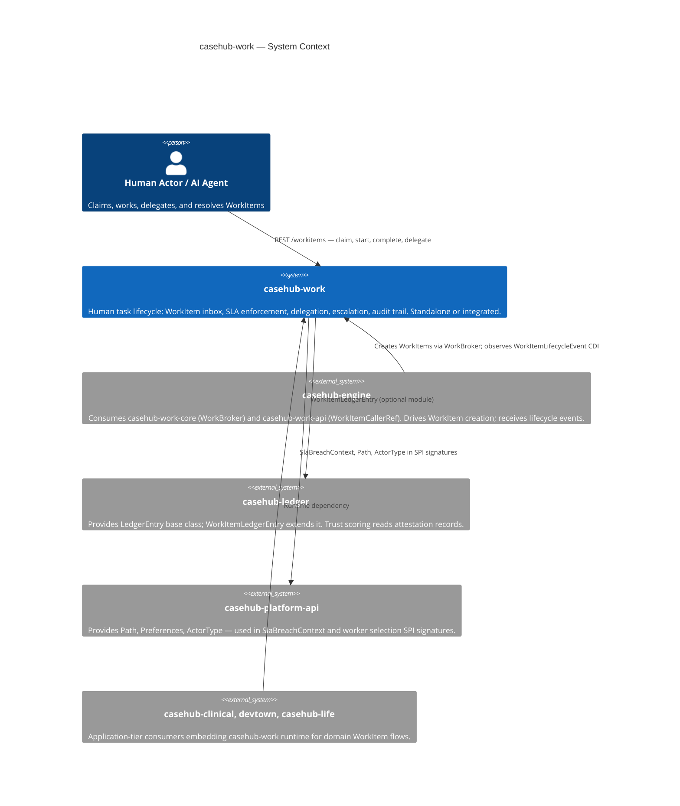
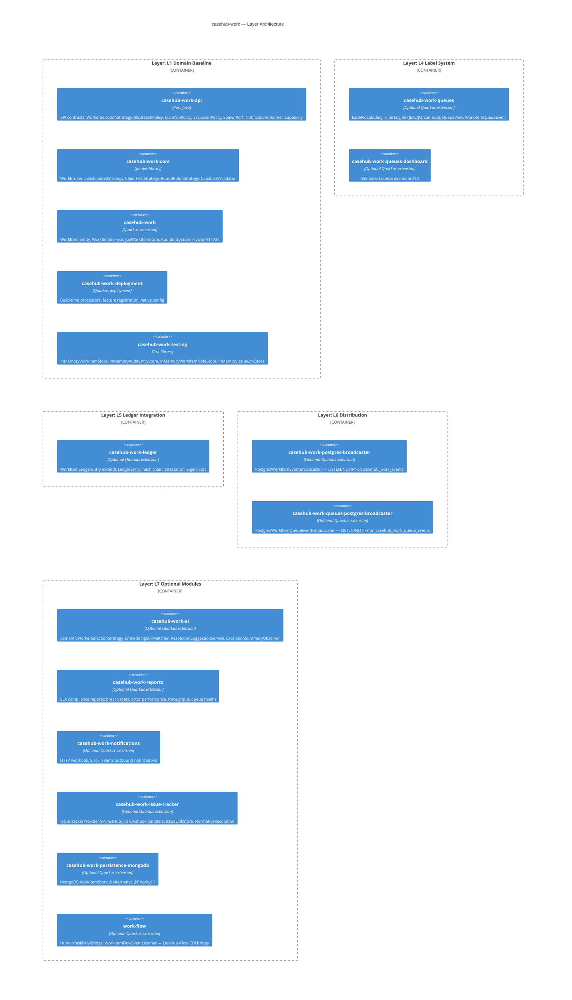
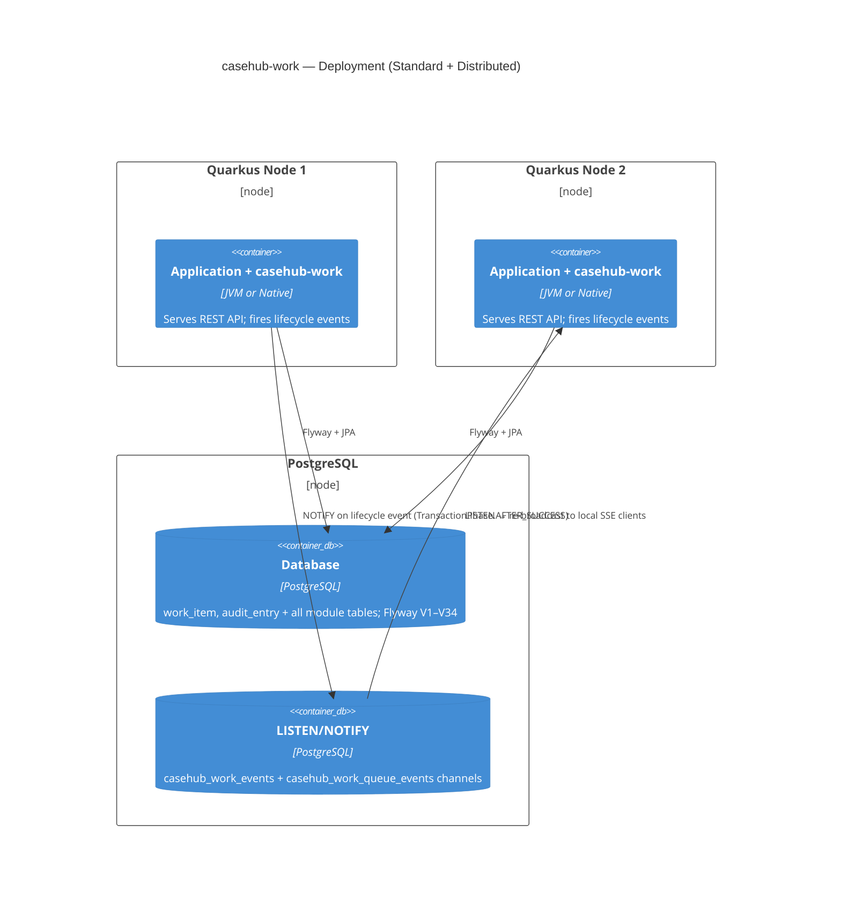

# CaseHub Work — ARC42STORIES.MD

**Spec:** Arc42Stories v0.1
**Profile:** CaseHub — Foundation tier
**Profile ref:** `../parent/docs/arc42stories-casehub-profile.md` · fallback: `https://raw.githubusercontent.com/casehubio/parent/main/docs/arc42stories-casehub-profile.md`
**Build position:** Foundation — depends on `casehub-platform-api` only (core); `casehub-ledger` optional
**Consumed by:** `casehub-engine` (work-adapter), `casehub-clinical`, `devtown`, `casehub-life`
**Depends on:** `casehub-platform-api` (compile, `api/` module only)

---

## §1 Introduction and Goals

### Description

CaseHub Work is a Quarkus extension that provides human-scale WorkItem lifecycle management: expiry, delegation, escalation, priority, SLA tracking, and audit trail. It is not a workflow engine, not a case manager, and not an agent mesh — those concerns belong to `casehub-engine`, `casehub-qhorus`, and Quarkus-Flow respectively. Any Quarkus application embeds it via CDI and REST resources without taking a dependency on any other casehubio module.

### Stakeholders

| Stakeholder | Interest |
|---|---|
| Quarkus app developer | Embeds the extension; configures `casehub.work.*` properties; wires CDI beans |
| Consumer repo (casehub-engine, casehub-clinical, devtown) | Calls REST or CDI API to create, claim, delegate, and complete WorkItems |
| Human task actor | Receives, claims, and resolves WorkItems via the inbox REST surface |
| AI agent | Polls or subscribes to WorkItem queues; delegates or escalates on SLA breach |
| Platform team | Maintains lifecycle contracts, SPI stability, and cross-repo protocol compliance |

### Quality Goals

| Priority | Goal | Scenario |
|---|---|---|
| 1 | SLA correctness | An expired WorkItem triggers its breach policy within one scheduler cycle, with no manual intervention |
| 2 | Isolation | The core extension compiles and passes unit tests without `casehub-ledger`, `casehub-qhorus`, or `casehub-engine` on the classpath |
| 3 | Zero-datasource unit testing | `WorkItemServiceTest` runs without Quarkus boot via `InMemoryWorkItemStore`, completing in under 1 s |

### Artifact Schema

| Artifact type | Format | Example | Where it lives |
|---|---|---|---|
| Issue | `#NNN` or `casehubio/work#NNN` | `#246` | GitHub Issues |
| ADR | `ADR-NNNN` | `ADR-0005` | `docs/adr/` |
| Garden entry | `GE-YYYYMMDD-XXXXXX` | `GE-20260522-9cd6d5` | `~/.hortora/garden/` |
| Protocol | `PP-YYYYMMDD-XXXXXX` | `PP-20260525-607b33` | `casehub-parent/docs/protocols/` |
| Design spec | `YYYY-MM-DD-topic-design` | `2026-04-14-tarkus-design` | `docs/specs/` |

---

## §2 Constraints

### Platform

| Constraint | Value |
|---|---|
| Java | 21 language level, running on JVM 26 |
| Framework | Quarkus 3.32.2 |
| Native target | GraalVM 25; verified startup 0.084 s |
| Build | `JAVA_HOME=$(/usr/libexec/java_home -v 26) mvn clean install` — use `mvn`, not `./mvnw` |

### Architectural Constraints

- Zero casehubio core deps: the `runtime/` module depends only on `casehub-platform-api`; all other casehubio integrations are optional or in separate modules
- Module naming: short names (`api/`, `runtime/`, `deployment/`) — no repo-prefix repetition (e.g. not `casehub-work-api/`)
- Flyway path scoping: all migrations live at `classpath:db/work/migration/` (PP-20260525-607b33)
- No auth on REST resources: consuming applications add `@RolesAllowed`; this extension ships auth-retrofit-readiness stubs only
- Test datasource: H2 `MODE=PostgreSQL` for unit and module tests; Testcontainers (real PostgreSQL) for dialect validation

---

## §3 Context and Scope



### Boundary Rules

What casehub-work explicitly does NOT do:

- Orchestrate case flow or interpret case state
- Interpret `callerRef` content — stored and echoed opaquely; convention: `casehub-engine` sets `"caseId:planItemId"`
- Provision AI agents — casehub-engine and Claudony own that
- Decide when to spawn child WorkItems — callers drive spawn via `SpawnPort`
- Implement trust scoring — casehub-ledger owns this; casehub-work fires events, ledger records and scores
- Determine when heterogeneous plan items all complete — casehub-engine; homogeneous M-of-N IS casehub-work

---

## §4 Solution Strategy

Foundation modules define their own layer taxonomy. casehub-work's layers represent the
internal architectural concerns added incrementally across 35 build Chapters:

### Layer Taxonomy

| Layer | Concern |
|---|---|
| L1 Domain Baseline | WorkItem + AuditEntry entities, Storage SPI, JPA defaults, WorkItemService — the inbox foundation |
| L2 REST API | WorkItemResource (7 sub-resources), DTOs, exception mappers, OpenAPI |
| L3 Lifecycle Engine | ExpiryCleanupJob, ClaimDeadlineJob, ClaimSlaPolicy SPI, SlaBreachPolicy SPI, CDI lifecycle events |
| L4 Label System | LabelVocabulary, MANUAL/INFERRED label persistence, FilterEngine (JEXL/JQ/Lambda), QueueView |
| L5 Ledger Integration | WorkItemLedgerEntry (JOINED from LedgerEntry), hash chain, peer attestation, EigenTrust |
| L6 Distribution | WorkItemEventBroadcaster SPI, LocalWorkItemEventBroadcaster @DefaultBean, PostgreSQL LISTEN/NOTIFY broadcaster |
| L7 Optional Modules | SLA reports, AI (semantic routing + LLM assist), notifications, issue tracker, MongoDB persistence, Quarkus-Flow bridge |

### Chapter Sequencing Rationale

Hard dependencies — order is non-negotiable:

- C1 before C2: REST requires the persisted WorkItem entity and service layer at runtime
- C2 before C3: lifecycle transitions require service methods to exist first
- C3 before C4: CDI events are emitted inside service transitions; transitions must exist
- C6 (Ledger) after C4: `LedgerEventCapture @Observes WorkItemLifecycleEvent` — the event bus must exist first
- C7 (Label Queues) before C16 (Confidence Routing): confidence-gated routing extends the filter engine from C7
- C18 (Module Separation) before C19 (Semantic AI + LLM Assist): semantic AI depends on the api/core SPI split
- C26 (Broadcaster SPI) before C27 (Distributed SSE): PostgreSQL broadcaster implements the SPI extracted in C26
- C33 (SlaBreachPolicy SPI) before C35 (Status Lifecycle): status correctness fixes (#243 EXPIRED in isTerminal, #244 Exhausted) depend on the sealed `BreachDecision` type from C33

---

## §5 Building Block View



### Module Index

| Folder | Artifact | Type | Purpose |
|---|---|---|---|
| `api/` | `casehub-work-api` | Pure Java SPI | WorkerSelectionStrategy, SlaBreachPolicy, BreachDecision (sealed), ClaimSlaPolicy, ExclusionPolicy, SpawnPort, NotificationChannel, Capability, WorkItemCallerRef; depends on `casehub-platform-api` |
| `core/` | `casehub-work-core` | Jandex library | WorkBroker, LeastLoadedStrategy, ClaimFirstStrategy, RoundRobinStrategy, CapabilityValidator; used by casehub-engine without pulling in JPA or REST |
| `runtime/` | `casehub-work` | Quarkus extension | WorkItem + AuditEntry entities, WorkItemService, WorkItemAssignmentService, ExpiryLifecycleService, REST resources (7), Flyway V1–V34 at `db/work/migration/` |
| `deployment/` | `casehub-work-deployment` | Quarkus deployment | Build-time processor, feature registration, `casehub.work.*` native config |
| `testing/` | `casehub-work-testing` | Test library | InMemoryWorkItemStore, InMemoryAuditEntryStore, InMemoryWorkItemNoteStore, InMemoryIssueLinkStore |
| `queues/` | `casehub-work-queues` | Optional extension | LabelVocabulary, MANUAL/INFERRED label persistence, FilterEngine (JEXL/JQ/Lambda), FilterChain, QueueView, WorkItemQueueEventBroadcaster SPI |
| `queues-dashboard/` | `casehub-work-queues-dashboard` | Optional extension | SSE queue dashboard UI |
| `ledger/` | `casehub-work-ledger` | Optional extension | WorkItemLedgerEntry (JOINED from LedgerEntry), LedgerEventCapture @Observes, EigenTrust; depends on `casehub-ledger` |
| `postgres-broadcaster/` | `casehub-work-postgres-broadcaster` | Optional extension | PostgresWorkItemEventBroadcaster @Alternative @Priority(1); no Flyway |
| `queues-postgres-broadcaster/` | `casehub-work-queues-postgres-broadcaster` | Optional extension | PostgresWorkItemQueueEventBroadcaster @Alternative @Priority(1); no Flyway |
| `ai/` | `casehub-work-ai` | Optional extension | SemanticWorkerSelectionStrategy @Alternative @Priority(1), EmbeddingSkillMatcher, ResolutionSuggestionService, EscalationSummaryObserver, Flyway V14 + V4001 |
| `reports/` | `casehub-work-reports` | Optional extension | SLA compliance REST reports, Caffeine 5-min TTL cache |
| `notifications/` | `casehub-work-notifications` | Optional extension | HTTP webhook, Slack, Teams; NotificationChannel SPI; Flyway V3000 |
| `issue-tracker/` | `casehub-work-issue-tracker` | Optional extension | IssueTrackerProvider SPI, IssueLinkStore SPI, GitHub/Jira webhook handlers, NormativeResolution; Flyway V5000–V5001 |
| `persistence-mongodb/` | `casehub-work-persistence-mongodb` | Optional extension | MongoDB WorkItemStore @Alternative @Priority(1) |
| `flow/` | `work-flow` | Optional extension | HumanTaskFlowBridge, WorkItemFlowEventListener |
| `integration-tests/` | — | Black-box test suite | @QuarkusIntegrationTest + native image validation (25 tests) |
| `examples/` | — | Runnable demos | POST /examples/{name}/run scenario runner |
| `flow-examples/` | — | Flow demos | Quarkus-Flow integration examples |
| `queues-examples/` | — | Queue demos | Queue and filter usage examples |

### WorkItem Domain Model

**WorkItemStatus** (10 values from `runtime/src/main/java/io/casehub/work/runtime/model/WorkItemStatus.java`):

| Status | Meaning | isTerminal() | isActive() |
|---|---|---|---|
| `PENDING` | Available for claiming; no assignee | false | true |
| `ASSIGNED` | Claimed; work not yet started | false | true |
| `IN_PROGRESS` | Actively being worked | false | true |
| `DELEGATED` | Forwarded to named actor; pending acceptance | false | true |
| `SUSPENDED` | On hold; will resume | false | true |
| `COMPLETED` | Resolved successfully | true | false |
| `REJECTED` | Declined by actor | true | false |
| `CANCELLED` | Externally cancelled | true | false |
| `EXPIRED` | Completion deadline passed | true | false |
| `ESCALATED` | All SLA breach policy branches exhausted; operator intervention required | true | false |

**Lifecycle transitions:**
```
PENDING → ASSIGNED (claim) | CANCELLED
ASSIGNED → IN_PROGRESS (start) | DELEGATED | RELEASED→PENDING | SUSPENDED | CANCELLED
IN_PROGRESS → COMPLETED | REJECTED | DELEGATED | SUSPENDED | CANCELLED
SUSPENDED → ASSIGNED | IN_PROGRESS (resume to priorStatus) | CANCELLED
DELEGATED → ASSIGNED (accept-delegation) | PENDING (decline, POOL path) | ASSIGNED (decline, DELEGATOR path)
any active → EXPIRED (SLA Fail) | PENDING (SLA EscalateTo) | ESCALATED (Chained exhausted)
```

---

## §6 Runtime View

### Scenario 1 — WorkItem creation with assignment

Actor or system POSTs to `POST /workitems`. `WorkItemService` validates the request against the template's `inputDataSchema` (via `FormSchemaValidationService` if set), persists the WorkItem as PENDING via `JpaWorkItemStore`, fires `WorkItemLifecycleEvent(CREATED)`. `WorkItemAssignmentService` observes CREATED and calls `WorkBroker` with the configured `WorkerSelectionStrategy`. If a pre-assignment resolves, status transitions to ASSIGNED; otherwise the item stays in the pool. If `casehub-work-ledger` is on the classpath, `LedgerEventCapture @Observes` fires asynchronously and appends a `WorkItemLedgerEntry`.

### Scenario 2 — SLA breach → Fail

`ExpiryCleanupJob` fires on schedule via `@Scheduled`. It calls `ExpiryLifecycleService.checkExpired()`, which scans all expired WorkItems and calls `SlaBreachPolicy.onBreach(SlaBreachContext)` per item:

- `BreachDecision.Fail` → WorkItem transitions to EXPIRED (terminal); `SlaBreachEvent` CDI fires; `EXPIRED` audit entry written
- `BreachDecision.EscalateTo(groups, deadline)` → item returns to PENDING with new candidate groups and deadline; `SLA_REASSIGNED` audit entry written; `WorkItemAssignmentService` pre-assigns via `SLA_ESCALATED` trigger
- `BreachDecision.Chained` → primary decision tried, fallback tried on failure; both exhausted → `executeExhausted()` → WorkItem transitions to ESCALATED (terminal)

`BreachExecutionFailed` exceptions are caught at item level — one misconfigured policy writes `BREACH_POLICY_MISCONFIGURED` audit and skips the item without rolling back the batch.

### Scenario 3 — Delegation accept/decline

Actor A (ASSIGNED or IN_PROGRESS) calls `PUT /workitems/{id}/delegate` → WorkItem transitions to DELEGATED, `claimDeadline` cleared. Actor B calls `PUT /workitems/{id}/accept-delegation` → ASSIGNED to B. Or Actor B calls `PUT /workitems/{id}/decline-delegation` → resolves `delegationDeclineTarget`: instance field `POOL` → PENDING (back to original candidate pool); instance field `DELEGATOR` → ASSIGNED back to Actor A. If no instance field, reads scope preference via `DeclineTarget.KEY` (default POOL).

---

## §7 Deployment View



### Deployment Variants

| Variant | Add to classpath | Capability gained |
|---|---|---|
| Minimal (evaluation) | `casehub-work` + H2 datasource | WorkItem lifecycle, SLA, REST API |
| Standard | `casehub-work` + PostgreSQL datasource | Full lifecycle with production datasource |
| Distributed cluster | + `casehub-work-postgres-broadcaster` | All nodes receive all SSE events via LISTEN/NOTIFY |
| Full audit | + `casehub-work-ledger` + `casehub-ledger` | Tamper-evident Merkle chain, EigenTrust scoring |
| AI routing | + `casehub-work-ai` + embedding provider | Semantic worker selection + LLM-assisted resolution |
| MongoDB | + `casehub-work-persistence-mongodb` | MongoDB WorkItemStore (drop-in, no datasource config change) |

---

## §8 Crosscutting Concepts

### Convention References

| Concern | Protocol |
|---|---|
| Module tier structure | `docs/protocols/universal/module-tier-structure.md` — pure-Java SPI / Jandex library / Quarkus extension three-tier rule |
| Flyway migrations | `docs/protocols/casehub/flyway-version-range-allocation.md` — V1–V999 runtime; V2000+ ledger subclass; optional modules own dedicated ranges (ai: V14+V4001, notifications: V3000, issue-tracker: V5000) |
| Flyway path scoping | PP-20260525-607b33 — all migrations at `db/work/migration/`; consumers set `quarkus.flyway.locations=classpath:db/work/migration` explicitly; Flyway auto-registration does not exist |
| CDI displacement | `docs/protocols/casehub/alternative-extension-patterns.md` — `@DefaultBean` displaced by `@Alternative @Priority(1)` via classpath presence; no consumer config change |
| SPI placement | `docs/PLATFORM.md` §Step 4 — consumer-facing SPIs in `api/`; `@DefaultBean` impls in `api/` when pure Java, in `runtime/` when JPA or config deps apply |
| Persistence backend priority | `docs/protocols/universal/persistence-backend-cdi-priority.md` — `@DefaultBean` → `@ApplicationScoped` → `@Alternative @Priority(1)` ladder |
| Auth readiness | `docs/protocols/casehub/auth-retrofit-readiness.md` — no `@RolesAllowed` in the extension; REST resources stay thin enough for retrofit |
| Capability vocabulary | `docs/adr/0003-capability-vocabulary-as-validated-value-type.md`, `docs/adr/0004-capability-validation-mode-as-deployment-config.md` |

### Anti-Patterns

**Symptom:** Augmentation fails with `UnsatisfiedResolutionException` for `PreferenceProvider` while all `@QuarkusTest` tests pass.
**Cause:** `casehub-platform` mock module added as `<scope>test</scope>` in a module that declares `<goal>build</goal>` in the `quarkus-maven-plugin`. Production augmentation validates CDI without the test classpath — `MockPreferenceProvider @DefaultBean` is invisible at augmentation time.
**Fix:** Change `casehub-platform` to `<scope>runtime</scope>` in modules that run `quarkus:build`. Keep `<scope>test</scope>` in library and extension modules that do not run `quarkus:build`.

**Symptom:** After adding a new non-terminal `WorkItemStatus` value, the expiry scheduler silently skips items in that status.
**Cause:** `WorkItemQuery.expired()` and `WorkItemQuery.claimExpired()` filter on explicit status sets. A new active status absent from those sets is invisible to `ExpiryCleanupJob`.
**Fix:** Whenever adding a new non-terminal `WorkItemStatus` value, update three places atomically: `WorkItemStatus.isActive()`, `WorkItemStatus.isTerminal()`, and the status predicates inside `WorkItemQuery.expired()` / `WorkItemQuery.claimExpired()`.

**Symptom:** SSE clients receive lifecycle events for WorkItems whose creating transaction rolled back.
**Cause:** A `WorkItemEventBroadcaster` observer fires during the transaction (before commit). If the transaction rolls back, the event was already dispatched.
**Fix:** Annotate all broadcaster `@Observes` methods with `during = TransactionPhase.AFTER_SUCCESS`. Never dispatch from `@Observes` without this parameter.

**Symptom:** Two concurrent claim requests on different cluster nodes both succeed — the same WorkItem is assigned to two actors.
**Cause:** `WorkItemStore.put()` without optimistic locking allows concurrent writers to overwrite each other's state.
**Fix:** `WorkItem` carries `@Version long version`; concurrent claim produces `OptimisticLockException` which `WorkItemResource` maps to HTTP 409 Conflict. The second claimer must retry claim.

---

## §9 Journeys and Chapters

### §9.1 Journey Overview

| Journey | Description | Chapters | Status |
|---|---|---|---|
| Core Platform | Domain baseline, REST API, lifecycle engine, CDI events, Quarkus-Flow, ledger, label queues, native image, WorkItemTemplate, model enrichment, audit history, subprocess spawn, atomic claim + schedule dedup, ClaimSlaPolicy SPI | C1–C15 | ✅ Complete |
| Enterprise Capabilities | Confidence-gated routing, worker selection strategy, module separation, semantic AI + LLM assist, MongoDB persistence, issue tracker, SLA reporting, multi-instance, business hours, notifications, broadcaster SPI, distributed SSE | C16–C27 | ✅ Complete |
| Lifecycle Enrichment | Named outcomes, template data schemas, conflict-of-interest exclusions, enforced builder, round-robin strategy, SlaBreachPolicy SPI + escalation removal, capability vocabulary, status lifecycle fixes + DELEGATED | C28–C35 | ✅ Complete |


### §9.2 Chapter Index

| # | Chapter | Journey | Key issues | Status |
|---|---|---|---|---|
| C1 | Domain Baseline | Core Platform | Phase 1 | ✅ |
| C2 | REST API | Core Platform | Phase 2 | ✅ |
| C3 | Lifecycle Engine | Core Platform | Phase 3 | ✅ |
| C4 | CDI Events | Core Platform | Phase 4 | ✅ |
| C5 | Quarkus-Flow Integration | Core Platform | Phase 5, #37, #38 | ✅ |
| C6 | Ledger Module | Core Platform | Phase 6, #45, ADR-0001 | ✅ |
| C7 | Label-Based Queues | Core Platform | Phase 7, #72, ADR-0002 | ✅ |
| C8 | Native Image | Core Platform | Phase 8 | ✅ |
| C9 | Form Schema *(superseded by C29)* | Core Platform | #107, #108 | ✅ |
| C10 | WorkItemTemplate | Core Platform | #76 | ✅ |
| C11 | WorkItem Model Enrichment | Core Platform | #74, #75, #82–#89, #91 | ✅ |
| C12 | Audit History API | Core Platform | Phase 10, #109–#111 | ✅ |
| C13 | Subprocess Spawn | Core Platform | SpawnPort SPI, V17+V18 | ✅ |
| C14 | Atomic Claim + Schedule Dedup | Core Platform | #94, #96 | ✅ |
| C15 | ClaimSlaPolicy SPI | Core Platform | #125 | ✅ |
| C16 | Confidence-Gated Routing | Enterprise Capabilities | Phase 11, #112–#114 | ✅ |
| C17 | Worker Selection Strategy | Enterprise Capabilities | Phase 12, #115–#116 | ✅ |
| C18 | Module Separation | Enterprise Capabilities | #118 | ✅ |
| C19 | Semantic Skill Matching + LLM Assist | Enterprise Capabilities | #121, #124, #126, V4001 | ✅ |
| C20 | MongoDB Persistence | Enterprise Capabilities | persistence-mongodb module | ✅ |
| C21 | Issue Tracker | Enterprise Capabilities | #73, #156–#161 | ✅ |
| C22 | SLA Compliance Reporting | Enterprise Capabilities | Phase 14, #142–#145 | ✅ |
| C23 | Multi-Instance WorkItems | Enterprise Capabilities | Phase 15, #106 | ✅ |
| C24 | Business-Hours Deadlines | Enterprise Capabilities | Phase 16 | ✅ |
| C25 | Notifications | Enterprise Capabilities | Phase 17, #140–#141 | ✅ |
| C26 | Broadcaster SPI | Enterprise Capabilities | Phase 18, #147, #150 | ✅ |
| C27 | Distributed SSE + Queue Broadcaster | Enterprise Capabilities | Phase 19+20, #93, #155 | ✅ |
| C28 | Named Outcomes | Lifecycle Enrichment | Phase 21, #169, #176, #178 | ✅ |
| C29 | Template Data Schemas | Lifecycle Enrichment | Phase 22, #170 — *supersedes C9* | ✅ |
| C30 | Conflict-of-Interest Exclusions | Lifecycle Enrichment | Phase 23, #171, #186, #192, ADR-0005 | ✅ |
| C31 | WorkItemCreateRequest Builder | Lifecycle Enrichment | Phase 24, #182 | ✅ |
| C32 | Round-Robin Strategy | Lifecycle Enrichment | #117, #200, #202, #203 | ✅ |
| C33 | SlaBreachPolicy SPI + Escalation Removal | Lifecycle Enrichment | Phase 25+26, #212–#216 | ✅ |
| C34 | Capability Vocabulary | Lifecycle Enrichment | #220, ADR-0003, ADR-0004 | ✅ |
| C35 | Status Lifecycle Fixes + DELEGATED | Lifecycle Enrichment | Phase 27, #241, #243–#245 | ✅ |

**Layer × Chapter matrix** (High/Med/Low/—):

| Layer | C1 | C2 | C3 | C4 | C5 | C6 | C7 | C8 | C9 | C10 | C11 | C12 | C13 | C14 | C15 |
|---|---|---|---|---|---|---|---|---|---|---|---|---|---|---|---|
| L1 Domain Baseline | **H** | L | — | L | — | — | — | — | L | **M** | **M** | L | **M** | **M** | L |
| L2 REST API | — | **H** | — | — | — | — | — | — | — | — | L | **M** | — | — | — |
| L3 Lifecycle Engine | — | — | **H** | **M** | — | — | — | — | — | — | — | — | — | — | **M** |
| L4 Label System | — | — | — | — | — | — | **H** | — | — | — | — | — | — | — | — |
| L5 Ledger Integration | — | — | — | — | — | **H** | — | — | — | — | — | — | — | — | — |
| L6 Distribution | — | — | — | — | — | — | — | — | — | — | — | — | — | — | — |
| L7 Optional Modules | — | — | — | — | **M** | — | — | — | — | — | — | — | — | — | — |

| Layer | C16 | C17 | C18 | C19 | C20 | C21 | C22 | C23 | C24 | C25 | C26 | C27 |
|---|---|---|---|---|---|---|---|---|---|---|---|---|
| L1 Domain Baseline | L | **M** | **M** | — | — | — | — | **M** | L | — | — | — |
| L2 REST API | — | — | — | — | — | — | — | — | — | — | — | — |
| L3 Lifecycle Engine | — | — | — | — | — | — | — | **M** | **M** | — | — | — |
| L4 Label System | **M** | — | — | — | — | — | — | — | — | — | — | — |
| L5 Ledger Integration | — | — | — | — | — | — | — | — | — | — | — | — |
| L6 Distribution | — | — | — | — | — | — | — | — | — | — | **M** | **H** |
| L7 Optional Modules | — | — | **M** | **M** | **M** | **M** | **M** | — | — | **H** | — | — |

| Layer | C28 | C29 | C30 | C31 | C32 | C33 | C34 | C35 |
|---|---|---|---|---|---|---|---|---|
| L1 Domain Baseline | **M** | **M** | **M** | L | — | L | **M** | **M** |
| L2 REST API | L | L | — | L | — | — | — | — |
| L3 Lifecycle Engine | — | — | — | — | **M** | **H** | — | **M** |
| L4 Label System | — | — | — | — | — | — | — | — |
| L5 Ledger Integration | — | — | — | — | — | — | — | — |
| L6 Distribution | — | — | — | — | — | — | — | — |
| L7 Optional Modules | — | — | — | — | — | — | — | — |

**Sequencing rationale:**
- C1 before C2: REST requires the persisted WorkItem entity and service layer at runtime
- C2 before C3: lifecycle transitions require service methods to exist
- C3 before C4: CDI events are emitted inside service transitions; transitions must exist first
- C6 (Ledger) after C4: `LedgerEventCapture @Observes WorkItemLifecycleEvent` — the event bus must exist
- C7 (Label Queues) before C16 (Confidence Routing): C16 extends the filter engine from C7
- C18 (Module Separation) before C19 (Semantic AI): semantic AI depends on the api/core SPI split
- C26 (Broadcaster SPI) before C27 (Distributed SSE): PostgreSQL broadcaster implements the SPI from C26
- C33 (SlaBreachPolicy SPI) before C35 (Status Lifecycle): C35 status correctness (#243 EXPIRED in isTerminal, #244 Exhausted) depends on sealed `BreachDecision` from C33
