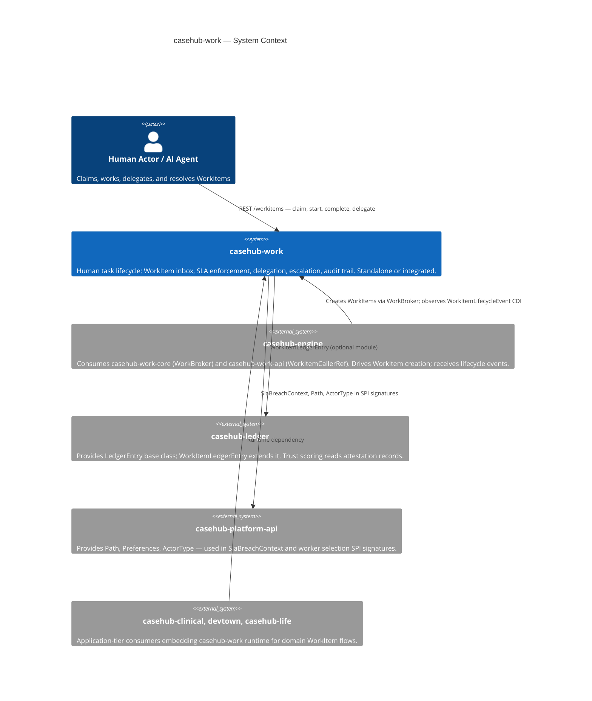
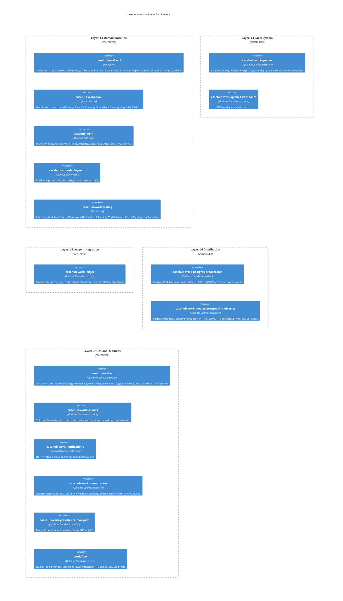

# CaseHub Work — ARC42STORIES.MD

**Spec:** Arc42Stories v0.1
**Profile:** CaseHub — Foundation tier
**Profile ref:** `../parent/docs/arc42stories-casehub-profile.md` · fallback: `https://raw.githubusercontent.com/casehubio/parent/main/docs/arc42stories-casehub-profile.md`
**Build position:** Foundation — depends on `casehub-platform-api` only (core); `casehub-ledger` optional
**Consumed by:** `casehub-engine` (work-adapter), `casehub-clinical`, `devtown`, `casehub-life`
**Depends on:** `casehub-platform-api` (compile, `api/` module only)

---

## §1 Introduction and Goals

### Description

CaseHub Work is a Quarkus extension that provides human-scale WorkItem lifecycle management: expiry, delegation, escalation, priority, SLA tracking, and audit trail. It is not a workflow engine, not a case manager, and not an agent mesh — those concerns belong to `casehub-engine`, `casehub-qhorus`, and Quarkus-Flow respectively. Any Quarkus application embeds it via CDI and REST resources without taking a dependency on any other casehubio module.

### Stakeholders

| Stakeholder | Interest |
|---|---|
| Quarkus app developer | Embeds the extension; configures `casehub.work.*` properties; wires CDI beans |
| Consumer repo (casehub-engine, casehub-clinical, devtown) | Calls REST or CDI API to create, claim, delegate, and complete WorkItems |
| Human task actor | Receives, claims, and resolves WorkItems via the inbox REST surface |
| AI agent | Polls or subscribes to WorkItem queues; delegates or escalates on SLA breach |
| Platform team | Maintains lifecycle contracts, SPI stability, and cross-repo protocol compliance |

### Quality Goals

| Priority | Goal | Scenario |
|---|---|---|
| 1 | SLA correctness | An expired WorkItem triggers its breach policy within one scheduler cycle, with no manual intervention |
| 2 | Isolation | The core extension compiles and passes unit tests without `casehub-ledger`, `casehub-qhorus`, or `casehub-engine` on the classpath |
| 3 | Zero-datasource unit testing | `WorkItemServiceTest` runs without Quarkus boot via `InMemoryWorkItemStore`, completing in under 1 s |

### Artifact Schema

| Artifact type | Format | Example | Where it lives |
|---|---|---|---|
| Issue | `#NNN` or `casehubio/work#NNN` | `#246` | GitHub Issues |
| ADR | `ADR-NNNN` | `ADR-0005` | `docs/adr/` |
| Garden entry | `GE-YYYYMMDD-XXXXXX` | `GE-20260522-9cd6d5` | `~/.hortora/garden/` |
| Protocol | `PP-YYYYMMDD-XXXXXX` | `PP-20260525-607b33` | `casehub-parent/docs/protocols/` |
| Design spec | `YYYY-MM-DD-topic-design` | `2026-04-14-tarkus-design` | `docs/specs/` |

---

## §2 Constraints

### Platform

| Constraint | Value |
|---|---|
| Java | 21 language level, running on JVM 26 |
| Framework | Quarkus 3.32.2 |
| Native target | GraalVM 25; verified startup 0.084 s |
| Build | `JAVA_HOME=$(/usr/libexec/java_home -v 26) mvn clean install` — use `mvn`, not `./mvnw` |

### Architectural Constraints

- Zero casehubio core deps: the `runtime/` module depends only on `casehub-platform-api`; all other casehubio integrations are optional or in separate modules
- Module naming: short names (`api/`, `runtime/`, `deployment/`) — no repo-prefix repetition (e.g. not `casehub-work-api/`)
- Flyway path scoping: all migrations live at `classpath:db/work/migration/` (PP-20260525-607b33)
- No auth on REST resources: consuming applications add `@RolesAllowed`; this extension ships auth-retrofit-readiness stubs only
- Test datasource: H2 `MODE=PostgreSQL` for unit and module tests; Testcontainers (real PostgreSQL) for dialect validation

---

## §3 Context and Scope



### Boundary Rules

What casehub-work explicitly does NOT do:

- Orchestrate case flow or interpret case state
- Interpret `callerRef` content — stored and echoed opaquely; convention: `casehub-engine` sets `"caseId:planItemId"`
- Provision AI agents — casehub-engine and Claudony own that
- Decide when to spawn child WorkItems — callers drive spawn via `SpawnPort`
- Implement trust scoring — casehub-ledger owns this; casehub-work fires events, ledger records and scores
- Determine when heterogeneous plan items all complete — casehub-engine; homogeneous M-of-N IS casehub-work

---

## §4 Solution Strategy

Foundation modules define their own layer taxonomy. casehub-work's layers represent the
internal architectural concerns added incrementally across 35 build Chapters:

### Layer Taxonomy

| Layer | Concern |
|---|---|
| L1 Domain Baseline | WorkItem + AuditEntry entities, Storage SPI, JPA defaults, WorkItemService — the inbox foundation |
| L2 REST API | WorkItemResource (7 sub-resources), DTOs, exception mappers, OpenAPI |
| L3 Lifecycle Engine | ExpiryCleanupJob, ClaimDeadlineJob, ClaimSlaPolicy SPI, SlaBreachPolicy SPI, CDI lifecycle events |
| L4 Label System | LabelVocabulary, MANUAL/INFERRED label persistence, FilterEngine (JEXL/JQ/Lambda), QueueView |
| L5 Ledger Integration | WorkItemLedgerEntry (JOINED from LedgerEntry), hash chain, peer attestation, EigenTrust |
| L6 Distribution | WorkItemEventBroadcaster SPI, LocalWorkItemEventBroadcaster @DefaultBean, PostgreSQL LISTEN/NOTIFY broadcaster |
| L7 Optional Modules | SLA reports, AI (semantic routing + LLM assist), notifications, issue tracker, MongoDB persistence, Quarkus-Flow bridge |

### Chapter Sequencing Rationale

Hard dependencies — order is non-negotiable:

- C1 before C2: REST requires the persisted WorkItem entity and service layer at runtime
- C2 before C3: lifecycle transitions require service methods to exist first
- C3 before C4: CDI events are emitted inside service transitions; transitions must exist
- C6 (Ledger) after C4: `LedgerEventCapture @Observes WorkItemLifecycleEvent` — the event bus must exist first
- C7 (Label Queues) before C16 (Confidence Routing): confidence-gated routing extends the filter engine from C7
- C18 (Module Separation) before C19 (Semantic AI + LLM Assist): semantic AI depends on the api/core SPI split
- C26 (Broadcaster SPI) before C27 (Distributed SSE): PostgreSQL broadcaster implements the SPI extracted in C26
- C33 (SlaBreachPolicy SPI) before C35 (Status Lifecycle): status correctness fixes (#243 EXPIRED in isTerminal, #244 Exhausted) depend on the sealed `BreachDecision` type from C33

---

## §5 Building Block View



### Module Index

| Folder | Artifact | Type | Purpose |
|---|---|---|---|
| `api/` | `casehub-work-api` | Pure Java SPI | WorkerSelectionStrategy, SlaBreachPolicy, BreachDecision (sealed), ClaimSlaPolicy, ExclusionPolicy, SpawnPort, NotificationChannel, Capability, WorkItemCallerRef; depends on `casehub-platform-api` |
| `core/` | `casehub-work-core` | Jandex library | WorkBroker, LeastLoadedStrategy, ClaimFirstStrategy, RoundRobinStrategy, CapabilityValidator; used by casehub-engine without pulling in JPA or REST |
| `runtime/` | `casehub-work` | Quarkus extension | WorkItem + AuditEntry entities, WorkItemService, WorkItemAssignmentService, ExpiryLifecycleService, REST resources (7), Flyway V1–V34 at `db/work/migration/` |
| `deployment/` | `casehub-work-deployment` | Quarkus deployment | Build-time processor, feature registration, `casehub.work.*` native config |
| `testing/` | `casehub-work-testing` | Test library | InMemoryWorkItemStore, InMemoryAuditEntryStore, InMemoryWorkItemNoteStore, InMemoryIssueLinkStore |
| `queues/` | `casehub-work-queues` | Optional extension | LabelVocabulary, MANUAL/INFERRED label persistence, FilterEngine (JEXL/JQ/Lambda), FilterChain, QueueView, WorkItemQueueEventBroadcaster SPI |
| `queues-dashboard/` | `casehub-work-queues-dashboard` | Optional extension | SSE queue dashboard UI |
| `ledger/` | `casehub-work-ledger` | Optional extension | WorkItemLedgerEntry (JOINED from LedgerEntry), LedgerEventCapture @Observes, EigenTrust; depends on `casehub-ledger` |
| `postgres-broadcaster/` | `casehub-work-postgres-broadcaster` | Optional extension | PostgresWorkItemEventBroadcaster @Alternative @Priority(1); no Flyway |
| `queues-postgres-broadcaster/` | `casehub-work-queues-postgres-broadcaster` | Optional extension | PostgresWorkItemQueueEventBroadcaster @Alternative @Priority(1); no Flyway |
| `ai/` | `casehub-work-ai` | Optional extension | SemanticWorkerSelectionStrategy @Alternative @Priority(1), EmbeddingSkillMatcher, ResolutionSuggestionService, EscalationSummaryObserver, Flyway V14 + V4001 |
| `reports/` | `casehub-work-reports` | Optional extension | SLA compliance REST reports, Caffeine 5-min TTL cache |
| `notifications/` | `casehub-work-notifications` | Optional extension | HTTP webhook, Slack, Teams; NotificationChannel SPI; Flyway V3000 |
| `issue-tracker/` | `casehub-work-issue-tracker` | Optional extension | IssueTrackerProvider SPI, IssueLinkStore SPI, GitHub/Jira webhook handlers, NormativeResolution; Flyway V5000–V5001 |
| `persistence-mongodb/` | `casehub-work-persistence-mongodb` | Optional extension | MongoDB WorkItemStore @Alternative @Priority(1) |
| `flow/` | `work-flow` | Optional extension | HumanTaskFlowBridge, WorkItemFlowEventListener |
| `integration-tests/` | — | Black-box test suite | @QuarkusIntegrationTest + native image validation (25 tests) |
| `examples/` | — | Runnable demos | POST /examples/{name}/run scenario runner |
| `flow-examples/` | — | Flow demos | Quarkus-Flow integration examples |
| `queues-examples/` | — | Queue demos | Queue and filter usage examples |

### WorkItem Domain Model

**WorkItemStatus** (10 values from `runtime/src/main/java/io/casehub/work/runtime/model/WorkItemStatus.java`):

| Status | Meaning | isTerminal() | isActive() |
|---|---|---|---|
| `PENDING` | Available for claiming; no assignee | false | true |
| `ASSIGNED` | Claimed; work not yet started | false | true |
| `IN_PROGRESS` | Actively being worked | false | true |
| `DELEGATED` | Forwarded to named actor; pending acceptance | false | true |
| `SUSPENDED` | On hold; will resume | false | true |
| `COMPLETED` | Resolved successfully | true | false |
| `REJECTED` | Declined by actor | true | false |
| `CANCELLED` | Externally cancelled | true | false |
| `EXPIRED` | Completion deadline passed | true | false |
| `ESCALATED` | All SLA breach policy branches exhausted; operator intervention required | true | false |

**Lifecycle transitions:**
```
PENDING → ASSIGNED (claim) | CANCELLED
ASSIGNED → IN_PROGRESS (start) | DELEGATED | RELEASED→PENDING | SUSPENDED | CANCELLED
IN_PROGRESS → COMPLETED | REJECTED | DELEGATED | SUSPENDED | CANCELLED
SUSPENDED → ASSIGNED | IN_PROGRESS (resume to priorStatus) | CANCELLED
DELEGATED → ASSIGNED (accept-delegation) | PENDING (decline, POOL path) | ASSIGNED (decline, DELEGATOR path)
any active → EXPIRED (SLA Fail) | PENDING (SLA EscalateTo) | ESCALATED (Chained exhausted)
```
