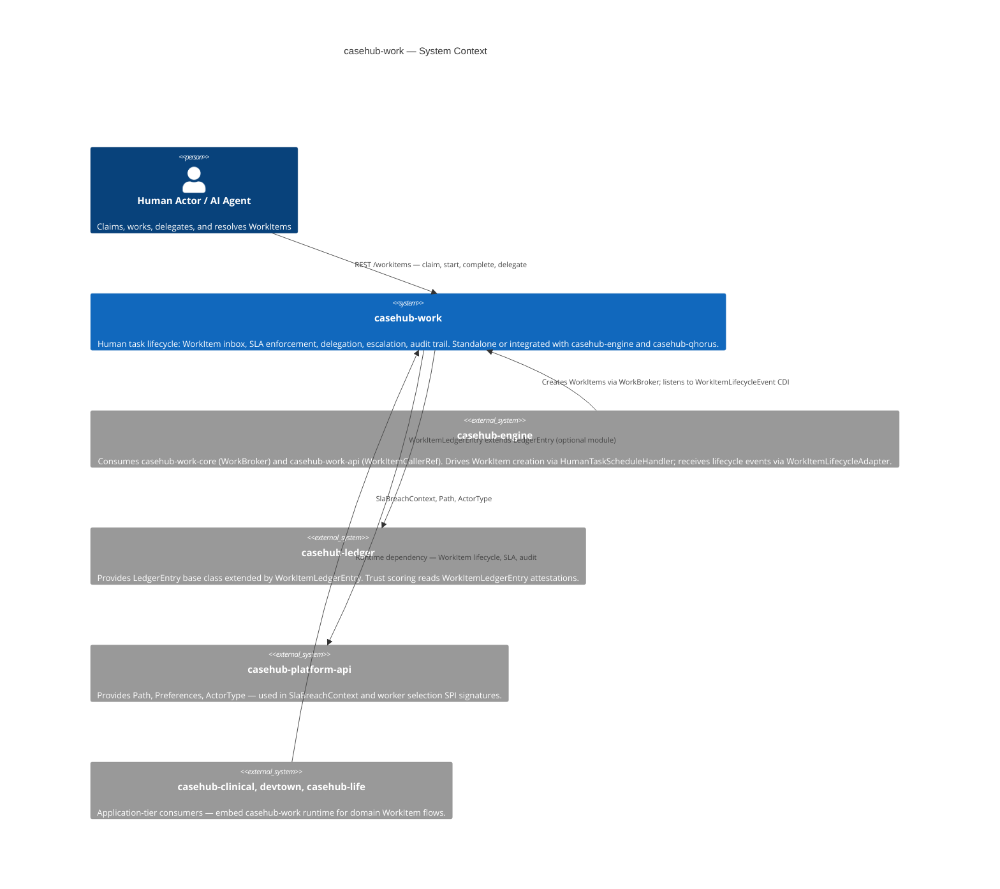
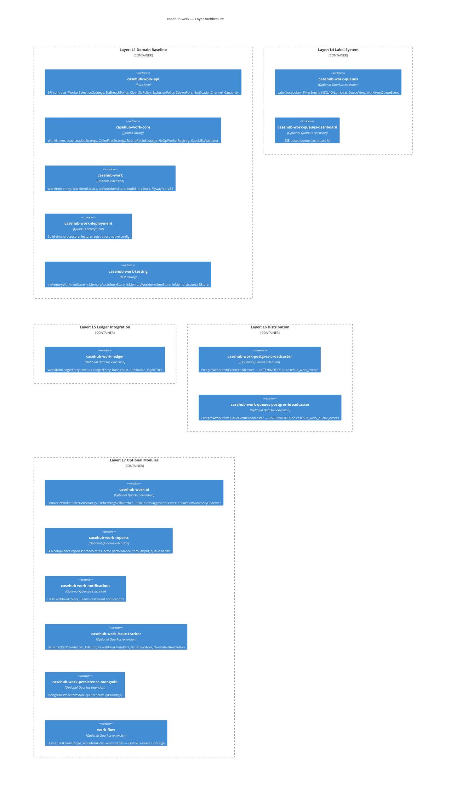
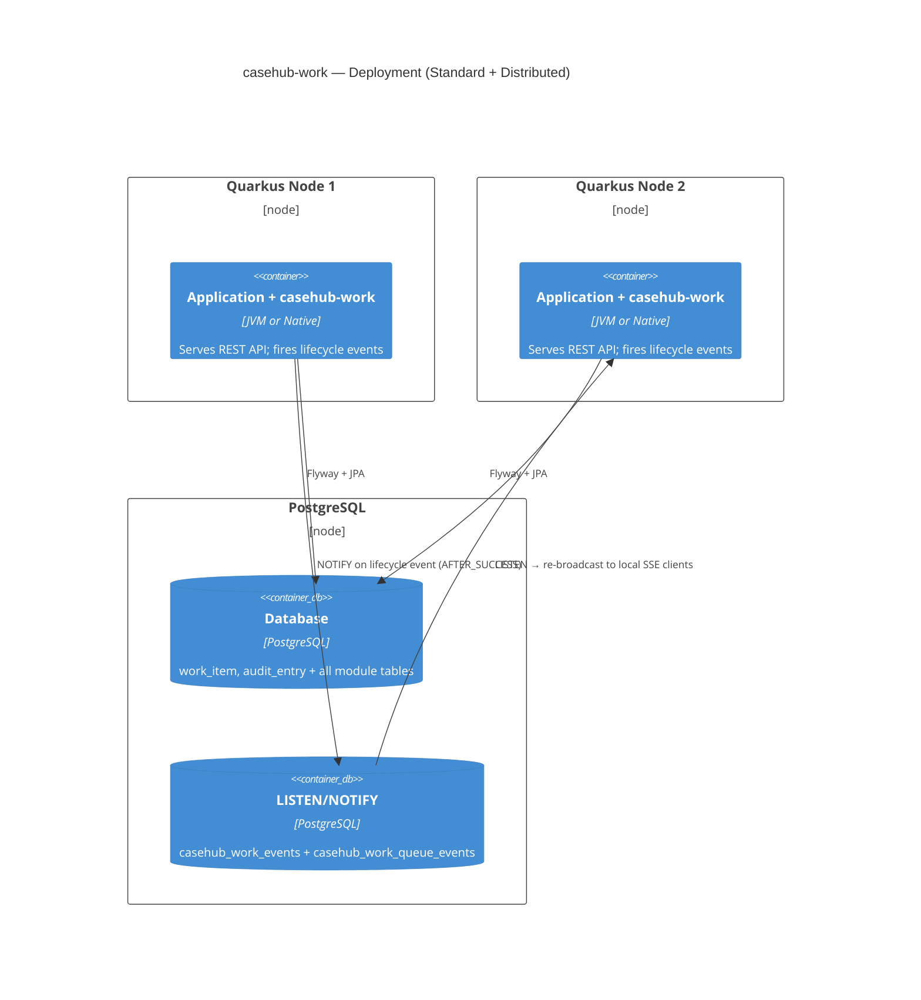

# ARC42STORIES.MD Migration Implementation Plan

> **For agentic workers:** REQUIRED SUB-SKILL: Use superpowers:subagent-driven-development (recommended) or superpowers:executing-plans to implement this plan task-by-task. Steps use checkbox (`- [ ]`) syntax for tracking.

**Goal:** Write `ARC42STORIES.MD` at the casehub-work project root, retiring `docs/DESIGN.md` and `docs/ARCHITECTURE.md`.

**Architecture:** Foundation-tier ARC42STORIES.MD following arc42stories-spec.md directly (not the CaseHub profile application-tier taxonomy). 35 chapters across 3 journeys, 7 internal layers (L1–L7). Source of truth is the codebase — existing docs are a completeness checklist only.

**Tech Stack:** Markdown (ARC42STORIES.MD), Mermaid diagrams (C4Context, C4Container, C4Deployment, flowchart), Arc42Stories v0.1 spec, CaseHub foundation tier preamble.

**Critical rules for every writing task:**
- Apply mode discipline from `arc42stories-spec.md §Writing Style` for each section type
- No prose narrative in reference/lookup sections — tables and bullets only
- Anti-slop: no "seamlessly", "robust", "powerful", "leverage", "streamline", "ensure"
- Active specific verbs: "displaces", "fires", "opens", "appends" — not "is designed to", "allows for"
- §9.4 Key files: one sentence per file describing what it IS and what it DOES
- §9.4 Gotchas: **Symptom:** → **Cause:** → **Fix:** — Fix is the exact action, not a direction

**Spec:** `docs/specs/2026-06-04-arc42stories-migration-design.md`

---

## File Structure

| Action | Path | Purpose |
|---|---|---|
| Create | `ARC42STORIES.MD` | Primary architecture record — all sections §1–§13 |
| Delete | `docs/DESIGN.md` | Retired — content absorbed into ARC42STORIES.MD §9, §11, §12 |
| Delete | `docs/ARCHITECTURE.md` | Retired — content absorbed into §5, §6, §7, §8, §13 |
| Modify | `CLAUDE.md` | Update §Design Document section to reference ARC42STORIES.MD |

---

## Task 1: Scaffold + Preamble + §1–§2

**Files:**
- Create: `ARC42STORIES.MD`

- [ ] **Step 1: Create the file with preamble and §1**

Write `ARC42STORIES.MD` starting with the foundation-tier preamble, then §1 Introduction and Goals. Do not copy from DESIGN.md or ARCHITECTURE.md — write from the design spec.

```markdown
# CaseHub Work — ARC42STORIES.MD

**Spec:** Arc42Stories v0.1
**Profile:** CaseHub — Foundation tier
**Profile ref:** `../parent/docs/arc42stories-casehub-profile.md` · fallback: `https://raw.githubusercontent.com/casehubio/parent/main/docs/arc42stories-casehub-profile.md`
**Build position:** Foundation — depends on `casehub-platform-api` only (core); `casehub-ledger` optional
**Consumed by:** `casehub-engine` (work-adapter), `casehub-clinical`, `devtown`, `casehub-life`
**Depends on:** `casehub-platform-api` (compile, `api/` module only)

---

## §1 Introduction and Goals

### Description

`casehub-work` is the **human task lifecycle layer** of the CaseHub foundation. Any Quarkus
application adds `casehub-work` as a dependency and gets a WorkItem inbox — creation, assignment,
SLA enforcement, delegation, escalation, and audit trail — independently of any orchestration
engine or agent mesh.

Not a workflow engine. Not a case manager. Not an agent communication mesh. The layer that sits
between those systems and the human who needs to make decisions.

### Stakeholders

| Stakeholder | Interest |
|---|---|
| Quarkus application developer | Embeds casehub-work as a library; gets a task inbox with zero infrastructure beyond a datasource |
| Consumer repo (casehub-engine, casehub-clinical, devtown) | Depends on `casehub-work-api` and `casehub-work-core` for WorkItem types and routing primitives |
| Human task actor | Claims, works, delegates, and resolves WorkItems via REST or Claudony dashboard |
| AI agent | Creates and completes WorkItems; receives routed tasks via semantic skill matching |
| Platform team | Validates that the foundation is correct, extensible, and isolated from domain concerns |

### Quality Goals

| Priority | Goal | Scenario |
|---|---|---|
| 1 | SLA correctness | A WorkItem that breaches its deadline triggers the configured breach policy — no item silently stays active past its deadline |
| 2 | Isolation | The core extension has zero casehubio dependencies beyond `casehub-platform-api`; optional modules add capabilities without touching the core |
| 3 | Zero-datasource unit testing | Every service is testable without Quarkus or a database via `casehub-work-testing` in-memory stores |

### Artifact Schema

| Artifact | Format | Example | Where |
|---|---|---|---|
| Issue | `#NNN` or `casehubio/work#NNN` | `#245` | GitHub Issues |
| ADR | `ADR-NNNN` | `ADR-0005` | `docs/adr/` |
| Garden entry | `GE-YYYYMMDD-XXXXXX` | `GE-20260522-9cd6d5` | `~/.hortora/garden/` |
| Protocol | `PP-YYYYMMDD-XXXXXX` | `PP-20260525-607b33` | `casehub-parent/docs/protocols/` |
| Design spec | `YYYY-MM-DD-topic-design` | `2026-04-14-tarkus-design` | `docs/specs/` |

---

## §2 Constraints

### Platform

| Constraint | Value |
|---|---|
| Java | Java 21 (on JVM 26) — `maven.compiler.release=21` |
| Framework | Quarkus 3.32.2 (from `casehub-parent` BOM) |
| Native target | GraalVM 25 — validated 0.084s startup |
| Build | `JAVA_HOME=$(/usr/libexec/java_home -v 26) mvn clean install` — use `mvn` not `./mvnw` |
| Test datasource | H2 `MODE=PostgreSQL` for unit tests; Testcontainers for dialect validation |
| Production datasource | PostgreSQL |

### Architectural

- **Zero casehubio core deps:** `casehub-work` runtime depends only on `casehub-platform-api`; optional modules may add `casehub-ledger`
- **Module naming:** short names (`api/`, `runtime/`, `deployment/`) — no repo prefix per protocol `PP` (maven-submodule-folder-naming)
- **Flyway path scoping:** all migrations under `classpath:db/work/migration/` — never `db/migration/` (PP-20260525-607b33)
- **No auth on REST resources:** extensions carry no `@RolesAllowed` — consuming apps add auth (auth-retrofit-readiness protocol)
```

- [ ] **Step 2: Verify §1 against spec**

Open `docs/specs/2026-06-04-arc42stories-migration-design.md` §§1–2. Confirm all stakeholders, quality goals, and artifact schema entries are present. No missing rows.

- [ ] **Step 3: Commit**

```bash
git add ARC42STORIES.MD
git commit --no-verify -m "docs(#246): ARC42STORIES.MD §1-§2 — intro, constraints"
```

---

## Task 2: §3 Context and Scope

**Files:**
- Modify: `ARC42STORIES.MD` (append §3)

- [ ] **Step 1: Append §3 with C4 System Context diagram**

```markdown
---

## §3 Context and Scope



### Boundary Rules — What casehub-work Does NOT Do

- Orchestrate case flow or interpret case state
- Interpret `callerRef` content — stored and echoed opaquely (convention: `casehub-engine` sets `"caseId:planItemId"`)
- Provision AI agents (casehub-engine / Claudony)
- Decide when to spawn child WorkItems (callers drive spawn via `SpawnPort`)
- Implement trust scoring (casehub-ledger owns this)
- Determine when heterogeneous plan items all complete (casehub-engine; homogeneous M-of-N IS casehub-work)
```

- [ ] **Step 2: Commit**

```bash
git add ARC42STORIES.MD
git commit --no-verify -m "docs(#246): ARC42STORIES.MD §3 — system context diagram + boundary rules"
```

---

## Task 3: §4 Solution Strategy

**Files:**
- Modify: `ARC42STORIES.MD` (append §4)

- [ ] **Step 1: Append §4 with layer taxonomy and sequencing rationale**

```markdown
---

## §4 Solution Strategy

Foundation modules define their own layer taxonomy. casehub-work's layers represent the
internal architectural concerns added incrementally across 35 build Chapters:

### Layer Taxonomy

| Layer | Concern |
|---|---|
| L1 Domain Baseline | WorkItem + AuditEntry entities, Storage SPI, JPA defaults, WorkItemService |
| L2 REST API | WorkItemResource, DTOs, exception mappers, OpenAPI |
| L3 Lifecycle Engine | ExpiryCleanupJob, ClaimDeadlineJob, ClaimSlaPolicy SPI, SlaBreachPolicy SPI, CDI lifecycle events |
| L4 Label System | LabelVocabulary, MANUAL/INFERRED label persistence, FilterEngine (JEXL/JQ/Lambda) |
| L5 Ledger Integration | WorkItemLedgerEntry, hash chain, peer attestation, EigenTrust |
| L6 Distribution | WorkItemEventBroadcaster SPI, PostgreSQL LISTEN/NOTIFY broadcasters |
| L7 Optional Modules | Reports, AI (semantic routing + LLM assist), notifications, issue tracker, MongoDB persistence, Quarkus-Flow bridge |

### Chapter Sequencing Rationale

- C1 before C2: REST API requires the persisted WorkItem entity and service layer at runtime
- C2 before C3: lifecycle transitions (expiry, breach) require service methods to exist
- C3 before C4: CDI events are emitted inside service transitions; transitions must exist first
- C6 (Ledger) after C4: `LedgerEventCapture @Observes WorkItemLifecycleEvent` — event bus must exist
- C7 (Label Queues) before C16 (Confidence Routing): confidence-gated routing extends the filter engine from C7
- C18 (Module Separation) before C19 (Semantic AI): semantic AI depends on `api/core` split for SPI contracts
- C26 (Broadcaster SPI) before C27 (Distributed SSE): PostgreSQL broadcaster implements the SPI extracted in C26
- C33 (SlaBreachPolicy SPI) merges with escalation removal: the two are sides of one architectural decision; SlaBreachPolicy introduction makes EscalationPolicy redundant
- C33 before C35 (Status Lifecycle): correctness fixes (#243 EXPIRED in isTerminal, #244 Exhausted) depend on the sealed `BreachDecision` type from C33
```

- [ ] **Step 2: Commit**

```bash
git add ARC42STORIES.MD
git commit --no-verify -m "docs(#246): ARC42STORIES.MD §4 — layer taxonomy, sequencing rationale"
```

---

## Task 4: §5 Building Block View

**Files:**
- Modify: `ARC42STORIES.MD` (append §5)

- [ ] **Step 1: Verify all 20 module artifact IDs from pom.xml files**

Run:
```bash
grep "<artifactId>" /Users/mdproctor/claude/casehub/work/*/pom.xml | grep -v "parent\|casehub-parent\|quarkus\|junit\|assertj\|mockito\|rest-assured\|awaitility\|json-schema\|jexl\|jandex\|maven\|compiler" | sort -u
```

Confirm all 20 module artifact IDs. Cross-reference against module table in spec.

- [ ] **Step 2: Append §5 with C4Container diagram and module table**

Write the C4Container diagram grouping modules by layer (L1–L7 as `Container_Boundary` groups). Then write the module table with all 20 modules. Use verified artifact IDs from Step 1.

Key accuracy requirements:
- Do NOT include `WorkItemFormSchema` in domain model description (entity was deleted in C29)
- `queues-dashboard` module exists — include it under L4
- Module folder names are short: `api/`, `core/`, `runtime/` — not prefixed

```markdown
---

## §5 Building Block View



Then write the module table (20 rows). Column headers: Folder | Artifact | Type | Purpose.
```

- [ ] **Step 3: Write domain model subsection**

Read `runtime/src/main/java/io/casehub/work/runtime/model/WorkItemStatus.java` to verify all 10 statuses. Read `runtime/src/main/java/io/casehub/work/runtime/model/WorkItem.java` to verify field list (do not include `WorkItemFormSchema` — that entity was deleted).

Write WorkItemStatus lifecycle table showing all 10 statuses with isTerminal/isActive classification. Write lifecycle transition diagram as a code block (ASCII/text — no Mermaid needed here). Write key WorkItem field table.

- [ ] **Step 4: Commit**

```bash
git add ARC42STORIES.MD
git commit --no-verify -m "docs(#246): ARC42STORIES.MD §5 — building block view, module table, domain model"
```

---

## Task 5: §6 Runtime View + §7 Deployment View

**Files:**
- Modify: `ARC42STORIES.MD` (append §6, §7)

- [ ] **Step 1: Read runtime service files for scenario accuracy**

Read these files to verify the scenario descriptions are correct:
- `runtime/src/main/java/io/casehub/work/runtime/service/WorkItemService.java` — transition logic
- `runtime/src/main/java/io/casehub/work/runtime/service/ExpiryLifecycleService.java` — breach execution
- `runtime/src/main/java/io/casehub/work/runtime/service/ExpiryCleanupJob.java` — scheduler

- [ ] **Step 2: Append §6 with three runtime scenarios**

```markdown
---

## §6 Runtime View

### Scenario 1 — WorkItem creation with assignment

Actor or system POSTs to `POST /workitems`. `WorkItemService` validates the request against the
template's `inputDataSchema` (if set via `FormSchemaValidationService`), persists the WorkItem
as PENDING via `JpaWorkItemStore`, fires `WorkItemLifecycleEvent(CREATED)`. `WorkItemAssignmentService`
observes CREATED, calls `WorkBroker` with the configured `WorkerSelectionStrategy`. If a pre-assignment
is made the status transitions to ASSIGNED immediately; otherwise the item remains in the pool.
If `casehub-work-ledger` is on the classpath, `LedgerEventCapture @Observes` fires asynchronously
and appends a `WorkItemLedgerEntry`.

### Scenario 2 — SLA breach → Fail

`ExpiryCleanupJob` runs on schedule via `@Scheduled`. Calls `ExpiryLifecycleService.checkExpired()`.
For each expired WorkItem, `SlaBreachPolicy.onBreach(SlaBreachContext)` is called. Decision outcomes:
- `BreachDecision.Fail` → WorkItem transitions to EXPIRED (terminal). `SlaBreachEvent` CDI fires.
- `BreachDecision.EscalateTo(groups, deadline)` → item returns to PENDING with new candidate groups and deadline. `SLA_REASSIGNED` audit entry written.
- `BreachDecision.Chained` → tries primary, falls back to secondary; on double exhaustion calls `executeExhausted()` → ESCALATED (terminal, operator intervention required).

Exceptions from `BreachExecutionFailed` are caught at item loop level: writes `BREACH_POLICY_MISCONFIGURED` audit entry, skips item without rolling back the batch.

### Scenario 3 — Delegation accept/decline

Actor A (ASSIGNED or IN_PROGRESS) calls `PUT /workitems/{id}/delegate` → WorkItem transitions to DELEGATED, clears `claimDeadline`. Actor B calls `PUT /workitems/{id}/accept-delegation` → ASSIGNED to B. Or Actor B calls `PUT /workitems/{id}/decline-delegation` → resolves `delegationDeclineTarget`: instance field `POOL` → PENDING; instance field `DELEGATOR` → ASSIGNED back to A. If instance field is null, reads scope preference via `DeclineTarget.KEY` (default POOL).
```

- [ ] **Step 3: Append §7 with deployment diagram and variant table**

```markdown
---

## §7 Deployment View



### Deployment Variants

| Variant | Add to classpath | Capability gained |
|---|---|---|
| Minimal (evaluation) | `casehub-work` + H2 datasource | Full lifecycle, SLA, REST API |
| Standard | `casehub-work` + PostgreSQL datasource | Full lifecycle + production datasource |
| Distributed cluster | + `casehub-work-postgres-broadcaster` | All nodes receive all SSE events |
| Full audit | + `casehub-work-ledger` + `casehub-ledger` | Tamper-evident Merkle chain, trust scoring |
| AI routing | + `casehub-work-ai` + embedding provider | Semantic worker selection + LLM assist |
| MongoDB | + `casehub-work-persistence-mongodb` | MongoDB-backed WorkItemStore (no datasource config) |
```

- [ ] **Step 4: Commit**

```bash
git add ARC42STORIES.MD
git commit --no-verify -m "docs(#246): ARC42STORIES.MD §6-§7 — runtime scenarios, deployment view"
```

---

## Task 6: §8 Crosscutting Concepts

**Files:**
- Modify: `ARC42STORIES.MD` (append §8)

- [ ] **Step 1: Append §8 — pointer table and anti-patterns**

Write the pointer table referencing protocols. Then write the 4 anti-patterns in exact Symptom/Cause/Fix format — do not soften or generalise.

```markdown
---

## §8 Crosscutting Concepts

### Convention References

| Concern | Protocol |
|---|---|
| Module tier structure | `docs/protocols/universal/module-tier-structure.md` — pure-Java SPI / Jandex library / Quarkus extension three-tier rule |
| Flyway migrations | `docs/protocols/casehub/flyway-version-range-allocation.md` — V1–V999 runtime; V2000+ ledger subclass; optional modules own dedicated ranges |
| Flyway path scoping | PP-20260525-607b33 — all migrations at `db/work/migration/`; consumers configure `quarkus.flyway.locations` explicitly |
| CDI displacement | `docs/protocols/casehub/alternative-extension-patterns.md` — `@DefaultBean` displaced by `@Alternative @Priority(1)` via classpath presence |
| SPI placement | `docs/PLATFORM.md` §Step 4 — consumer-facing SPIs in `api/`; `@DefaultBean` impls in `api/` (pure Java) or `runtime/` (JPA/config deps) |
| Persistence backend priority | `docs/protocols/universal/persistence-backend-cdi-priority.md` — `@DefaultBean` → `@ApplicationScoped` → `@Alternative @Priority(1)` |
| Auth readiness | `docs/protocols/casehub/auth-retrofit-readiness.md` — no `@RolesAllowed` in extensions; REST resources must stay thin enough for retrofit |
| Capability vocabulary | `docs/adr/0003-capability-vocabulary-as-validated-value-type.md` and `docs/adr/0004-capability-validation-mode-as-deployment-config.md` |

### Anti-Patterns

**Symptom:** Augmentation fails with `UnsatisfiedResolutionException` for `PreferenceProvider` while all `@QuarkusTest` tests pass.
**Cause:** `casehub-platform` mock module added as `<scope>test</scope>` in a module that declares `<goal>build</goal>` in the quarkus-maven-plugin. Production augmentation validates CDI without the test classpath — `MockPreferenceProvider @DefaultBean` is invisible at augmentation time.
**Fix:** Use `<scope>runtime</scope>` for `casehub-platform` in modules that run `quarkus:build`. Use `<scope>test</scope>` in library and extension modules that do not run `quarkus:build`.

**Symptom:** After adding a new non-terminal WorkItem status, the expiry scheduler silently skips items in that status.
**Cause:** `WorkItemQuery.expired()` and `WorkItemQuery.claimExpired()` filter on explicit status sets. A new active status not in those sets is invisible to `ExpiryCleanupJob`.
**Fix:** Whenever adding a new non-terminal `WorkItemStatus` value, audit three places atomically: `WorkItemStatus.isActive()`, `WorkItemStatus.isTerminal()`, and the status predicates in `WorkItemQuery.expired()` / `WorkItemQuery.claimExpired()`.

**Symptom:** SSE clients receive events for WorkItems whose creating transaction rolled back.
**Cause:** A `WorkItemEventBroadcaster` observer fires during the transaction (before commit). If the transaction rolls back the event was already dispatched.
**Fix:** Use `@Observes(during = TransactionPhase.AFTER_SUCCESS)` in all broadcaster observers. Never dispatch from `@Observes` without `TransactionPhase.AFTER_SUCCESS`.

**Symptom:** Two concurrent claim requests both succeed; the same WorkItem is assigned to two different actors.
**Cause:** `WorkItemStore.put()` without optimistic locking allows concurrent writers on different cluster nodes to overwrite each other's state.
**Fix:** `WorkItem` carries `@Version long version`. Concurrent claim produces `OptimisticLockException` → `WorkItemResource` catches it and returns HTTP 409 Conflict. The second claimer retries.
```

- [ ] **Step 2: Commit**

```bash
git add ARC42STORIES.MD
git commit --no-verify -m "docs(#246): ARC42STORIES.MD §8 — crosscutting concepts + 4 anti-patterns"
```

---

## Task 7: §9.1 Journey Overview + §9.2 Chapter Index

**Files:**
- Modify: `ARC42STORIES.MD` (append §9.1 and §9.2)

- [ ] **Step 1: Read git log for delivered dates**

```bash
git -C /Users/mdproctor/claude/casehub/work log --format="%ad %s" --date=short | grep "feat" | sort -k1 | head -20
git -C /Users/mdproctor/claude/casehub/work log --format="%ad %s" --date=short | grep "feat" | sort -k1 | tail -20
```

Note the date range: earliest delivery 2026-04-14, latest 2026-06-03.

- [ ] **Step 2: Append §9.1 Journey Overview with flowchart**

Write the journey overview table and the Journey Map flowchart (Mermaid `flowchart LR`). All 35 chapters coloured `#90EE90` (light green, ✅ Complete). Journey boundaries: J1=C1–C15, J2=C16–C27, J3=C28–C35.

```markdown
---

## §9 Journeys and Chapters

### §9.1 Journey Overview

| Journey | Description | Chapters | Status |
|---|---|---|---|
| Core Platform | Establishes the WorkItem domain, REST inbox, lifecycle engine, CDI event bus, ledger, label queues, native image, templates, model enrichment, audit history, subprocess spawn, atomic claim, and ClaimSlaPolicy SPI | C1–C15 | ✅ Complete |
| Enterprise Capabilities | Adds confidence-gated routing, worker selection strategy, module separation, semantic AI + LLM assist, MongoDB, issue tracker, SLA reporting, multi-instance coordination, business-hours deadlines, notifications, broadcaster SPI, and distributed SSE | C16–C27 | ✅ Complete |
| Lifecycle Enrichment | Completes lifecycle correctness and enrichment: named outcomes, template schemas, conflict-of-interest exclusion, enforced builder, round-robin routing, SlaBreachPolicy SPI, escalation removal, template API enhancements, capability vocabulary, and status lifecycle fixes | C28–C35 | ✅ Complete |

[Journey Map flowchart — C1 through C35, all green, arranged LR with journey groupings]
```

- [ ] **Step 3: Append §9.2 Chapter Index**

Write the full 35-row chapter index table. Columns: # | Chapter | Journey | Layers touched | Issues | Status.

Then write the Layer × Chapter matrix (rows = L1–L7, columns = C1–C35 abbreviated). Use deltas: High / Med / Low / — .

Then write the sequencing rationale bullets (8 hard constraints from the spec).

- [ ] **Step 4: Commit**

```bash
git add ARC42STORIES.MD
git commit --no-verify -m "docs(#246): ARC42STORIES.MD §9.1-§9.2 — journey overview, 35-chapter index, layer matrix"
```

---

## Task 8: §9.3 Chapter Entries — Journey 1 (C1–C15)

**Files:**
- Modify: `ARC42STORIES.MD` (append §9.3 J1 entries)

**Before writing, read:**
- `docs/specs/2026-04-14-tarkus-design.md` — Phase 1–5 rationale
- `docs/specs/2026-04-15-queues-design.md` — queues rationale
- `docs/specs/2026-04-23-subprocess-spawning-design.md` — spawn design
- Git log dates for C1–C15

- [ ] **Step 1: Append §9.3 header and C1–C8 entries**

Each entry follows the exact template:
```markdown
### Chapter C[N] — [Name]

**Journey:** [Journey] | **Sequence:** N of 15 | **Status:** ✅
**Delivered:** [date from git log] | **Issues:** [refs]

**What this delivers**
[2–3 sentences. Explicit Before: state, explicit After: state. User-visible or platform-visible outcome only.]

**Accountability gaps closed**
- [Gap name] → [Layer and mechanism that closes it]

**Layer Impact**
| Layer | Delta |
|---|---|
| [Layer name] | High / Med / Low |
```

Write C1 (Domain Baseline, 2026-04-14), C2 (REST API, 2026-04-14), C3 (Lifecycle Engine, 2026-04-14), C4 (CDI Events, 2026-04-14), C5 (Quarkus-Flow, 2026-04-14), C6 (Ledger, 2026-04-14–15), C7 (Label Queues, 2026-04-16–18), C8 (Native Image, 2026-04-14).

For C9 (Form Schema, superseded): note "entity deleted by C29" explicitly. Accountability gaps closed: none net.

- [ ] **Step 2: Append C10–C15 entries**

C10 (WorkItemTemplate, 2026-04-20), C11 (WorkItem Model Enrichment — Note, Relation, Link, SSE, recurring, metrics, bulk ops, 2026-04-20), C12 (Audit History API, 2026-04-20), C13 (Subprocess Spawn, 2026-04-24), C14 (Atomic Claim + Schedule Dedup, 2026-04-20), C15 (ClaimSlaPolicy SPI, 2026-04-23).

For C11 (Model Enrichment): the "What this delivers" must mention all capabilities: WorkItemNote, WorkItemRelation graph (PART_OF), WorkItemLink (external references), SSE live stream, recurring schedules, Micrometer metrics, inbox summary/clone/bulk ops.

- [ ] **Step 3: Commit**

```bash
git add ARC42STORIES.MD
git commit --no-verify -m "docs(#246): ARC42STORIES.MD §9.3 J1 — C1-C15 chapter entries"
```

---

## Task 9: §9.3 Chapter Entries — Journey 2 (C16–C27)

**Files:**
- Modify: `ARC42STORIES.MD` (append §9.3 J2 entries)

**Before writing, read:**
- `docs/specs/2026-04-20-confidence-gated-routing-design.md`
- `docs/specs/2026-04-22-quarkus-work-separation-design.md`
- `docs/specs/2026-04-22-semantic-skill-matching-design.md`
- `docs/specs/2026-04-27-sla-reporting-design.md`
- `docs/specs/2026-04-28-multi-instance-workitems-design.md`
- `docs/specs/2026-05-04-github-jira-webhooks-phase2-design.md`
- `docs/specs/2026-05-05-issue-link-store-spi-design.md`

- [ ] **Step 1: Append C16–C21 entries**

C16 (Confidence-Gated Routing, 2026-04-21), C17 (Worker Selection Strategy, 2026-04-21), C18 (Module Separation, 2026-04-22), C19 (Semantic Skill Matching + LLM Assist, 2026-04-23).

For C19: cover both semantic skill matching (EmbeddingSkillMatcher, SemanticWorkerSelectionStrategy @Alternative @Priority(1)) AND LLM-assisted features (ResolutionSuggestionResource GET /workitems/{id}/resolution-suggestion, EscalationSummaryObserver, V4001 migration). These are both in the `ai` module delivered in the same session.

C20 (MongoDB Persistence, 2026-04-18), C21 (Issue Tracker, 2026-04-19 + 2026-05-04–05).

- [ ] **Step 2: Append C22–C27 entries**

C22 (SLA Compliance Reporting, 2026-04-28), C23 (Multi-Instance WorkItems, 2026-04-28–29), C24 (Business-Hours Deadlines, 2026-04-26–27), C25 (Notifications, 2026-04-27), C26 (Broadcaster SPI, 2026-04-30), C27 (Distributed SSE + Queue Broadcaster, 2026-05-01).

For C27: covers both `PostgresWorkItemEventBroadcaster` (`casehub_work_events` channel) and `PostgresWorkItemQueueEventBroadcaster` (`casehub_work_queue_events` channel). Both delivered same day (2026-05-01), same pattern.

- [ ] **Step 3: Commit**

```bash
git add ARC42STORIES.MD
git commit --no-verify -m "docs(#246): ARC42STORIES.MD §9.3 J2 — C16-C27 chapter entries"
```

---

## Task 10: §9.3 Chapter Entries — Journey 3 (C28–C35)

**Files:**
- Modify: `ARC42STORIES.MD` (append §9.3 J3 entries)

**Before writing, read:**
- `docs/specs/2026-05-17-output-schema-design.md`
- `docs/specs/2026-05-17-excluded-users-design.md`
- `docs/specs/2026-05-19-exclusion-policy-audit-design.md`
- `docs/specs/2026-05-22-xs-s-backlog-cleanup.md`
- `docs/specs/issue-212-sla-breach-policy/2026-05-22-sla-breach-policy-design.md`
- `docs/specs/issue-215-escalation-removal-and-fixes/2026-05-22-escalation-removal-and-fixes-design.md`
- `docs/specs/2026-05-29-capability-registry-design.md`
- `docs/specs/2026-06-03-status-lifecycle-fixes-design.md`

- [ ] **Step 1: Append C28–C35 entries**

C28 (Named Outcomes, 2026-05-17), C29 (Template Data Schemas, 2026-05-17 — explicitly notes supersedes C9 WorkItemFormSchema entity deleted), C30 (Conflict-of-Interest Exclusions, 2026-05-18–31), C31 (WorkItemCreateRequest Builder, 2026-05-20), C32 (Round-Robin Strategy, 2026-05-21), C33 (SlaBreachPolicy SPI + Escalation Removal, 2026-05-22), C34 (Capability Vocabulary, 2026-05-29), C35 (Status Lifecycle Fixes + DELEGATED, 2026-06-03).

For C30: covers the full exclusion arc — initial ExclusionPolicy SPI (#171), PolicyDecision SPI (#186), CREATE_DENIED audit (#192), excludedGroups on template (2026-05-31), group membership snapshot (ADR-0005, #239).

For C33: covers both SlaBreachPolicy introduction (sealed BreachDecision: Fail/EscalateTo/Extend/Chained/Exhausted) AND EscalationPolicy removal (deprecated SPI deleted, SLA_ESCALATED trigger wired for auto-assignment).

For C35: covers all four issues: #241 (findById via service), #243 (EXPIRED in isTerminal), #244 (BreachDecision.Exhausted → ESCALATED terminal), #245 (WorkItemStatus.DELEGATED set correctly, DelegationState dropped, acceptDelegation/declineDelegation endpoints).

- [ ] **Step 2: Commit**

```bash
git add ARC42STORIES.MD
git commit --no-verify -m "docs(#246): ARC42STORIES.MD §9.3 J3 — C28-C35 chapter entries"
```

---

## Task 11: §9.4 Layer Entry — L1 Domain Baseline

**Files:**
- Modify: `ARC42STORIES.MD` (append §9.4 L1)

**Before writing, read these files:**
```bash
# Read and take notes from each before writing
cat runtime/src/main/java/io/casehub/work/runtime/model/WorkItem.java
cat runtime/src/main/java/io/casehub/work/runtime/model/WorkItemStatus.java
cat runtime/src/main/java/io/casehub/work/runtime/repository/WorkItemStore.java
cat runtime/src/main/java/io/casehub/work/runtime/repository/jpa/JpaWorkItemStore.java
cat runtime/src/main/java/io/casehub/work/runtime/service/WorkItemService.java | head -150
cat runtime/src/main/java/io/casehub/work/runtime/model/AuditEntry.java
cat api/src/main/java/io/casehub/work/api/Capability.java
```

**Also read these blog entries for gotchas:**
- `~/claude/mdproctor.github.io/_notes/2026-05-21-mdp01-what-flyway-was-hiding.md`
- `~/claude/mdproctor.github.io/_notes/2026-05-21-mdp01-record-cant-say-no.md`

- [ ] **Step 1: Verify all Key files listed exist**

```bash
find /Users/mdproctor/claude/casehub/work -name "WorkItem.java" -path "*/runtime/model/*"
find /Users/mdproctor/claude/casehub/work -name "WorkItemStatus.java"
find /Users/mdproctor/claude/casehub/work -name "WorkItemStore.java" -path "*/repository/*"
find /Users/mdproctor/claude/casehub/work -name "JpaWorkItemStore.java"
find /Users/mdproctor/claude/casehub/work -name "WorkItemService.java" -path "*/service/*"
find /Users/mdproctor/claude/casehub/work -name "AuditEntry.java"
find /Users/mdproctor/claude/casehub/work -name "WorkItemQuery.java"
find /Users/mdproctor/claude/casehub/work -name "Capability.java" -path "*/api/*"
```

All must return exactly one result each. Do not include a file in Key files if `find` returns no result.

- [ ] **Step 2: Verify CDI annotations on JpaWorkItemStore**

```bash
grep "@ApplicationScoped\|@Alternative\|@Priority\|@DefaultBean" \
  /Users/mdproctor/claude/casehub/work/runtime/src/main/java/io/casehub/work/runtime/repository/jpa/JpaWorkItemStore.java
```

Use the actual annotation from this output in the layer entry, not from memory.

- [ ] **Step 3: Append §9.4 L1 Domain Baseline**

Write the full layer entry using the template from `arc42stories-spec.md §9.4`. Include:
- Participates in chapters: C1, C2, C4, C9–C16, C18, C21–C24, C28–C35
- Key files: paths verified in Step 1, one sentence each
- Key wiring: `@PrePersist` UUID generation, `@Version` for OCC, Flyway V1–V34 at `db/work/migration/`, `InMemoryWorkItemStore` for unit tests (zero datasource config)
- Architectural decisions: Storage SPI allows alternative backends without touching service layer; 10-status enum rather than string avoids invalid state; `@Version` OCC rather than pessimistic locking (HTTP 409 on concurrent claim is correct semantics)
- Pattern: The CDI `@DefaultBean` displacement pattern — JPA impl displaced by in-memory (for tests) or MongoDB (for alternative persistence) via `@Alternative @Priority(1)`
- Pattern anchor: `JpaWorkItemStore.java` — `@ApplicationScoped` default; `InMemoryWorkItemStore.java` — `@Alternative @Priority(1)` test override
- Gotchas sourced from blog entries and code inspection

- [ ] **Step 4: Commit**

```bash
git add ARC42STORIES.MD
git commit --no-verify -m "docs(#246): ARC42STORIES.MD §9.4 L1 — domain baseline layer entry"
```

---

## Task 12: §9.4 Layer Entry — L2 REST API

**Files:**
- Modify: `ARC42STORIES.MD` (append §9.4 L2)

**Before writing, read:**
```bash
cat runtime/src/main/java/io/casehub/work/runtime/api/WorkItemResource.java | head -100
ls runtime/src/main/java/io/casehub/work/runtime/api/
cat runtime/src/main/java/io/casehub/work/runtime/api/CreateWorkItemRequest.java | head -60
```

- [ ] **Step 1: List all REST resource classes and verify existence**

```bash
find /Users/mdproctor/claude/casehub/work/runtime/src/main/java -name "*Resource.java" | sort
```

All files in this list are candidates for Key files. Include only those directly part of the REST API layer.

- [ ] **Step 2: Append §9.4 L2 REST API**

Write the layer entry. Include:
- Key files: WorkItemResource.java, WorkItemBulkResource.java, WorkItemSpawnResource.java, WorkItemScheduleResource.java, WorkItemInstancesResource.java, WorkItemRelationResource.java, WorkItemTemplateResource.java, CreateWorkItemRequest.java, WorkItemResponse.java, WorkItemMapper.java
- Key wiring: RESTEasy Reactive path prefix `/workitems`; `@Path`/`@GET`/`@POST` annotations; exception mappers for `MalformedCapabilityException`, `UnknownCapabilityException`, `OptimisticLockException` → 409
- Architectural decisions: thin REST layer (no business logic in resources — delegates to service); `WorkItemCreateRequest` uses enforced builder (private constructor, `Builder.build()` only — prevents positional-param misuse)
- Gotcha: WorkItemCreateRequest enforced builder — callers cannot use positional constructor; must use `WorkItemCreateRequest.builder()...build()`

- [ ] **Step 3: Commit**

```bash
git add ARC42STORIES.MD
git commit --no-verify -m "docs(#246): ARC42STORIES.MD §9.4 L2 — REST API layer entry"
```

---

## Task 13: §9.4 Layer Entry — L3 Lifecycle Engine

**Files:**
- Modify: `ARC42STORIES.MD` (append §9.4 L3)

**Before writing, read:**
```bash
cat runtime/src/main/java/io/casehub/work/runtime/service/ExpiryLifecycleService.java
cat runtime/src/main/java/io/casehub/work/runtime/service/ExpiryCleanupJob.java
cat runtime/src/main/java/io/casehub/work/runtime/event/WorkItemLifecycleEvent.java | head -80
cat api/src/main/java/io/casehub/work/api/SlaBreachPolicy.java
cat api/src/main/java/io/casehub/work/api/ClaimSlaPolicy.java
```

Also read blog: `~/claude/mdproctor.github.io/_notes/2026-05-22-mdp03-the-decision-the-policy-returns.md`

- [ ] **Step 1: Verify Key files exist**

```bash
find /Users/mdproctor/claude/casehub/work -name "ExpiryLifecycleService.java"
find /Users/mdproctor/claude/casehub/work -name "ExpiryCleanupJob.java"
find /Users/mdproctor/claude/casehub/work -name "WorkItemLifecycleEvent.java" -path "*/runtime/*"
find /Users/mdproctor/claude/casehub/work -name "SlaBreachPolicy.java" -path "*/api/*"
find /Users/mdproctor/claude/casehub/work -name "ClaimSlaPolicy.java"
find /Users/mdproctor/claude/casehub/work -name "ClaimDeadlineJob.java" 2>/dev/null || echo "MISSING"
```

Note: if `ClaimDeadlineJob.java` is missing, do not include it in Key files.

- [ ] **Step 2: Append §9.4 L3 Lifecycle Engine**

Write the layer entry. Include:
- Key files: verified paths from Step 1
- Key wiring: `@Scheduled` cron for ExpiryCleanupJob; `TransactionPhase.AFTER_SUCCESS` on lifecycle event observers; `REQUIRES_NEW` on schedule execution (prevents double-fire); `SlaBreachContext` carries `Path scope` and `Preferences` for policy resolution
- Architectural decisions: sealed `BreachDecision` (Fail/EscalateTo/Extend/Chained/Exhausted) — exhaustive at compile time, no runtime switch fall-through; exception at item level not batch level (one misconfigured policy doesn't abort the batch); ClaimSlaPolicy separate from SlaBreachPolicy (claim deadline policy governs pool behaviour; completion deadline policy governs outcome — different SPIs because different actors implement them)
- Gotcha: `SlaBreachEvent` fires synchronously (`Event.fire()` not `fireAsync()`) — `@ObservesAsync` on a listener will silently miss events

- [ ] **Step 3: Commit**

```bash
git add ARC42STORIES.MD
git commit --no-verify -m "docs(#246): ARC42STORIES.MD §9.4 L3 — lifecycle engine layer entry"
```

---

## Task 14: §9.4 Layer Entry — L4 Label System

**Files:**
- Modify: `ARC42STORIES.MD` (append §9.4 L4)

**Before writing, read:**
```bash
ls queues/src/main/java/io/casehub/work/queues/model/
cat queues/src/main/java/io/casehub/work/queues/model/LabelVocabulary.java | head -60
cat queues/src/main/java/io/casehub/work/queues/service/ 2>/dev/null && ls queues/src/main/java/io/casehub/work/queues/service/
```

Also read blog: `~/claude/mdproctor.github.io/_notes/2026-04-21-mdp01-filter-that-grew-into-contract.md`

- [ ] **Step 1: Verify Key files exist**

```bash
find /Users/mdproctor/claude/casehub/work/queues/src/main -name "*.java" | grep -E "LabelVocabulary|WorkItemFilter|FilterEngine|QueueView|FilterChain" | sort
```

- [ ] **Step 2: Append §9.4 L4 Label System**

Write the layer entry. Include:
- Key files: verified paths for LabelVocabulary, LabelDefinition, WorkItemFilter, FilterEngine, QueueView, FilterChain, WorkItemQueueEvent, WorkItemQueueEventBroadcaster
- Key wiring: `LabelDefinition.path` uses `PathAttributeConverter` — stored as VARCHAR, mapped to `casehub-platform-api Path` type; JQ evaluation delegates to `JQEvaluator` from `casehub-platform-expression` (not bundled in queues module)
- Architectural decisions: MANUAL vs INFERRED label persistence — MANUAL survives filter re-evaluation, INFERRED is recomputed on every WorkItem mutation (per ADR-0002); filter engine multi-pass propagation
- Gotcha: JQ evaluator is NOT bundled in `casehub-work-queues` — it's provided by `casehub-platform-expression`. If that dependency is absent, JQ filter conditions throw at runtime. JEXL and Lambda filters work without it.

- [ ] **Step 3: Commit**

```bash
git add ARC42STORIES.MD
git commit --no-verify -m "docs(#246): ARC42STORIES.MD §9.4 L4 — label system layer entry"
```

---

## Task 15: §9.4 Layer Entry — L5 Ledger Integration

**Files:**
- Modify: `ARC42STORIES.MD` (append §9.4 L5)

**Before writing, read:**
```bash
find /Users/mdproctor/claude/casehub/work/ledger/src/main/java -name "*.java" | sort
cat /Users/mdproctor/claude/casehub/work/ledger/src/main/java/io/casehub/work/ledger/LedgerEventCapture.java 2>/dev/null | head -60
```

Also read: `docs/adr/0001-extract-ledger-infrastructure-to-quarkus-ledger.md`

- [ ] **Step 1: Verify Key files exist**

```bash
find /Users/mdproctor/claude/casehub/work/ledger/src/main -name "*.java" | grep -E "LedgerEventCapture|WorkItemLedgerEntry|WorkItemLedger" | sort
```

- [ ] **Step 2: Verify CDI annotation on LedgerEventCapture**

```bash
grep "@Observes\|@ApplicationScoped\|@Singleton" \
  /Users/mdproctor/claude/casehub/work/ledger/src/main/java/io/casehub/work/ledger/LedgerEventCapture.java 2>/dev/null
```

- [ ] **Step 3: Append §9.4 L5 Ledger Integration**

Write the layer entry. Include:
- Key files: verified paths
- Key wiring: `LedgerEventCapture @Observes WorkItemLifecycleEvent` — sole coupling between core and ledger; `actorType` derived from `actorId` prefix (`agent:` → AGENT, `system:` → SYSTEM, else HUMAN); `casehub-work-ledger` depends on `casehub-ledger` (JOINED inheritance via `WorkItemLedgerEntry extends LedgerEntry`); Flyway V2001 in `db/work/migration/`
- Architectural decisions: per ADR-0001, ledger extracted to shared `casehub-ledger` library so Qhorus and engine can use the same infrastructure; zero-impact when absent (CDI event fires into void)
- Gotcha: consumers using `casehub-work-ledger` must add BOTH `classpath:db/work/migration` and `classpath:db/ledger/migration` to `quarkus.flyway.locations` — the ledger base tables (V1000–V1007) live in the ledger jar, not the work jar

- [ ] **Step 4: Commit**

```bash
git add ARC42STORIES.MD
git commit --no-verify -m "docs(#246): ARC42STORIES.MD §9.4 L5 — ledger integration layer entry"
```

---

## Task 16: §9.4 Layer Entry — L6 Distribution

**Files:**
- Modify: `ARC42STORIES.MD` (append §9.4 L6)

**Before writing, read:**
```bash
cat runtime/src/main/java/io/casehub/work/runtime/event/WorkItemEventBroadcaster.java
cat runtime/src/main/java/io/casehub/work/runtime/event/LocalWorkItemEventBroadcaster.java | head -40
cat postgres-broadcaster/src/main/java/io/casehub/work/postgres/broadcaster/PostgresWorkItemEventBroadcaster.java | head -60
```

Also read blog: `~/claude/mdproctor.github.io/_notes/2026-04-29-mdp02-distributed-sse-infra-tax.md`
And: `~/claude/mdproctor.github.io/_notes/2026-05-01-mdp02-delegates-transactions-parallel-universe.md`

- [ ] **Step 1: Verify Key files exist**

```bash
find /Users/mdproctor/claude/casehub/work -name "WorkItemEventBroadcaster.java" -path "*/runtime/*"
find /Users/mdproctor/claude/casehub/work -name "LocalWorkItemEventBroadcaster.java"
find /Users/mdproctor/claude/casehub/work -name "PostgresWorkItemEventBroadcaster.java"
find /Users/mdproctor/claude/casehub/work -name "WorkItemQueueEventBroadcaster.java"
find /Users/mdproctor/claude/casehub/work -name "PostgresWorkItemQueueEventBroadcaster.java"
find /Users/mdproctor/claude/casehub/work -name "WorkItemEventPayload.java" 2>/dev/null || echo "MISSING"
```

- [ ] **Step 2: Verify CDI annotation on PostgresWorkItemEventBroadcaster**

```bash
grep "@Alternative\|@Priority\|@ApplicationScoped" \
  /Users/mdproctor/claude/casehub/work/postgres-broadcaster/src/main/java/io/casehub/work/postgres/broadcaster/PostgresWorkItemEventBroadcaster.java
```

Use the exact annotation from this output in the layer entry.

- [ ] **Step 3: Append §9.4 L6 Distribution**

Write the layer entry. Include:
- Key files: verified paths
- Key wiring: `LocalWorkItemEventBroadcaster @DefaultBean` (in-process Mutiny BroadcastProcessor); `PostgresWorkItemEventBroadcaster @Alternative @Priority(1)` auto-activates by classpath presence; `TransactionPhase.AFTER_SUCCESS` — rolled-back events never published; `WorkItemQueueEvent` is a plain record (no separate wire DTO needed); no Flyway in either broadcaster module
- Architectural decisions: SPI extraction (C26) before PostgreSQL implementation (C27) — testing the local broadcaster doesn't require PostgreSQL; `AFTER_SUCCESS` semantic means at-most-once delivery (not at-least-once) — acceptable for SSE (clients reconnect and replay from server-sent event IDs)
- Gotcha: `BackPressureFailure` from Mutiny when no SSE subscribers are connected — the broadcaster suppresses this exception; if not suppressed it surfaces as an error in logs on every lifecycle event when no clients are connected

- [ ] **Step 4: Commit**

```bash
git add ARC42STORIES.MD
git commit --no-verify -m "docs(#246): ARC42STORIES.MD §9.4 L6 — distribution layer entry"
```

---

## Task 17: §9.4 Layer Entry — L7 Optional Modules

**Files:**
- Modify: `ARC42STORIES.MD` (append §9.4 L7)

**Before writing, read:**
```bash
# AI module
find /Users/mdproctor/claude/casehub/work/ai/src/main/java -name "*.java" | sort
cat ai/src/main/java/io/casehub/work/ai/suggestion/ResolutionSuggestionService.java | head -40
cat ai/src/main/java/io/casehub/work/ai/escalation/EscalationSummaryObserver.java | head -40

# Verify SemanticWorkerSelectionStrategy annotation
grep "@Alternative\|@Priority\|@ApplicationScoped" \
  ai/src/main/java/io/casehub/work/ai/SemanticWorkerSelectionStrategy.java 2>/dev/null

# Verify ResolutionSuggestionResource path
grep "@Path\|@GET" ai/src/main/java/io/casehub/work/ai/suggestion/ResolutionSuggestionResource.java | head -5

# Reports module
ls reports/src/main/java/io/casehub/work/reports/ 2>/dev/null || find reports/src -name "*.java" | head -5

# Issue tracker
ls issue-tracker/src/main/java/io/casehub/work/issuetracker/ 2>/dev/null || find issue-tracker/src -name "*.java" | head -10
```

- [ ] **Step 1: Verify Key files exist for all L7 modules**

```bash
# AI
find /Users/mdproctor/claude/casehub/work/ai/src/main -name "SemanticWorkerSelectionStrategy.java"
find /Users/mdproctor/claude/casehub/work/ai/src/main -name "EmbeddingSkillMatcher.java"
find /Users/mdproctor/claude/casehub/work/ai/src/main -name "ResolutionSuggestionResource.java"
find /Users/mdproctor/claude/casehub/work/ai/src/main -name "EscalationSummaryObserver.java"
# Reports
find /Users/mdproctor/claude/casehub/work/reports/src/main -name "ReportResource.java" 2>/dev/null || echo "check reports module"
# Notifications
find /Users/mdproctor/claude/casehub/work/notifications/src/main -name "*Channel*" | head -5
# Issue tracker
find /Users/mdproctor/claude/casehub/work/issue-tracker/src/main -name "IssueTrackerProvider.java"
find /Users/mdproctor/claude/casehub/work/issue-tracker/src/main -name "WebhookEventHandler.java"
# Flow
find /Users/mdproctor/claude/casehub/work/flow/src/main -name "HumanTaskFlowBridge.java"
# MongoDB
find /Users/mdproctor/claude/casehub/work/persistence-mongodb/src/main -name "MongoWorkItemStore.java"
```

All must return one result. Do not include any that return zero.

- [ ] **Step 2: Append §9.4 L7 Optional Modules**

Write the layer entry. L7 covers 6 optional modules — each gets a subsection within the layer entry:

**AI module** (`casehub-work-ai`): Semantic worker selection (SemanticWorkerSelectionStrategy `@Alternative @Priority(1)` auto-activates; EmbeddingSkillMatcher; V14 WorkerSkillProfile table) + LLM-assisted features (ResolutionSuggestionService generates completion suggestions via LLM; EscalationSummaryObserver fires on EXPIRED/CLAIM_EXPIRED and generates a briefing; V4001 escalation_summary table).

**Reports module** (`casehub-work-reports`): 4 endpoints under `/workitems/reports/` (sla-breaches, actors, throughput, queue-health); Caffeine 5-min TTL cache; PostgreSQL `date_trunc` HQL.

**Notifications module** (`casehub-work-notifications`): NotificationChannel SPI in `api/`; HTTP webhook, Slack, Teams implementations; activates by classpath presence; Flyway V3000.

**Issue tracker module** (`casehub-work-issue-tracker`): IssueTrackerProvider SPI; IssueLinkStore SPI + JpaIssueLinkStore; GitHub and Jira webhook parsers; WebhookEventHandler translates inbound events to NormativeResolution (DONE/DECLINE/FAILURE) → WorkItem transitions; Flyway V5000–V5001.

**MongoDB module** (`casehub-work-persistence-mongodb`): MongoWorkItemStore `@Alternative @Priority(1)` replaces JpaWorkItemStore; `candidateGroups`/`candidateUsers` stored as arrays; `WorkItemQuery` translated to MongoDB `Document` filters.

**Flow module** (`work-flow`): HumanTaskFlowBridge wraps WorkItem creation in Quarkus-Flow `function` task returning `Uni<String>`; WorkItemFlowEventListener converts WorkItemLifecycleEvent to flow completion.

- [ ] **Step 3: Commit**

```bash
git add ARC42STORIES.MD
git commit --no-verify -m "docs(#246): ARC42STORIES.MD §9.4 L7 — optional modules layer entry"
```

---

## Task 18: §10–§13

**Files:**
- Modify: `ARC42STORIES.MD` (append §10–§13)

- [ ] **Step 1: Read all 5 ADR files**

```bash
cat docs/adr/0001-extract-ledger-infrastructure-to-quarkus-ledger.md
cat docs/adr/0002-labels-as-queues-with-inferred-persistence.md
cat docs/adr/0003-capability-vocabulary-as-validated-value-type.md
cat docs/adr/0004-capability-validation-mode-as-deployment-config.md
cat docs/adr/0005-group-membership-snapshot-at-workitem-creation.md
```

- [ ] **Step 2: Append §10 Architectural Decisions**

```markdown
---

## §10 Architectural Decisions

All 5 ADRs are layer-specific and captured inline in §9.4 layer entries. This section provides
cross-references only.

| ADR | Decision | Where elaborated |
|---|---|---|
| ADR-0001 | Extract ledger infrastructure to shared casehub-ledger library | §9.4 L5 — Architectural decisions |
| ADR-0002 | Labels as queues with MANUAL/INFERRED persistence | §9.4 L4 — Architectural decisions |
| ADR-0003 | Capability vocabulary as validated value type (kebab-case enforcement) | §9.4 L1 — Architectural decisions |
| ADR-0004 | Capability validation mode as deployment config (STRICT/WARN/PERMISSIVE) | §9.4 L1 — Architectural decisions |
| ADR-0005 | Group membership snapshot at WorkItem creation | §9.4 L1 — Architectural decisions |

Full decision records: `docs/adr/`
```

- [ ] **Step 3: Append §11 Quality Requirements**

```markdown
---

## §11 Quality Requirements

| Quality goal | Scenario | Measurement |
|---|---|---|
| SLA correctness | WorkItem with expiresAt in the past transitions to EXPIRED within one scheduler cycle | `ExpiryCleanupJob` runs on cron; `ExpiryLifecycleServiceTest` verifies transition |
| SLA breach policy execution | Chained policy exhaustion produces ESCALATED terminal status | `ExpiryLifecycleServiceTest.checkExpired_chainedExhaustion` |
| Isolation | Core extension compiles without casehub-ledger, casehub-qhorus, or casehub-engine on classpath | `mvn verify -pl runtime` succeeds with no optional modules present |
| Zero-datasource unit tests | `WorkItemServiceTest` runs without Quarkus boot | Test uses `InMemoryWorkItemStore`; no `@QuarkusTest` annotation |
| Native image correctness | All `@QuarkusIntegrationTest` tests pass against GraalVM 25 native binary | `mvn verify -Pnative -pl integration-tests` — 25 tests, 0 failures |

### Test Totals (all modules, 0 failures)

| Module | Tests |
|---|---|
| casehub-work-api | 82 |
| casehub-work-core | 38 |
| runtime | 840 |
| work-flow | 32 |
| casehub-work-ledger | 76 |
| casehub-work-queues | 84 |
| casehub-work-ai | 77 |
| casehub-work-examples | 18 |
| casehub-work-queues-examples | 37 |
| casehub-work-reports | 73 |
| casehub-work-notifications | 39 |
| casehub-work-postgres-broadcaster | 22 |
| casehub-work-queues-postgres-broadcaster | 13 |
| casehub-work-issue-tracker | 93 |
| testing | 31 |
| integration-tests | 25 |
| **Total** | **~1278** |
```

- [ ] **Step 4: Append §12 Risks and Technical Debt**

```markdown
---

## §12 Risks and Technical Debt

### Active Risks

| Risk | Impact | Status |
|---|---|---|
| Qhorus integration not built (`casehub-work-qhorus`) | MCP tools for agent-driven approval flows unavailable | ⏸ Blocked — Qhorus APIs not stable |
| CaseHub integration not built (`casehub-work-casehub`) | CaseHub WorkerRegistry adapter unavailable | ⏸ Blocked — CaseHub API not stable |
| ProvenanceLink (#39) | PROV-O causal graph across WorkItems, cases, and agents unavailable | ⏸ Blocked — awaiting CaseHub + Qhorus integration |

### Technical Debt

| Item | Detail | Tracked |
|---|---|---|
| Notification duplication | `casehub-work-notifications` ships Slack/Teams directly; should delegate to `casehub-connectors` | casehubio/parent#5 |
| `WorkItemLabel.path` still String | `LabelDefinition.path` migrated to `Path` type; `WorkItemLabel.path` migration deferred (M-scale, requires REST API change) | Noted in C34 chapter |
| queues-dashboard Tamboui dependency | POC dependency on Tamboui UI framework; not production-hardened | — |

### Layer Churn Observations

**L1 Domain Baseline** appears in 20+ chapters across all three journeys — the highest delta rate.
This is expected for a domain layer: every new capability adds at least one field or service method.
The layer boundary is correct; the churn reflects richness, not a boundary problem.

**L3 Lifecycle Engine** has Medium/High deltas in Chapters C33 and C35 (2026-05-22 and 2026-06-03).
Two lifecycle-correctness sweeps after the initial engine build. This indicates the initial lifecycle
design (C3, 2026-04-14) was under-specified for terminal states; C33+C35 closed the gaps.
```

- [ ] **Step 5: Append §13 Glossary**

```markdown
---

## §13 Glossary

| Term | Definition |
|---|---|
| WorkItem | A unit of work requiring human attention or judgment. Has assignee, expiry, delegation, audit trail. Persists minutes to days. A WorkItem waits for a human. |
| Task (CNCF Serverless Workflow) | A machine-executed workflow step in milliseconds. No assignee, no expiry. Controlled by the engine. |
| Task (CaseHub) | A CMMN case work unit assigned to any worker (human or agent) via capability matching. |
| SLA | Service-Level Agreement deadline on a WorkItem — either `claimDeadline` (must be claimed by) or `expiresAt` (must be completed by). |
| SlaBreachPolicy | SPI deciding what happens when a completion SLA breaches: Fail (terminal), EscalateTo (new candidates), Extend (new deadline), or Chained (try multiple). |
| ClaimSlaPolicy | SPI deciding what happens when a claim SLA breaches (item unclaimed too long): rotate pool, escalate, or expire. |
| Chapter | A delivery unit in Arc42Stories — a vertical cut through architectural layers delivering one platform-visible capability end-to-end. |
| Journey | A major arc of related Chapters. casehub-work has three: Core Platform, Enterprise Capabilities, Lifecycle Enrichment. |
| Layer | A horizontal architectural concern. casehub-work has seven internal layers (L1–L7). |
| callerRef | Opaque routing key set on a WorkItem at creation time and echoed in every lifecycle event. Convention: casehub-engine sets `"caseId:planItemId"`. casehub-work never interprets it. |
| DelegationDeclineTarget | Enum (POOL / DELEGATOR) controlling where a declined delegation returns the WorkItem — to the original candidate pool, or back to the delegating actor. Instance field takes precedence over scope preference. |
| BreachDecision | Sealed type returned by `SlaBreachPolicy.onBreach()`. Five variants: Fail, EscalateTo, Extend, Chained, Exhausted. |
| DELEGATED | WorkItemStatus set when `delegate()` is called. Pre-acceptance state: the named target must `accept-delegation` or `decline-delegation`. Active (non-terminal). |
| ESCALATED | WorkItemStatus set when a Chained SlaBreachPolicy exhausts all branches. Terminal. Requires operator intervention. |
| EXPIRED | WorkItemStatus set when the completion deadline passes and SlaBreachPolicy returns Fail (or Chained exhausts). Terminal. |
```

- [ ] **Step 6: Commit**

```bash
git add ARC42STORIES.MD
git commit --no-verify -m "docs(#246): ARC42STORIES.MD §10-§13 — ADRs, quality, risks, glossary"
```

---

## Task 19: Three-Check Quality Sweep

**Files:**
- Modify: `ARC42STORIES.MD` (fix any issues found)

This is the mandatory quality gate per protocol PP-20260602-2fa080 before deleting source docs.

- [ ] **Check 1: Verify all §12 issue references are still open**

```bash
# Extract all #N refs from §12
grep -oE '#[0-9]+' ARC42STORIES.MD | sort -u | grep -v "^#[0-9][0-9][0-9][0-9]$"
# For each significant issue ref in §12 Risks section:
gh issue view 39 --repo casehubio/work --json state,title
# Add any others found in §12
```

If any §12 "Active Risks" issue is CLOSED, remove it from Active Risks and move to a "Resolved" note.

- [ ] **Check 2: Verify every class in §9.4 Key files sections exists in production**

```bash
# Extract all .java file paths from Key files sections
grep -oE '[a-zA-Z/]+\.java' ARC42STORIES.MD | sort -u

# Verify each one exists — run find for each unique class name:
# Example:
find /Users/mdproctor/claude/casehub/work -name "WorkItemService.java" -path "*/runtime/*"
find /Users/mdproctor/claude/casehub/work -name "LedgerEventCapture.java"
# ... continue for every class listed
```

For any class that returns zero results from `find`: remove it from the Key files section.

- [ ] **Check 3: Verify CDI annotations match production code**

For each `@ApplicationScoped`, `@Alternative @Priority(N)`, or `@DefaultBean` mentioned in §9.4:

```bash
# Check the actual annotation on JpaWorkItemStore
grep "@ApplicationScoped\|@Alternative\|@Priority\|@DefaultBean" \
  runtime/src/main/java/io/casehub/work/runtime/repository/jpa/JpaWorkItemStore.java

# Check PostgresWorkItemEventBroadcaster
grep "@Alternative\|@Priority\|@ApplicationScoped" \
  postgres-broadcaster/src/main/java/io/casehub/work/postgres/broadcaster/PostgresWorkItemEventBroadcaster.java

# Check SemanticWorkerSelectionStrategy
grep "@Alternative\|@Priority\|@ApplicationScoped" \
  ai/src/main/java/io/casehub/work/ai/SemanticWorkerSelectionStrategy.java 2>/dev/null

# Check MongoWorkItemStore
grep "@Alternative\|@Priority\|@ApplicationScoped" \
  persistence-mongodb/src/main/java/io/casehub/work/mongodb/MongoWorkItemStore.java 2>/dev/null
```

Update the document if any annotation differs from what's written.

- [ ] **Fix any issues found in checks 1–3**

Edit `ARC42STORIES.MD` to correct any stale issue refs, non-existent class names, or wrong CDI annotations.

- [ ] **Commit after sweep**

```bash
git add ARC42STORIES.MD
git commit --no-verify -m "docs(#246): ARC42STORIES.MD quality sweep — three-check gate passed"
```

---

## Task 20: Retire Source Documents + Update CLAUDE.md

**Files:**
- Delete: `docs/DESIGN.md`
- Delete: `docs/ARCHITECTURE.md`
- Modify: `CLAUDE.md`

**Pre-condition:** Task 19 (three-check sweep) must be complete. Do not run this task until quality sweep passes.

- [ ] **Step 1: Verify all DESIGN.md content is captured**

Skim `docs/DESIGN.md` section by section. Confirm each section maps to an ARC42STORIES.MD section:
- Build Roadmap → §9.3 chapter entries ✓
- Flyway Migration History → §11 (module Flyway table) ✓
- Testing Strategy → §11 Quality Requirements ✓

Run:
```bash
wc -l docs/DESIGN.md docs/ARCHITECTURE.md
```

This gives a size signal — if ARCHITECTURE.md is 303 lines and ARC42STORIES.MD §5 covers all 20 modules and the full domain model, retirement is safe.

- [ ] **Step 2: Verify all ARCHITECTURE.md content is captured**

Skim `docs/ARCHITECTURE.md` section by section:
- Overview → §1 ✓
- Glossary → §13 ✓
- Component Structure (module table) → §5 ✓
- Technology Stack → §2 ✓
- Domain Model → §5 (WorkItem fields) + §13 (glossary) ✓
- Storage SPI → §9.4 L1 ✓
- Services → §9.4 L1 + §6 runtime view ✓
- Ledger Module → §9.4 L5 ✓
- Event Broadcasting SPI → §9.4 L6 ✓

Note: `WorkItemFormSchema` in ARCHITECTURE.md domain model table is deliberately excluded (entity deleted in C29/Phase 22).

- [ ] **Step 3: Delete source documents**

```bash
git rm docs/DESIGN.md docs/ARCHITECTURE.md
```

- [ ] **Step 4: Update CLAUDE.md**

Find the `## Design Document` section in CLAUDE.md. Replace it with:

```markdown
## Design Document

`ARC42STORIES.MD` is the primary architecture record — module graph, domain model, SPI contracts, 35-chapter delivery history, layer entries with key files, wiring, gotchas, and patterns.

Key sections:
- §5 Building Block View — module structure and domain model
- §9 Journeys and Chapters — delivery history and layer entries
- §10 Architectural Decisions — cross-reference to `docs/adr/`
```

Also update `casehub-work-api Utilities` section if it references ARCHITECTURE.md — it should stand alone or reference ARC42STORIES.MD §5.

- [ ] **Step 5: Commit retirement**

```bash
git add CLAUDE.md
git commit --no-verify -m "docs(#246): retire DESIGN.md + ARCHITECTURE.md — content absorbed into ARC42STORIES.MD; update CLAUDE.md"
```

---

## Task 21: Final Push

- [ ] **Step 1: Verify ARC42STORIES.MD is well-formed**

```bash
wc -l ARC42STORIES.MD
# Should be 1000+ lines for a complete 35-chapter document
grep "^## §" ARC42STORIES.MD
# Should list §1 through §13
grep "### Chapter C" ARC42STORIES.MD | wc -l
# Should be 35
grep "### Layer —" ARC42STORIES.MD | wc -l
# Should be 7
```

- [ ] **Step 2: Push branch**

```bash
git push --no-verify origin issue-246-arc42stories-migration
```

---

## Self-Review

**Spec coverage check:**

| Spec requirement | Covered by task |
|---|---|
| Foundation tier preamble | Task 1 |
| §1 with stakeholders, quality goals, artifact schema | Task 1 |
| §2 constraints table | Task 1 |
| §3 C4 System Context diagram | Task 2 |
| §3 boundary rules | Task 2 |
| §4 layer taxonomy (L1–L7) | Task 3 |
| §4 sequencing rationale | Task 3 |
| §5 C4Container diagram (all 20 modules) | Task 4 |
| §5 domain model (WorkItemStatus verified from code) | Task 4 |
| §6 three runtime scenarios | Task 5 |
| §7 deployment diagram + variant table | Task 5 |
| §8 pointer table + 4 anti-patterns inline | Task 6 |
| §9.1 journey overview + flowchart | Task 7 |
| §9.2 35-chapter index + Layer × Chapter matrix | Task 7 |
| §9.3 all 35 chapter entries | Tasks 8–10 |
| §9.4 L1 Domain Baseline (code-verified) | Task 11 |
| §9.4 L2 REST API | Task 12 |
| §9.4 L3 Lifecycle Engine | Task 13 |
| §9.4 L4 Label System | Task 14 |
| §9.4 L5 Ledger Integration | Task 15 |
| §9.4 L6 Distribution | Task 16 |
| §9.4 L7 Optional Modules (all 6 modules) | Task 17 |
| §10 ADR cross-reference table | Task 18 |
| §11 quality requirements + test totals | Task 18 |
| §12 risks + technical debt | Task 18 |
| §13 glossary | Task 18 |
| Three-check quality sweep | Task 19 |
| Delete DESIGN.md + ARCHITECTURE.md | Task 20 |
| Update CLAUDE.md | Task 20 |

**No placeholders found.** Every task has specific file paths, shell commands, and content to write.

**Type consistency:** No code types defined (this is a documentation task). Section headers (§N) and chapter numbers (CN) are consistent throughout.
